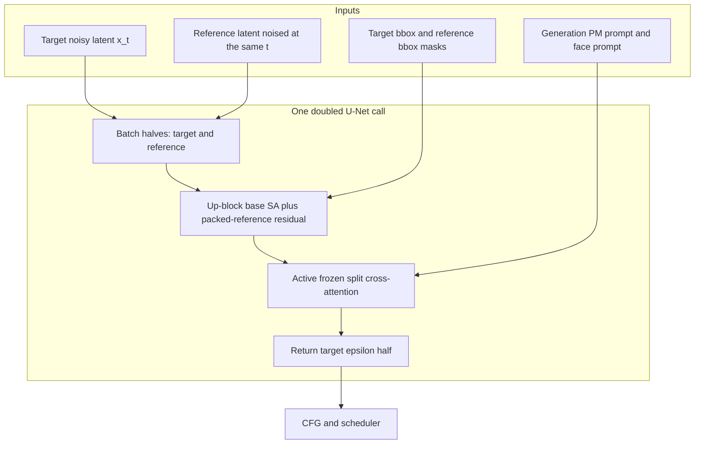
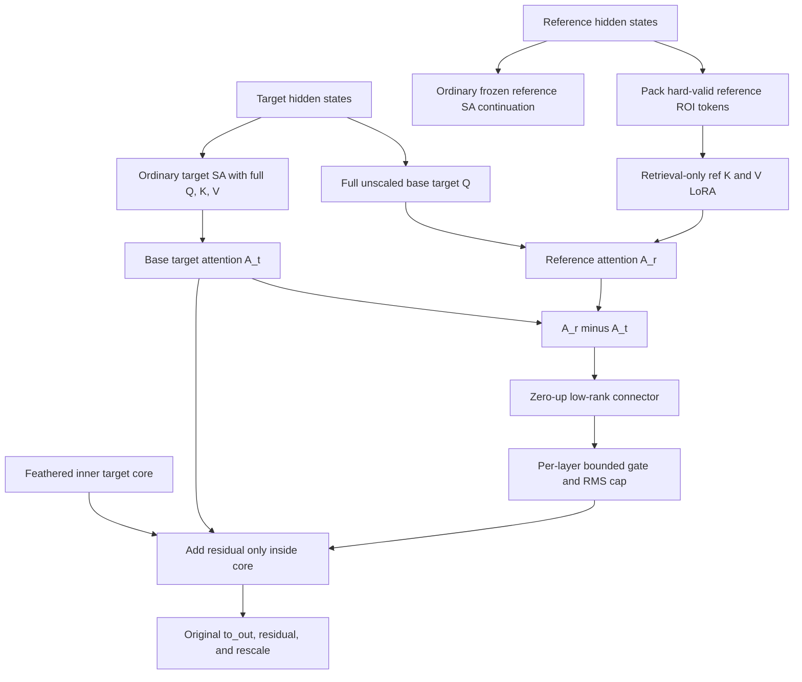

# NN2-PPR1: combined code analysis and implementation handoff

**Project:** PhotoMaker conditional generation with branched spatial attention  
**Code baseline:** [`kolyangg/rsrch@39fd37a`](https://github.com/kolyangg/rsrch/tree/39fd37a197903dde61e9f795ddd77dac502af5a9)  
**Next experiment:** **NN2-PPR1 — parity-preserving packed-reference residual**  
**Prepared:** 19 July 2026

## Executive decision

The doubled target/reference U-Net design is viable, but the current self-attention operator is too destructive. Inside the target face box it replaces target self-attention with reference-only attention, while the reference “mask” leaves all excluded positions in the softmax sequence as zero tokens. Applied at all 70 self-attention sites with a hard binary merge, this gives the reference branch absolute authority over face geometry and creates a plausible mechanism for folding, duplicated features, flat plates, seams, and poor face-to-body alignment.

The next run should change only that spatial operator and the minimum controls required for valid attribution:

- preserve ordinary target self-attention exactly;
- pack only valid reference-face tokens, with a real key-validity mask for any padding;
- form a reference-minus-target attention candidate;
- pass it through a zero-output-initialized, low-rank connector;
- add the bounded residual only inside a feathered inner face core;
- use this processor at explicit `up_blocks.*.attn1` sites only;
- keep the existing split cross-attention active but frozen;
- keep pose adaptation and CA mixing off;
- use one SDXL base for both training and validation;
- retain the active cross-image `CosmicLargeTrain` sampler for this first architecture attribution run;
- train only in the inference-active BA timestep region with blended global/face diffusion loss.

Call this configuration **NN2-PPR1**. It is intentionally narrower than a final product architecture. If it removes anatomical artifacts while retaining identity, later experiments can add better correspondence, data counterfactuals, or mask tracking one at a time.

## 1. Experimental question and invariants

The experiment should answer one question:

> Does replacing absolute reference-face ownership with a parity-preserving, valid-token reference residual remove geometry and seam failures without losing useful identity transfer?

The following are invariants, not tunable variables in NN2-PPR1:

| Item | NN2-PPR1 decision |
|---|---|
| Pose adaptation | Off (`0.0`) |
| CA mixing for face | Off (`false`) |
| Cross-attention topology | Existing split target/reference CA remains active |
| Cross-attention training | Frozen |
| CA face-token masking | Off for this run |
| Reference/target data sampler | Active `cosmic_large` path, unchanged after a read-only audit |
| Training base | `stabilityai/stable-diffusion-xl-base-1.0` |
| Validation base | Same model; alternate base is `null` |
| Reference timestep | `t_ref = t_gen`, existing fixed reference noise |
| Dynamic target-box tracking | Off |
| Reference warping/alignment | None |
| Decoded identity loss | Off |
| Guidance rescale | Unchanged (`0.0`) |
| BA schedule | Same 50-step switch: BA starts at step 15 |

Do not bundle pose adaptation, CA mixing, landmark warping, dynamic retracking, a reference timestep cap, AdaIN, attention temperature, entropy gating, wrong-reference dropout, or a new sampler into this run. Any such addition would make the spatial repair impossible to attribute cleanly.

## 2. What the pinned implementation actually does

### 2.1 The active NN1a–f training path is cross-image

All six NN1 launchers source the same common runner. That runner explicitly selects `datasets=all_datasets` and `train_dataset_name=cosmic_large` and applies the same reference crop/downscale settings to every NN1 variant ([common runner L117–126](https://github.com/kolyangg/rsrch/blob/39fd37a197903dde61e9f795ddd77dac502af5a9/diffusion_template/jul_serv_runs/_run_ba_NN1_common_1gpu.sh#L117-L126)). The six configs change attention, timestep, CA, or loss behavior; none changes the sampler.

`cosmic_large` resolves to the final `src.datasets.cosmic.CosmicLargeTrain` ([dataset config L58–76](https://github.com/kolyangg/rsrch/blob/39fd37a197903dde61e9f795ddd77dac502af5a9/diffusion_template/src/configs/datasets/all_datasets.yaml#L58-L76)). In that active class:

- `train_on_separate_image` and `same_id_ref_map_json_pth` are explicitly discarded ([`cosmic.py` L922–962](https://github.com/kolyangg/rsrch/blob/39fd37a197903dde61e9f795ddd77dac502af5a9/diffusion_template/src/datasets/cosmic.py#L922-L962));
- a reference is randomly selected from `img_data["face_paths"]` ([L1313–1339](https://github.com/kolyangg/rsrch/blob/39fd37a197903dde61e9f795ddd77dac502af5a9/diffusion_template/src/datasets/cosmic.py#L1313-L1339)); and
- `__getitem__` uses the top-level record image as the target and the selected face-path image as the reference ([L1376–1406](https://github.com/kolyangg/rsrch/blob/39fd37a197903dde61e9f795ddd77dac502af5a9/diffusion_template/src/datasets/cosmic.py#L1376-L1406)).

The same-image fallback at [`cosmic.py` L118–132](https://github.com/kolyangg/rsrch/blob/39fd37a197903dde61e9f795ddd77dac502af5a9/diffusion_template/src/datasets/cosmic.py#L118-L132) belongs to the older `CosmicDoubledTrain`, not the class used by NN1a–f. Setting `same_id_ref_map_json_pth` therefore cannot change those runs.

The repository’s saved [`cosmic_large_origtarget_genref.ipynb`](https://github.com/kolyangg/rsrch/blob/39fd37a197903dde61e9f795ddd77dac502af5a9/dataset_full/cosmic_large_origtarget_genref.ipynb) mirrors the active loader and visualizes distinct target and reference files. Its sample includes major scale, crop, view, and pose differences. That does not prove the entire server dataset is clean, but it does establish that NN1a–f are not same-image training by construction.

The remaining data risks are different:

- identity mismatches inside `face_paths`;
- synthetic near-duplicates or an overly easy portrait distribution;
- insufficient yaw, pitch, expression, occlusion, and face-scale coverage;
- detector or bbox failures;
- reference images whose face crop contains excessive background or artifacts.

These warrant a read-only audit. They do not justify changing the sampler in the first processor-repair run unless the audit finds a clear integrity failure.

### 2.2 One doubled U-Net call

At BA-active timesteps, the code forms a doubled batch `[target, reference]`. Reference noise is sampled once per generation and reused; the target and reference use the same diffusion timestep, `t_ref=t_gen` ([runtime L367–410](https://github.com/kolyangg/rsrch/blob/39fd37a197903dde61e9f795ddd77dac502af5a9/diffusion_template/src/model/photomaker_branched/branched_runtime.py#L367-L410)). The U-Net returns both halves, and only the target epsilon half is passed back to CFG and the scheduler.

This topology is not itself the defect. It gives each target sample one contemporaneous reference memory stream and allows layer-wise target-to-reference retrieval. The defect lies in how self-attention constructs and merges that retrieval.

### 2.3 Current self-attention is an absolute replacement

The current `BranchedAttnProcessor` splits the hidden batch into target and reference halves ([processor L238–255](https://github.com/kolyangg/rsrch/blob/39fd37a197903dde61e9f795ddd77dac502af5a9/diffusion_template/src/model/photomaker_branched/attn_processor_cleanest.py#L238-L255)). In simplified form it computes:

```text
Q_t = target query
A_bg   = Attn(Q_t * (1-M), K_target, V_target)
A_face = Attn(Q_t * M, K(reference * M_ref), V(reference * M_ref))
target_out = (1-M) * A_bg + M * A_face
```

The actual background path is at [L267–285](https://github.com/kolyangg/rsrch/blob/39fd37a197903dde61e9f795ddd77dac502af5a9/diffusion_template/src/model/photomaker_branched/attn_processor_cleanest.py#L267-L285), the face path at [L330–357](https://github.com/kolyangg/rsrch/blob/39fd37a197903dde61e9f795ddd77dac502af5a9/diffusion_template/src/model/photomaker_branched/attn_processor_cleanest.py#L330-L357), and the hard merge at [L384–390](https://github.com/kolyangg/rsrch/blob/39fd37a197903dde61e9f795ddd77dac502af5a9/diffusion_template/src/model/photomaker_branched/attn_processor_cleanest.py#L384-L390).

With the active binary masks, every target token inside the face box loses the target-self-attention candidate. Its only attention output comes from reference K/V. Repeating that substitution across all patched resolutions and blocks can overwrite target pose, expression, occluders, lighting, and the neck/jaw transition even when the target query is trying to preserve them. This is the strongest code-level explanation for face-to-body misalignment and folded or duplicated facial structures.

The disabled options are not involved: `POSE_ADAPT_RATIO=0.0` and `CA_MIXING_FOR_FACE=False` are hard-coded in the active processor ([L302–310](https://github.com/kolyangg/rsrch/blob/39fd37a197903dde61e9f795ddd77dac502af5a9/diffusion_template/src/model/photomaker_branched/attn_processor_cleanest.py#L302-L310)). NN2-PPR1 keeps both off.

### 2.4 Zeroing reference tokens is not an attention mask

The processor performs:

```python
ref_face_hidden = ref_hidden * ref_mask_flat
key_face = ref_to_k(ref_face_hidden)
value_face = ref_to_v(ref_face_hidden)
```

but supplies no key-validity mask to scaled dot-product attention ([processor L330–357](https://github.com/kolyangg/rsrch/blob/39fd37a197903dde61e9f795ddd77dac502af5a9/diffusion_template/src/model/photomaker_branched/attn_processor_cleanest.py#L330-L357)). For the usual bias-free SDXL K projection, every excluded token has key zero, so its logit is zero for every query and it contributes `exp(0)=1` to the softmax denominator. If `n` excluded positions remain, their combined probability mass is

\[
p_{invalid}=\frac{n}{n+\sum_{j\in ROI}\exp(s_j)}.
\]

Their values are also zero, so this mass dilutes the output toward zero. If a projection has a bias, the excluded positions instead become many repeated bias tokens. Either behavior is incorrect: multiplication changes token content but does not remove tokens from attention.

The fix must be one of:

1. physically pack valid ROI tokens; or
2. pad variable-length packed sequences and apply an additive `-inf` key mask.

NN2-PPR1 uses both: pack each sample’s ROI, pad only to the batch maximum, and mask padded slots with additive `-inf`.

### 2.5 The reference stream is coupled to trainable retrieval weights

The current processor uses `ref_to_q/k/v` both for target-to-reference retrieval and for the reference half’s own continuation ([processor L364–380](https://github.com/kolyangg/rsrch/blob/39fd37a197903dde61e9f795ddd77dac502af5a9/diffusion_template/src/model/photomaker_branched/attn_processor_cleanest.py#L364-L380)). Training a projection to make reference tokens useful to the target therefore also changes how the reference memory is encoded for every later layer.

NN2-PPR1 separates these roles:

- the target and reference base continuations use the ordinary frozen `attn.to_q/k/v` paths;
- only target-to-reference retrieval uses cloned `ref_to_k/v` LoRA projections;
- no retrieval-specific `ref_to_q` is needed because queries always come from the target base path.

This preserves a stable reference memory while still allowing the retrieval keys and values to specialize.

### 2.6 Current masks and site selection amplify the defect

`mask_softness=0` makes the pipeline mask binary ([pipeline L873–890](https://github.com/kolyangg/rsrch/blob/39fd37a197903dde61e9f795ddd77dac502af5a9/diffusion_template/src/pipelines/photomaker_branched_clean.py#L873-L890)); each processor resizes and thresholds it ([processor L426–456](https://github.com/kolyangg/rsrch/blob/39fd37a197903dde61e9f795ddd77dac502af5a9/diffusion_template/src/model/photomaker_branched/attn_processor_cleanest.py#L426-L456)). A hard bbox boundary repeated across many layers is a natural seam generator.

Simply changing the current mask to soft is unsafe. The current operator multiplies queries by the mask. In general,

\[
M\,A(QM,K,V)+(1-M)\,A(Q(1-M),K,V)\ne A(Q,K,V),
\]

because scaling a query changes its logits and softmax temperature. A soft ownership mask must be applied only to an output residual, never to Q, K, or V.

Site selection is also too coarse. `ba_patch_top_k` keeps the first fraction of matching processor names in dictionary order ([runtime L15–40](https://github.com/kolyangg/rsrch/blob/39fd37a197903dde61e9f795ddd77dac502af5a9/diffusion_template/src/model/photomaker_branched/branched_runtime.py#L15-L40)); it cannot express “up blocks only.” All-site reference replacement can alter coarse spatial layout in down and mid blocks. NN2-PPR1 needs an explicit name policy for `up_blocks.*.attn1.processor`. On the standard SDXL registry this is expected to resolve to 36 self-attention sites, but the code must discover and log the actual names and count rather than hard-code 36.

### 2.7 Cross-attention is a batch-half router

`BranchedCrossAttnProcessor` is not a target face/background spatial split. Target-half queries attend the generation/PhotoMaker prompt; reference-half queries attend the face prompt; their outputs are concatenated ([processor L671–761](https://github.com/kolyangg/rsrch/blob/39fd37a197903dde61e9f795ddd77dac502af5a9/diffusion_template/src/model/photomaker_branched/attn_processor_cleanest.py#L671-L761)).

NN1d’s active-but-frozen cross-attention is the cleanest inheritance point: it preserved 96/96 detected faces while avoiding the broader collapse seen when CA projections were trained, although spatial folding remained ([NN1 results L95–130](https://github.com/kolyangg/rsrch/blob/39fd37a197903dde61e9f795ddd77dac502af5a9/diffusion_template/Jul_new_exp/2026-07-17_NN1a_NN1f_results_and_NN2_architecture_plan.md#L95-L130)). Keep all split CA processors installed, freeze their parameters, keep `ba_uncond_face_fix=true`, and leave `ba_face_prompt_attention_mask=false` for the first repaired spatial run.

`branched_runtime.py` currently assigns `equalize_face_kv` and `equalize_clip` to CA processors ([L187–202](https://github.com/kolyangg/rsrch/blob/39fd37a197903dde61e9f795ddd77dac502af5a9/diffusion_template/src/model/photomaker_branched/branched_runtime.py#L187-L202)), but the active processor never reads them. Remove these dead assignments or implement them later as a separate experiment; they must not appear as active behavior in NN2-PPR1 logs.

### 2.8 Training/validation base mismatch can invalidate attribution

The training model is configured from SDXL base ([model config L1–4](https://github.com/kolyangg/rsrch/blob/39fd37a197903dde61e9f795ddd77dac502af5a9/diffusion_template/src/configs/model/photomaker_branched_lora2.yaml#L1-L4)), while the NN1 common runner forces validation onto RealVisXL ([runner L149–155](https://github.com/kolyangg/rsrch/blob/39fd37a197903dde61e9f795ddd77dac502af5a9/diffusion_template/jul_serv_runs/_run_ba_NN1_common_1gpu.sh#L149-L155)). The alternate-base validation path copies processor state with `strict=False` and, outside strict mode, suppresses processor-copy failures ([trainer L510–577](https://github.com/kolyangg/rsrch/blob/39fd37a197903dde61e9f795ddd77dac502af5a9/diffusion_template/src/trainer/base_trainer.py#L510-L577)). `BranchLoRALinear` stores cloned base weights as buffers ([processor L12–36](https://github.com/kolyangg/rsrch/blob/39fd37a197903dde61e9f795ddd77dac502af5a9/diffusion_template/src/model/photomaker_branched/attn_processor_cleanest.py#L12-L36)), so a full processor copy can transplant SDXL-derived branch bases into a RealVis U-Net.

NN2-PPR1 must set `pretrained_model_for_validation_name_or_path=null`. RealVis can be tested later by training and validating a separate RealVis model with the same topology.

### 2.9 Schedule and objective

The existing `inference_ba_region` sampler restricts training timesteps to the region where BA is active at inference ([`lora2.py` L442–457](https://github.com/kolyangg/rsrch/blob/39fd37a197903dde61e9f795ddd77dac502af5a9/diffusion_template/src/model/photomaker_branched/lora2.py#L442-L457)). Keep `train_ba_all_steps=true`: despite the name, this ensures every sampled training update uses the doubled processor-compatible forward. With it false, early branches call an undoubled U-Net while branched processors remain installed ([L545–590](https://github.com/kolyangg/rsrch/blob/39fd37a197903dde61e9f795ddd77dac502af5a9/diffusion_template/src/model/photomaker_branched/lora2.py#L545-L590)). That path should not be used until processor switching is explicit.

Use `BlendedMaskedDiffusionLoss` with `lambda_face=0.20`. The implementation combines separately normalized full-image and face losses as `(1-lambda)*full + lambda*face` ([loss L63–80](https://github.com/kolyangg/rsrch/blob/39fd37a197903dde61e9f795ddd77dac502af5a9/diffusion_template/src/loss/diffusion_loss.py#L63-L80)). A large face weight would let a small crop dominate the global/body anchor. Keep decoded ID loss off: NN1e raised ID similarity while losing detections and smoothing faces, showing that identity score alone is confounded.

## 3. Ranked diagnosis

| Priority | Mechanism | Code evidence | Expected symptom | NN2-PPR1 response |
|---|---|---|---|---|
| P0 | Exclusive reference-only face attention | Target face output has no target-attention alternative before the hard merge | Pose displacement, folded/duplicated features, occluder loss, face/body mismatch | Untouched base target path plus residual reference evidence |
| P0 | Invalid reference tokens remain in softmax | Reference hidden states are multiplied by a mask; no key-validity mask is supplied | Diluted/flat face features, plate-like regions, unstable attention | Packed ROI tokens plus additive `-inf` padding mask |
| P0 | Train/validation base mixture | SDXL branch state can be copied into RealVis validation | Misleading validation and restore-specific artifacts | Same SDXL base end-to-end; strict manifest |
| P1 | Trainable retrieval also drives reference continuation | `ref_to_q/k/v` are reused by the reference stream | Drifting/corrupted memory across layers | Frozen base continuation; retrieval-only `ref_to_k/v` |
| P1 | Hard boundary at all self-attention sites | Binary bbox and all 70 sites | Seams, jaw/neck discontinuity, global geometry changes | Feathered inner-core residual; explicit up-block sites |
| P1 | Schedule mismatch in NN1a/d | Default mode samples all timesteps although BA starts late in inference | Learning behavior not exercised at inference | `inference_ba_region` |
| P2 | Pair quality may be uneven | Active loader samples `face_paths` but performs no online identity/pose check | Identity noise or shortcut learning | Audit now; sampler ablation only after spatial repair |

## 4. Proposed NN2-PPR1 architecture

### 4.1 System diagram



### 4.2 Processor diagram



### 4.3 Mathematical definition

For a patched layer `l`, let ordinary target and reference attention be

\[
A_t=\operatorname{Attn}(Q_t,K_t,V_t),
\qquad
A_{refbase}=\operatorname{Attn}(Q_r,K_r,V_r).
\]

Pack reference hidden tokens whose hard ROI validity is true, pad to the maximum packed length in the batch, and use an additive key mask `P` with zero for valid keys and `-inf` for padding:

\[
A_r=\operatorname{Attn}(Q_t,K_{roi},V_{roi};P).
\]

The reference candidate is expressed relative to the target candidate:

\[
D_l=A_r-A_t.
\]

Use a low-rank connector rather than a full `hidden_size × hidden_size` zero projection:

\[
Z_l(D)=W^{up}_l W^{down}_l D,
\qquad W^{up}_l=0\text{ at initialization}.
\]

`W_down` is Kaiming-initialized; `W_up` and its bias, if present, are exactly zero. Rank 16 is sufficient for the first run and adds roughly 1.35M connector parameters across the expected 36 SDXL up-block sites, instead of roughly 51.6M for full square connectors.

The residual is bounded by a per-layer gate and a masked RMS cap:

\[
\alpha_l=\alpha_{max}\sigma(g_l),\qquad \alpha_{max}=0.5,
\]

\[
\widehat D_l=\operatorname{RMSCap}(Z_l(D_l), A_t, M_{core}, c=0.25),
\]

\[
A_{out}=A_t+M_{core}\,v_{roi}\,\alpha_l\widehat D_l.
\]

`v_roi` is a per-sample 0/1 validity flag. It is zero if the packed reference ROI is empty, so an invalid/empty ROI fails closed to the base path. The original `attn.to_out`, dropout, residual connection, and `rescale_output_factor` are then applied to `[A_out, A_refbase]` in their normal order.

Exact step-zero parity comes from `W_up=0`, not from the sigmoid. `sigmoid(0)=0.5`, so with `g_l=0` the bounded gate starts at 0.25; the branch is nevertheless exactly zero. Do not also initialize the gate to zero output, because double-zero initialization would starve the connector of a useful first-step gradient.

### 4.4 Mask semantics

NN2-PPR1 uses two different masks for two different jobs:

1. **Reference validity mask:** a hard mask derived from the raw reference bbox. It selects K/V tokens. Invalid tokens are absent or receive additive `-inf`; they never remain as zero K/V entries.
2. **Target ownership mask:** a continuous inner-core mask. It is applied only to the output residual. It is zero at the target bbox edge, rises with a cosine ramp over the inner 10% of each bbox dimension, and is one in the central core.

The target core leaves hair, jawline, neck, hands, goggles, and other boundary occluders primarily target-owned. The current expanded/original bbox feather helper ([`br_pipeline_helpers.py` L81–142](https://github.com/kolyangg/rsrch/blob/39fd37a197903dde61e9f795ddd77dac502af5a9/diffusion_template/src/pipelines/br_pipeline_helpers.py#L81-L142)) is not sufficient when expansion is `1.0`: it does not create an eroded target-owned ring. Implement a separate core-mask helper.

### 4.5 Correctness-first query policy

For version 1, compute `A_r` for all target query rows and mask the resulting residual outside the core. This is slightly more compute than gathering target query rows, but it has three advantages:

- Q stays full and unscaled;
- only variable-length reference K/V packing is required;
- the branch-off parity test is straightforward.

Gathering target query rows and scattering the residual can be added later as a pure performance optimization after numerical equivalence is tested.

## 5. Detailed implementation plan

### 5.1 Add the new processor module

Create:

```text
diffusion_template/src/model/photomaker_branched/packed_residual_attn_processor.py
```

Add:

```python
class PackedResidualBranchedAttnProcessor(nn.Module):
    _is_branched_processor = True
    _branched_kind = "self"

    def __init__(
        self,
        hidden_size: int,
        *,
        ref_kv_kind: str = "lora",
        ref_kv_rank: int = 32,
        connector_rank: int = 16,
        gate_max: float = 0.5,
        gate_init_logit: float = 0.0,
        delta_rms_cap: float = 0.25,
        target_core_erode_frac: float = 0.10,
        diagnostics: bool = False,
    ): ...

    def init_from_attention(self, attn): ...
    def set_masks(self, mask, mask_ref, mask_core=None): ...
    def forward(self, attn, hidden_states, ...): ...
```

Reuse `_clone_effective_linear` and `BranchLoRALinear` from `attn_processor_cleanest.py`, or move those utilities into `branch_helpers.py` and import them from both processors. Avoid duplicate implementations with different checkpoint key names.

`init_from_attention` must create only:

```python
self.ref_to_k = _clone_effective_linear(attn.to_k, kind="lora", rank=ref_kv_rank)
self.ref_to_v = _clone_effective_linear(attn.to_v, kind="lora", rank=ref_kv_rank)
self.connector_down = nn.Linear(hidden_size, connector_rank, bias=False)
self.connector_up = nn.Linear(connector_rank, hidden_size, bias=False)
self.gate_logit = nn.Parameter(torch.tensor(gate_init_logit))

nn.init.kaiming_uniform_(self.connector_down.weight, a=math.sqrt(5))
nn.init.zeros_(self.connector_up.weight)
```

Do not add `ref_to_q`, `noise_to_q/k/v`, pose-adaptation weights, or CA-mixing weights to this class.

### 5.2 Base-attention helper and exact parity

Implement one helper that returns the attention output **before** `to_out` and
the already projected, head-shaped Q tensor:

```python
def _base_self_attention_pre_out(attn, x, attention_mask=None):
    q = attn.to_q(x)
    k = attn.to_k(x)
    v = attn.to_v(x)
    q, k, v = reshape_to_heads(q, k, v, attn.heads)
    if getattr(attn, "norm_q", None) is not None:
        q = attn.norm_q(q)
    if getattr(attn, "norm_k", None) is not None:
        k = attn.norm_k(k)
    a = F.scaled_dot_product_attention(
        q, k, v,
        attn_mask=attention_mask,
        dropout_p=0.0,
        is_causal=False,
    )
    return merge_heads(a), q
```

After spatial/group normalization, call this helper **once on the full doubled
batch**, then split both its attention output and Q into target/reference
halves. Do not run two separate base-attention calls. One full-batch call most
closely matches the ordinary installed processor, avoids duplicate projection
work, and lets the retrieval lane reuse the exact target Q that produced
`A_t`.

The surrounding `forward` must reproduce the installed Diffusers processor’s semantics, including:

- `spatial_norm(hidden_states, temb)` before flattening;
- 4D-to-3D flattening and exact restoration;
- `group_norm` on the full doubled batch before the base Q/K/V projections;
- any supported attention-mask preparation;
- `norm_q` and `norm_k` when present;
- `attn.to_out[0]`, then `attn.to_out[1]`;
- the original residual tensor, without face suppression;
- division by `attn.rescale_output_factor`.

Do not copy the current strict-face residual suppression. `strict_face_routing=false` in NN2-PPR1, and base parity requires the original residual.

Assert that `encoder_hidden_states is None` in this self-attention processor. Cross-attention remains handled by `BranchedCrossAttnProcessor`.

### 5.3 Packed reference ROI

Use normalized reference hidden states and a hard resized validity mask:

```python
valid = resize_reference_mask(mask_ref, spatial_hw, mode="nearest") > 0.5
packed, valid_lengths, pad_mask, sample_has_roi = pack_valid_tokens(ref_hidden, valid)
```

`pack_valid_tokens` should:

1. flatten each sample’s `[H,W]` mask to `[L]`;
2. gather `ref_hidden[b, valid[b]]` without changing token values;
3. pad gathered sequences to `Nmax=max(valid_lengths.max(), 1)`;
4. construct an additive mask of shape `[B,1,1,Nmax]`, with `0` for valid packed keys and `-inf` for padding;
5. for an empty row, insert one all-zero dummy token, mark it usable only to prevent all-`-inf` SDPA, and set `sample_has_roi[b]=0` so the final residual is exactly zero.

Use an additive float mask rather than a boolean mask to avoid version-dependent ambiguity over whether `True` means allowed or blocked.

Then compute retrieval attention with the full, already normalized target base
queries returned by the base helper:

```python
k_roi = self.ref_to_k(packed)
v_roi = self.ref_to_v(packed)
k_roi, v_roi = reshape_kv_to_heads(...)
apply norm_k_if_present(k_roi)

a_ref = F.scaled_dot_product_attention(
    q_target_from_base,
    k_roi,
    v_roi,
    attn_mask=pad_mask,
    dropout_p=0.0,
    is_causal=False,
)
a_ref = merge_heads(a_ref)
```

Never form `reference_hidden * reference_mask` before projection. Never fall back to the full reference grid when the ROI is empty.

### 5.4 Target inner-core mask

Add a common helper, preferably in `branch_helpers.py`:

```python
def make_inner_core_mask(mask4: torch.Tensor, erode_frac: float = 0.10) -> torch.Tensor:
    """Return [B,1,H,W], zero outside and at bbox edge, cosine ramp to one inside."""
```

For each sample:

1. threshold the legacy target bbox mask at `>0.5` only to locate its support;
2. find `(x0,y0,x1,y1)` from the nonzero support;
3. set ramp widths `rx=max(1, round(erode_frac*(x1-x0)))` and `ry=max(1, round(erode_frac*(y1-y0)))`;
4. for pixels inside the bbox, compute normalized distance to the nearest horizontal and vertical edge;
5. apply `0.5 - 0.5*cos(pi*clamp(distance/ramp,0,1))` separately in x and y;
6. combine the two ramps with `min(wx, wy)`;
7. leave the mask zero if its support is empty.

Construct this mask once in `patch_unet_attention_processors`, not independently in every layer. Each processor should bilinearly resize it to its attention resolution and **must not threshold it**. The hard reference validity mask should use nearest resize or bilinear-plus-threshold and remain binary.

### 5.5 Residual connector, gate, and RMS cap

Compute:

```python
diff = a_ref - a_target
delta = self.connector_up(self.connector_down(diff))
gate = self.gate_max * torch.sigmoid(self.gate_logit)
delta = masked_rms_cap(
    delta,
    base=a_target,
    mask=target_core,
    max_ratio=self.delta_rms_cap,
)
target_out = (
    a_target
    + target_core * sample_has_roi[:, None, None] * gate * delta
)
```

Use a per-sample RMS over the masked face core:

```python
denom = (mask.sum(dim=(1, 2)) * hidden_size).clamp_min(1.0)
base_rms = sqrt((mask * base.square()).sum((1, 2)) / denom + eps)
delta_rms = sqrt((mask * delta.square()).sum((1, 2)) / denom + eps)
cap_scale = min(1, max_ratio * base_rms / (delta_rms + eps))
```

Compute these statistics in FP32, broadcast `cap_scale` over `[L,D]`, detach
the statistic-derived scale factor before multiplying the residual, and cast
the bounded result back to the attention dtype. This avoids an incentive to
manipulate the cap denominator and keeps BF16 square/sum operations stable.
Log both pre-cap and post-cap ratios.

At initialization:

- `connector_up.weight` is zero;
- the layer output equals the ordinary base path exactly;
- only `connector_up` is expected to receive a nonzero gradient on the first backward pass;
- `connector_down`, `ref_to_k/v`, and `gate_logit` may receive zero gradient on that first pass and should begin receiving gradients after `connector_up` moves.

This staged gradient behavior is expected and must be encoded in tests so it is not misdiagnosed as a broken branch.

### 5.6 Reference continuation

The reference half must be the reference slice from the single full-batch base
attention call:

```python
a_base_all, q_base_all = _base_self_attention_pre_out(attn, normalized_hidden_all)
a_target, a_reference_base = a_base_all[:B], a_base_all[B:]
q_target_from_base = q_base_all[:B]
```

This uses direct base `attn.to_q/k/v`. Do not use `self.ref_to_k/v` or a new
`ref_to_q` in the continuation. Concatenate the pre-output target and reference
tensors, then apply the shared `to_out`, residual, and rescale once.

### 5.7 Runtime installation and variant dispatch

Modify:

```text
diffusion_template/src/model/photomaker_branched/branched_runtime.py
```

Add a variant dispatch:

```python
variant = getattr(pipeline, "ba_processor_variant", "legacy")
if variant == "packed_residual_v1":
    self_attn_cls = PackedResidualBranchedAttnProcessor
elif variant == "legacy":
    self_attn_cls = BranchedAttnProcessor
else:
    raise ValueError(...)
```

Add explicit self-attention selection:

```python
def select_branched_self_attention_names(names, policy):
    if policy == "all":
        return [n for n in names if n.endswith("attn1.processor")]
    if policy == "up_blocks_attn1":
        return [
            n for n in names
            if n.startswith("up_blocks.") and n.endswith("attn1.processor")
        ]
    raise ValueError(...)
```

Preserve `ba_patch_top_k` only for legacy variants. For `packed_residual_v1`, either reject `ba_patch_top_k != 1.0` or ignore it with a single explicit log; do not combine dictionary-order top-k with the new site policy.

The existing “already patched” check is critical. It currently uses `isinstance` against only the two legacy classes. If the new class is not included, every call to `patch_unet_attention_processors` can rebuild processors, detach the optimizer from the live modules, and reset learned weights. Replace the check with the shared marker:

```python
has_branched = any(
    bool(getattr(proc, "_is_branched_processor", False))
    for proc in pipeline.unet.attn_processors.values()
)
```

Give the legacy SA and CA classes the same marker, or include them explicitly. The update-mask branch must also recognize the new class. When processors already exist, update only their masks and runtime state; never reconstruct them.

Log and persist:

- processor variant;
- site policy;
- sorted patched SA names and count;
- sorted patched CA names and count;
- processor object identities before and after validation restoration in correctness mode.

When constructing the new class, pass `ref_kv_rank` from the existing
`pipeline.branched_attn_lora_rank` value (32 under the proposed launcher) and
pass every connector, gate, and mask option from the corresponding model
attribute.

### 5.8 Model configuration plumbing

Modify the constructor in:

```text
diffusion_template/src/model/photomaker_branched/lora2.py
```

Add and store:

```python
ba_processor_variant: str = "legacy"
ba_site_policy: str = "all"
ba_connector_rank: int = 16
ba_gate_max: float = 0.5
ba_gate_init_logit: float = 0.0
ba_delta_rms_cap: float = 0.25
ba_target_core_erode_frac: float = 0.10
ba_reference_token_mode: str = "legacy_zero_mask"
ba_reference_continuation: str = "legacy_ref_projection"
ba_diagnostics: bool = False
```

Validate allowed values. For `packed_residual_v1`, assert:

- `ba_site_policy == "up_blocks_attn1"` for this named experiment;
- `ba_reference_token_mode == "packed_bbox_roi"`;
- `ba_reference_continuation == "frozen_base"`;
- `0 < ba_gate_max <= 1`;
- `0 < ba_delta_rms_cap <= 1`;
- `0 <= ba_target_core_erode_frac < 0.5`;
- pose adaptation is `0.0` and CA mixing is `false`;
- `train_branched_ca_lora` is `false`.

Extend `ba_sa_train_mode` with `packed_residual`, or branch directly on `ba_processor_variant` in the trainability helper. Do not silently reuse `ref_kv_only`, because the connector and gate must also be trained.

### 5.9 Validation-pipeline propagation

Modify `build_pipeline_from_pretrained` in:

```text
diffusion_template/src/pipelines/br_pipeline_helpers.py
```

Copy every new `ba_*` field from the unwrapped model onto the validation pipeline, just as the existing function copies `branched_attn_weight_mode` and rank ([helper L1105–1161](https://github.com/kolyangg/rsrch/blob/39fd37a197903dde61e9f795ddd77dac502af5a9/diffusion_template/src/pipelines/br_pipeline_helpers.py#L1105-L1161)). A configuration field that exists only on the training model but is absent from the constructed pipeline will cause validation to reinstall the legacy processor.

Add a strict assertion after pipeline construction:

```python
assert pipeline.ba_processor_variant == unwrapped_model.ba_processor_variant
assert pipeline.ba_site_policy == unwrapped_model.ba_site_policy
```

### 5.10 Trainable manifest and optimizer selection

Modify:

```text
diffusion_template/src/model/photomaker_branched/lora2_helpers.py
```

The current `_assert_branched_installation` requires exactly 70 legacy SA and 70 CA processors and checks the SA class name literally ([L74–88](https://github.com/kolyangg/rsrch/blob/39fd37a197903dde61e9f795ddd77dac502af5a9/diffusion_template/src/model/photomaker_branched/lora2_helpers.py#L74-L88)). This will reject a correct up-only installation. Replace hard-coded counts with expected names returned by the site selector:

```python
expected_sa = set(select_branched_self_attention_names(all_names, model.ba_site_policy))
expected_ca = {n for n in all_names if n.endswith("attn2.processor")}
```

Verify class markers and exact name equality. Log actual counts, not constants.

The current `configure_branched_trainables` enables only `.ref_to_` parameters in ref modes ([L211–260](https://github.com/kolyangg/rsrch/blob/39fd37a197903dde61e9f795ddd77dac502af5a9/diffusion_template/src/model/photomaker_branched/lora2_helpers.py#L211-L260)). Add an explicit `packed_residual` branch that enables only:

```text
*.attn1.processor.ref_to_k.lora_A
*.attn1.processor.ref_to_k.lora_B
*.attn1.processor.ref_to_v.lora_A
*.attn1.processor.ref_to_v.lora_B
*.attn1.processor.connector_down.weight
*.attn1.processor.connector_up.weight
*.attn1.processor.gate_logit
```

If the connector uses biases, include only the intended ones. All underlying U-Net parameters, all non-patched SA processors, all CA processor parameters, and all unrelated LoRA adapters must remain frozen under `train_ba_only=true`.

Extend `_processor_trainable_manifest` categories to distinguish:

- `sa_ref_k`;
- `sa_ref_v`;
- `sa_connector_down`;
- `sa_connector_up`;
- `sa_gate`.

Require every category at every selected SA site. Reject any trainable `ref_to_q`, `noise_to_*`, or CA parameter.

The existing `get_state_dict` in `lora2.py` saves parameters according to `requires_grad` and can therefore include connector and gate state once trainability is correct ([L310–347](https://github.com/kolyangg/rsrch/blob/39fd37a197903dde61e9f795ddd77dac502af5a9/diffusion_template/src/model/photomaker_branched/lora2.py#L310-L347)). Extend the strict manifest with processor variant and site policy, and fail restore if either differs.

### 5.11 Config file

Create:

```text
diffusion_template/src/configs/one_id_ba_NN2_ppr1.yaml
```

Recommended content:

```yaml
defaults:
  - one_id_ba_NN1d_frozen_ca
  - _self_

# Clean processor-repair attribution run.
train_ba_all_steps: true
train_ba_only: true
train_branched_ca_lora: false
branched_attn_weight_mode: ref_only
branched_attn_new_weight_kind: lora
ba_patch_top_k: 1.0
ba_train_top_k: 1.0
non_ba_train: false
ba_noise_lr_scale: 1.0

loss_kind: blended_masked
lambda_face: 0.20
strict_face_routing: false
mask_expansion_ratio: 1.0
mask_softness: 0.0

pretrained_model_for_validation_name_or_path: null
update_proc_weights_val: true

model:
  ba_processor_variant: packed_residual_v1
  ba_site_policy: up_blocks_attn1
  ba_sa_train_mode: packed_residual
  ba_train_timestep_mode: inference_ba_region
  ba_correctness_guards: true
  ba_invalid_sample_policy: skip_batch
  ba_strict_processor_restore: true
  ba_uncond_face_fix: true
  ba_face_prompt_mode: id_only
  ba_face_prompt_attention_mask: false

  ba_connector_rank: 16
  ba_gate_max: 0.50
  ba_gate_init_logit: 0.0
  ba_delta_rms_cap: 0.25
  ba_target_core_erode_frac: 0.10
  ba_reference_token_mode: packed_bbox_roi
  ba_reference_continuation: frozen_base
  ba_diagnostics: true

  use_id_loss: false

pipeline:
  pose_adapt_ratio: 0.0
  ca_mixing_for_face: false

validation_args:
  use_dynamic_mask: false
  guidance_rescale: 0.0
```

Because this inherits NN1d, explicitly overriding `branched_attn_weight_mode` to `ref_only` is necessary: NN1d inherits NN1a’s `noise_and_ref`. The new processor does not need target/noise projection clones.

### 5.12 Launcher

Create:

```text
diffusion_template/jul_serv_runs/start_ba_NN2_ppr1_1gpu.sh
```

Use the common runner initially so batch size, data, validation set, optimizer, and seeds remain comparable, but append the same-base override after the common runner’s RealVis argument:

```bash
#!/usr/bin/env bash
set -euo pipefail

SCRIPT_DIR="$(cd -- "$(dirname -- "${BASH_SOURCE[0]}")" && pwd)"
export NN1_CONFIG_NAME="one_id_ba_NN2_ppr1"
export NN1_RUN_NAME_DEFAULT="ba_NN2_ppr1_1gpu"
export NN1_DEFAULT_GPU="1"
export NN1_DEFAULT_PORT="29620"
export NN1_DESCRIPTION="NN2-PPR1: up-block packed-reference residual; frozen split CA"
export NN1_REQUIRE_ID_LOSS="0"
export NN1_LAUNCHER_PATH="${SCRIPT_DIR}/$(basename -- "${BASH_SOURCE[0]}")"

source "${SCRIPT_DIR}/_run_ba_NN1_common_1gpu.sh" \
  pretrained_model_for_validation_name_or_path=null \
  "$@"
```

Hydra arguments are applied in order, so the final `null` overrides the RealVis value embedded earlier in the common runner. The run must print and save the resolved config and assert that both base identifiers are SDXL/null before allocating the first training batch. A dedicated NN2 common runner that removes the RealVis line entirely is preferable once more NN2 variants exist.

For the screening run, launch three 2k-step epochs:

```bash
NUM_EPOCHS=3 \
OPTIMIZER_STEPS_PER_EPOCH=2000 \
FULL_STEP0_VAL=true \
bash jul_serv_runs/start_ba_NN2_ppr1_1gpu.sh
```

Validate at steps 0, 2k, 4k, and 6k. If 6k is clean and still improving, continue the same checkpoint to 10k rather than changing configuration.

## 6. Required tests before training

Add a focused test module, for example:

```text
diffusion_template/tests/test_packed_residual_attn_processor.py
```

### 6.1 Unit tests

1. **Exact branch-off parity**
   - Instantiate an attention module and its ordinary Diffusers processor.
   - Clone it into the new processor with zero `connector_up`.
   - Compare target and reference outputs in FP32 for 3D and 4D inputs, batches 1 and 2, and attention grids 8, 16, 32, and 64.
   - Use `atol=1e-5`, `rtol=1e-5` unless the installed kernel requires a documented tighter/looser value.
   - Repeat in BF16 with an agreed tolerance and deterministic SDPA settings.

2. **No soft Q/K/V masking**
   - Register hooks or inspect intermediate tensors.
   - Confirm target base Q/K/V match direct base projections regardless of target-core mask values.

3. **Invalid keys receive zero probability**
   - Use a tiny manually verifiable example.
   - Confirm padding logits are `-inf` before softmax and probabilities are exactly zero after softmax.

4. **Empty ROI fails closed**
   - Supply one empty reference mask and one valid mask in the same batch.
   - Confirm finite output and exactly zero residual for the empty row.

5. **Connector initialization and gradients**
   - At step zero, output delta is exactly zero.
   - On the first backward pass, `connector_up.grad` is finite and nonzero.
   - It is acceptable for `connector_down`, gate, and ref K/V gradients to be zero on the first pass.
   - Apply one optimizer update to `connector_up`, run a second backward pass, and confirm gradients reach connector-down and reference K/V.

6. **RMS cap**
   - Force a large connector output.
   - Confirm the post-cap masked delta/base RMS ratio is at most `0.25 + tolerance` per sample.

7. **Reference continuation isolation**
   - Perturb retrieval `ref_to_k/v` while zeroing the target residual.
   - Confirm the reference-half base continuation is unchanged.

8. **Site policy**
   - Resolve names from the actual SDXL U-Net registry.
   - Confirm every selected SA name starts with `up_blocks.` and ends with `attn1.processor`.
   - Confirm no down/mid SA is replaced.
   - Log the discovered count; do not assert a magic number unless the test fixture pins the exact SDXL config.

9. **Processor persistence**
   - Call the patch/update path multiple times.
   - Confirm processor object identities do not change.
   - Simulate validation restore and confirm optimizer parameter objects still belong to the live processors.

10. **Trainability manifest**
    - Confirm only ref K/V LoRA, connector-down/up, and gate parameters require gradients at selected SA sites.
    - Confirm zero trainable CA parameters.

11. **Strict save/reload**
    - Save, reconstruct, and strictly reload.
    - Confirm exact processor names, class, variant, site policy, trainable keys, and tensor equality.
    - Deliberately change the site policy and confirm restore fails.

### 6.2 End-to-end preflight

Before real training:

1. run one forward/backward/optimizer step on a two-sample microbatch;
2. verify all losses, gates, RMS values, and gradients are finite;
3. run the fixed 96-image validation at initialization;
4. compare its target noise predictions with a branch-disabled same-base control on the same seeds;
5. investigate any material difference before training—zero initialization should make the new SA route equivalent to the base SA route, apart from documented kernel/batch numerical noise;
6. save and reload the step-zero checkpoint and repeat a fixed prediction fingerprint.

## 7. Data audit before launch

The audit is read-only and must not change NN2-PPR1 sampling. Run it against the exact server JSON/path resolved by Hydra, not a similarly named local class.

For at least 2,000 sampled target/reference pairs, log:

- exact path equality;
- pixel hash and perceptual-hash near duplicates;
- successful face detection in target and reference;
- calibrated identity similarity, with thresholds estimated from known same/different pairs rather than imported from another benchmark;
- yaw, pitch, and roll difference;
- target/reference face-size ratio;
- bbox clipping/area;
- occlusion and profile-view prevalence;
- source type if synthetic and real reference folders can be distinguished.

Produce distributions, not only means. Stratify evaluation panels by pose delta and occlusion. Change the sampler before NN2-PPR1 only if there is an integrity failure such as material identity mismatch or invalid/missing faces. If the issue is merely limited hard-pose coverage, record it and test pose-diverse sampling as the next independent ablation after the spatial route is clean.

## 8. Training diagnostics

Log the following per selected site at a low frequency, such as the first batch and every 200 optimizer steps:

| Diagnostic | Purpose |
|---|---|
| Packed ROI token count: min/median/max | Detect empty or unexpectedly huge reference regions |
| Padding fraction | Verify packing efficiency and batch variability |
| Invalid-key probability in debug implementation | Must be exactly zero |
| `gate = 0.5*sigmoid(logit)` | Detect saturation or a branch that never activates |
| Connector pre-cap delta/base masked RMS p50/p95 | Measure raw branch pressure |
| Connector post-cap delta/base masked RMS p50/p95 | Confirm safety cap behavior |
| Fraction of samples hitting the cap | Persistent 100% indicates an over-aggressive branch |
| Gradient norm for ref K, ref V, connector-down, connector-up, gate | Confirm staged learning and detect dead layers |
| Patched processor names and object IDs | Detect accidental reconstruction |
| Forward time and peak memory | Quantify packed-residual overhead |

Attention entropy may be logged for diagnosis but must not gate the branch in this experiment. A low-entropy attention distribution can still be confidently wrong.

## 9. Evaluation protocol and promotion gates

Use the same fixed 96 images, prompts, seeds, target boxes, reference boxes, inference steps, and guidance scale as NN1d. Compare at least:

- same-base PhotoMaker control;
- NN1d at its matched checkpoint;
- NN2-PPR1 at 0, 2k, 4k, and 6k.

Keep the existing ID metric but interpret it correctly. `IDSimBest` detects generated faces and takes the best cosine match against a precomputed embedding ([metric L21–40](https://github.com/kolyangg/rsrch/blob/39fd37a197903dde61e9f795ddd77dac502af5a9/diffusion_template/src/metrics/id_sim_metric.py#L21-L40)); it can reward an identity-like face even when anatomy, pose, or multi-face behavior is wrong. Always report detection count beside it.

Add a face/body structural review on hard subsets:

- full-body and medium shots;
- profile and three-quarter views;
- laughing/open-mouth expressions;
- hands crossing the face;
- goggles, hats, hair, and strong occluders;
- strong head roll or body action;
- small faces and night/low-contrast scenes.

If possible, add evaluator-only measurements for head center relative to shoulder midpoint, head scale relative to shoulder width, head roll relative to body pose, facial-landmark topology/confidence, and the number of detected faces. These metrics do not affect training and therefore do not confound the architecture test.

NN2-PPR1 is promotable only if:

- face detection remains 96/96;
- repeated, folded, or plate-like facial regions disappear on the known hard cases;
- head pose, expression, hair, hands, goggles, jaw, and neck remain coherent with the target body;
- prompt adherence and body/background stability are no worse than NN1d;
- identity similarity improves or remains useful without a structural regression;
- gates do not saturate across all sites;
- the RMS cap is not active for nearly every sample/site;
- checkpoint reload reproduces the same fixed validation.

Stop at 2k or 4k if the old collage/folding pattern reappears systematically. If the run is anatomically clean but identity is weak, finish 6k and choose exactly one next change: compare `up-only` with `up+mid`, or introduce audited pose-diverse pairing. Do not immediately increase gate strength and face-loss weight together.

## 10. Likely follow-up sequence

Only after NN2-PPR1 establishes a safe residual route:

1. **Site ablation:** up-only versus up+mid.
2. **Data ablation:** pose-delta-aware same-identity sampling if the audit shows weak coverage.
3. **Counterfactual conditioning:** 10% null reference and 10–15% wrong reference, with an explicit branch-disabled/null target rather than zero K/V.
4. **Semantic correspondence:** canonical ROI normalization or learned feature/value matching; avoid a bbox-only image warp.
5. **Conservative dynamic tracking:** EMA-smoothed bbox updates with IoU, displacement, and failure guards.
6. **Learned query-dependent gating or routing supervision.**
7. **Independent inference ablations:** reference-noise cap, attention temperature, AdaIN, and guidance rescale, one at a time.

Relevant architectural precedents are [PhotoMaker](https://openaccess.thecvf.com/content/CVPR2024/html/Li_PhotoMaker_Customizing_Realistic_Human_Photos_via_Stacked_ID_Embedding_CVPR_2024_paper.html), [IP-Adapter](https://arxiv.org/abs/2308.06721), [MasaCtrl](https://arxiv.org/abs/2304.08465), [ControlNet](https://arxiv.org/abs/2302.05543), [FlashFace](https://arxiv.org/abs/2403.17008), [DreamMatcher](https://arxiv.org/abs/2402.09812), [InfiniteYou](https://arxiv.org/abs/2503.16418), [DreamO](https://arxiv.org/abs/2504.16915), [UNO](https://arxiv.org/abs/2504.02160), [DynamicID](https://arxiv.org/abs/2503.06505), and [AnyPhoto](https://arxiv.org/abs/2603.14770). Together they support localized valid evidence, target-owned structure, residual/zero-initialized conditioning, decoder-side placement, and pose-diverse identity data. They do not establish that all of their mechanisms should be combined in one SDXL experiment.

## 11. Definition of done for the implementing agent

Implementation is complete only when all of the following are true:

- the new class exists separately from the legacy processor;
- target and reference base continuations reproduce ordinary self-attention;
- only valid packed reference ROI tokens participate in retrieval;
- target Q is never multiplied by an ownership mask;
- the soft target core is applied only to the residual;
- the zero-up connector gives exact branch-off parity;
- only explicit up-block self-attention sites are patched;
- persistent processors are updated, never rebuilt during a run;
- split CA remains installed and frozen;
- pose adaptation and CA mixing are asserted off;
- train and validation bases match;
- strict manifests include variant, sites, classes, and trainable keys;
- unit, persistence, gradient, and save/reload tests pass;
- the resolved config, site list, parameter manifest, and step-zero fingerprint are saved with the run;
- the 96-image step-zero panel is reviewed before any long training allocation.

The central safety property is simple: **with the connector disabled or zero-initialized, the target path is the ordinary target path. Reference information can add bounded evidence, but it can never become the only face-attention candidate.**
