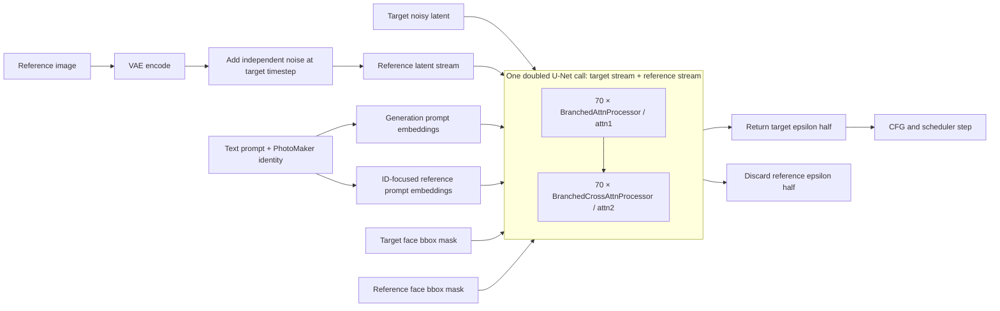

# Branched attention for improving PhotoMaker identity fidelity

Date: 18 July 2026

Status: research-review brief based primarily on the completed NN1a–NN1f
experiments.

Audience: an experienced researcher in diffusion models, personalized
generation, attention control, or face-identity conditioning.

## Requested review

We would like a critical assessment of:

1. whether the core branched-attention hypothesis is technically sound;
2. how this architecture relates to prior work on identity adapters,
   reference/mutual attention, and spatial controls;
3. why the current NN1 implementation transfers reference identity together
   with reference pose, layout, lighting, hair, and occluders;
4. whether the mechanism should be repaired, narrowed, or replaced;
5. what architectural and supervisory changes would most cleanly separate
   identity from target geometry and appearance.

This document intentionally separates implemented behavior, observed evidence,
and interpretation. The latest source also contains post-NN1 experimental
toggles, but the architecture described below is the NN1 route:

```text
reference K/V mode = masked full spatial grid
target-face mode   = absolute reference-attention update
layer scope        = all self-attention layers
```

## Executive summary

The project starts from PhotoMaker V2 and asks whether explicit spatial
reference attention can improve identity fidelity while retaining PhotoMaker's
strengths in pose, composition, prompt following, and image quality.

NN1 uses one target latent and one same-identity reference latent in a single
doubled U-Net batch. At every one of the 70 SDXL self-attention sites:

- target-background queries attend target K/V;
- target-face queries attend spatial K/V from the masked reference face;
- the reference stream also continues through its own self-attention;
- a target bbox selects where the reference-derived face update is used.

At all 70 cross-attention sites:

- the target stream attends the normal PhotoMaker-conditioned generation
  prompt;
- the reference stream attends an ID-focused face prompt.

The first half of the doubled U-Net output is returned as the denoising
prediction. There is no independent, protected PhotoMaker epsilon prediction
and no final PhotoMaker/BA epsilon merge during the BA stage.

The branch is unquestionably active. All NN1 variants move the face strongly
away from the same-seed PhotoMaker baseline. However, none produces a generally
usable improvement:

- trainable branched cross-attention causes severe color-mask and collage
  collapse;
- freezing branched cross-attention substantially improves photorealism;
- the remaining spatial self-attention still duplicates, folds, displaces, or
  erases features under yaw, expression, hair, goggles, hats, hands, and other
  occlusions;
- a decoded face-recognition loss increases the identity metric while sometimes
  smoothing away valid landmarks.

Our current interpretation is that the fundamental problem is not insufficient
branch strength. It is excessive and poorly aligned reference authority:
target-coordinate face queries receive unaligned reference-coordinate K/V, with
no explicit target-face attention candidate and no correspondence mechanism.

## 1. Research objective

### 1.1 Desired capability

Given:

- a text prompt describing the target image;
- one reference image of a person;
- a PhotoMaker-compatible trigger token;
- target and reference face boxes;

generate an image that:

- is recognizably closer to the reference identity than unmodified PhotoMaker;
- preserves the target pose, viewpoint, expression, framing, body, clothing,
  scene, lighting intent, and prompt semantics;
- preserves target-compatible hair, glasses, hats, hands, and other occluders;
- does not paste the reference face geometry into the target;
- does not introduce seams, duplicated landmarks, blank faces, color plates, or
  head/neck misalignment;
- is causally dependent on the supplied reference, rather than merely moving
  away from PhotoMaker.

### 1.2 Why start from PhotoMaker?

PhotoMaker provides a strong and efficient personalized-generation baseline.
Its central published idea is to encode one or more identity images into
stacked identity embeddings and inject those embeddings into the text
conditioning sequence. The local project uses the PhotoMaker V2 checkpoint
with an SDXL-family U-Net.

The motivation for branched attention is that compact identity embeddings may
discard fine local evidence. A spatial reference latent can, in principle,
retain eyes, brows, mouth shape, facial proportions, and other details that are
hard to compress into a few prompt tokens.

The competing risk is equally important: a spatial face representation also
contains pose, expression, crop position, illumination, hair, accessories, and
background. NN1 does not explicitly disentangle these factors.

### 1.3 Success is not “maximum face change”

The primary objective is a Pareto improvement over PhotoMaker:

```text
more reference-causal identity
+ equal or better face validity
+ preserved target geometry and prompt control
+ minimal change outside the intended identity region
```

Face distance from PhotoMaker is only evidence that the branch is active. It is
not evidence that identity improved.

## 2. High-level NN1 architecture



The doubled batch is structural, not two sequential U-Net evaluations:

```text
training without CFG: [target B, reference B]                    -> 2B
inference with CFG:   [target uncond/cond, reference uncond/cond] -> 4B
```

This approximately doubles U-Net batch memory and computation during BA-active
steps, but target and reference interact inside the same attention processors.

## 3. Inputs and conditioning

For each training sample, the model receives:

- a 1024×1024 target image;
- one associated same-identity reference face image from the dataset's
  reference pool;
- a target prompt assembled from facial, pose, and background captions;
- a target face bbox;
- a reference face bbox.

NN1 training uses the `cosmic_large` dataset configuration. The reference is
cropped around its face with a random margin in `[0.2, 0.6]`, may be
horizontally flipped, and has a 50% chance of downscale/upscale sharpness
jitter. These augmentations increase diversity but also make target/reference
spatial correspondence less predictable.

Strict correctness guards reject a complete microbatch if:

- the target bbox is invalid or empty;
- the reference bbox is invalid or empty;
- reference face recognition fails;
- installed processor topology or checkpoint state is inconsistent.

These guards prevent silent full-image masks, zero identity embeddings, and
partial checkpoint loading. They do not change the attention equations.

## 4. Target and reference latent preparation

Let:

- \(x_t\) be the scheduler-scaled noisy target latent at diffusion timestep
  \(t\);
- \(z_r = \operatorname{VAE}(I_r)\) be the reference image latent;
- \(\epsilon_r\) be independent Gaussian reference noise.

The reference stream is:

```text
xref,t = scheduler.scale_model_input(
    scheduler.add_noise(zref, εref, t),
    t,
)
```

The same timestep is used for target and reference, but the reference has its
own noise realization. During one inference trajectory, the implementation
keeps the same sampled reference noise across denoising steps.

The U-Net input is:

```text
X = concat_batch(xtarget,t, xreference,t)
```

No geometric warp, landmark alignment, canonicalization, optical flow, or
dense feature correspondence is applied between the two streams.

Questions for review:

- Is same-timestep noising enough to make spatial target/reference hidden
  states compatible?
- Does fixed reference noise improve trajectory consistency, or preserve an
  arbitrary nuisance pattern throughout denoising?
- Would a clean or differently noised reference memory be preferable?

## 5. Branched self-attention: the core mechanism

`BranchedAttnProcessor` replaces every `attn1` processor in the U-Net. Startup
assertions and logs confirm 70 installed self-attention processors.

At layer \(\ell\), split the hidden batch into:

```text
Ht ∈ R[B,L,C]  target hidden states
Hr ∈ R[B,L,C]  reference hidden states
```

Let \(M_t\) and \(M_r\) be target and reference face masks resized to the
current attention resolution. NN1 thresholds resized masks back to binary.

### 5.1 Target background update

The target-background branch is approximately:

```text
Qt  = Wq,target(Ht)
Kt  = Wk,target(Ht)
Vt  = Wv,target(Ht)

Qbg = (1 - Mt) ⊙ Qt
Abg = Attention(Qbg, Kt, Vt)
```

With `strict_face_routing=false`, background K/V is computed from the full
target hidden map, not a face-suppressed map. The final spatial merge applies
`Abg` only outside the face mask, but target face tokens can still be present
in its K/V context.

### 5.2 Target face update from reference K/V

The NN1 face branch is:

```text
Qface = Mt ⊙ Qt

Hr,face = Mr ⊙ Hr
Kr      = Wk,reference(Hr,face)
Vr      = Wv,reference(Hr,face)

Aref = Attention(Qface, Kr, Vr)
```

Important implementation details:

- `POSE_ADAPT_RATIO` is hardcoded to zero;
- there is no `Attention(Qface, Ktarget, Vtarget)` candidate in NN1;
- reference and target face coordinates are not aligned;
- `Hr,face` has the full `H×W` sequence length;
- outside-reference-face positions are zero-valued, but remain in the softmax
  as K/V positions;
- the reference bbox is a broad rectangle, not a semantic face-part mask.

Thus the face-attention update is reference-owned:

```text
Atarget-attention-face is absent
Aface = Areference
```

This statement applies to the self-attention update. It should not be
misinterpreted as deleting all target information from the U-Net:

- the processor applies the normal output projection;
- a processor-level residual may be added when the diffusers attention module
  enables it;
- transformer and U-Net residual paths continue around attention blocks;
- target prompt conditioning remains active.

The exact amount of target information surviving around the reference update
should be measured, not assumed.

### 5.3 Spatial merge

Before output projection:

```text
Atarget = (1 - Mt) ⊙ Abg + Mt ⊙ Aref
```

This merge occurs at every self-attention layer. It is not a final pixel-space
or epsilon-space face replacement.

Because subsequent convolutions, residual blocks, and attention layers process
the merged hidden state, local reference changes can propagate beyond the
literal bbox even though measured outside-face changes remain much smaller
than face changes.

### 5.4 Reference-stream continuation

The reference half also performs ordinary self-attention using reference-side
projection clones:

```text
Areference-stream = Attention(
    Wq,reference(Hr),
    Wk,reference(Hr),
    Wv,reference(Hr),
)
```

The output batch continues as:

```text
concat_batch(Atarget, Areference-stream)
```

The reference stream therefore evolves through all U-Net blocks instead of
serving as a static memory bank.

### 5.5 Why this is attractive

The design provides:

- spatially rich reference evidence at every self-attention resolution;
- target-coordinate queries, which in principle ask for details relevant to
  the current target location;
- one joint U-Net execution rather than a separate reference encoder;
- an explicit spatial target region;
- trainable reference- and target-side projection adapters.

### 5.6 Why this may be ill-posed

The same design assumes that attention can discover useful identity
correspondence between unaligned face grids at every layer. A target query for
a profile eye can attend a frontal eye, hair, glasses, mouth, or zero K/V
position. The result then receives full authority over the face-attention
update.

The mechanism has no explicit way to say:

```text
“reference evidence is uncertain here; retain target geometry”
```

This is the leading architectural explanation for NN1 artifacts.

## 6. Branched cross-attention

`BranchedCrossAttnProcessor` replaces all 70 `attn2` processors. It does not
directly make target face queries attend the face prompt. Instead, it assigns a
different text/identity context to each latent half.

Let:

- \(E_g\) be normal generation-prompt embeddings with PhotoMaker identity
  injection;
- \(E_f\) be an ID-focused face-prompt sequence.

The processor computes:

```text
Atarget,CA = Attention(
    Wq,target(Ht),
    Wk,target(Eg),
    Wv,target(Eg),
)

Areference,CA = Attention(
    Wq,reference(Hr),
    Wk,reference(Ef),
    Wv,reference(Ef),
)
```

The two outputs are concatenated and continue in their respective streams.
Identity from the reference prompt reaches the target primarily through later
branched self-attention interactions with the reference hidden stream.

### 6.1 Face-prompt construction

In NN1a/b/d/e/f:

- the fused PhotoMaker prompt is cloned for the reference half;
- only PhotoMaker ID-token positions are retained and amplified;
- most other token embeddings become zero;
- zero-token positions remain in the cross-attention softmax;
- the conditional and unconditional CFG halves are handled separately so the
  unconditional reference half retains a valid negative prompt;
- tokenwise standard deviation is matched to the generation prompt.

NN1c additionally supplies an additive attention mask that excludes non-ID
positions from the conditional reference softmax. In the usual 77-token
sequence this removes approximately 75 zero-token sink positions.

NN1c produced the strongest collapse. This implies that weak reference-prompt
conditioning was not the main problem; strengthening it amplified an unsafe
downstream spatial route.

## 7. Denoising schedule and output ownership

The 50-step inference schedule is:

| Denoising step | Active path |
|---:|---|
| 0–9 | text-only SDXL |
| 10–14 | ordinary PhotoMaker |
| 15–49 | full spatial branched attention |

At BA-active steps:

1. target and reference latents are concatenated;
2. the doubled U-Net executes;
3. the reference output half is discarded;
4. the target output half becomes the conditional/unconditional epsilon
   prediction used by CFG and the scheduler.

There is no parallel ordinary PhotoMaker epsilon prediction at these steps:

```text
εBA = first_half(UNet([xtarget, xreference]))
```

This differs materially from adapter architectures that keep the pretrained
prediction as an explicit baseline and add a bounded residual.

The staged schedule gives PhotoMaker five steps to establish target structure
before BA becomes active. However, BA still acts for 35 of 50 denoising steps,
including many detail-forming steps.

## 8. Trainable parameterization

The pretrained SDXL/RealVisXL U-Net and normal PhotoMaker components are
frozen for NN1. Training is restricted to cloned attention projections inside
the branched processors.

NN1a uses `noise_and_ref` mode with rank-32 LoRA projection clones:

```text
self-attention:
  target/noise Q, K, V
  reference Q, K, V

cross-attention:
  target/noise Q, K, V
  reference Q, K, V
```

The reference-side branch uses learning rate `5e-5`. Target/noise clones use a
`0.25` multiplier, or `1.25e-5`. AdamW uses weight decay `1e-2`, gradient
clipping `1.0`, and 2,000 warmup optimizer steps.

Observed trainability manifests:

| Runs | Trainable branch tensors | Main trainable groups |
|---|---:|---|
| NN1a–c | 1,680 | SA target/ref QKV + CA target/ref QKV |
| NN1d–e | 840 | SA target/ref QKV; CA executes but is frozen |
| NN1f | 280 | SA reference K and V only |

NN1a–c logs report 71,598,080 trainable BA parameters. Although each
projection modification is low-rank, the adapter is replicated across six Q/K/V
routes at every one of 140 attention sites, so this is not a tiny adapter in
aggregate.

Freezing a processor's weights does not remove it from the forward pass.
NN1d–f still execute split branched cross-attention at all 70 sites.

## 9. Training objectives

### 9.1 Diffusion objective

All six runs predict epsilon. The `masked_alternating` objective alternates:

- full-latent epsilon MSE;
- target-face-crop epsilon MSE.

With `trainer.masked_loss_step=2`, every second batch uses face-only diffusion
loss and the intervening batches use full-image diffusion loss.

This objective tells the model to reconstruct the training target, but it does
not explicitly say which reference attributes are identity and which must be
rejected as pose, expression, illumination, or occlusion.

### 9.2 Optional decoded identity objective

NN1e and NN1f add a differentiable identity loss when training timestep
`t <= 400`:

1. infer predicted clean latent \(\hat{x}_0\) from noisy latent and predicted
   epsilon;
2. decode \(\hat{x}_0\) through the frozen VAE;
3. crop the generated target bbox and trusted reference bbox;
4. resize both to 160×160;
5. embed them with frozen VGGFace2 InceptionResnetV1;
6. minimize cosine distance with weight `0.1`.

This loss increased the measured identity score, but sometimes rewarded
identity-correlated texture or smoothed face regions with missing landmarks.
It currently lacks an explicit face-validity, landmark, occlusion, or
counterfactual constraint.

### 9.3 Training protocol

All NN1 runs used:

- one GPU per run;
- physical and effective batch size 2;
- 10,000 optimizer steps;
- 1024×1024 training;
- full fixed 96-image validation at step 0 and every 2,000 steps;
- one reference image per target;
- same-seed PhotoMaker comparison;
- visual review as the primary decision criterion.

The historical protocol uses different but related SDXL-family bases:

- branch training instantiates `stabilityai/stable-diffusion-xl-base-1.0`;
- fixed-set validation instantiates `SG161222/RealVisXL_V4.0`;
- trained branched-processor state is strictly copied into the temporary
  validation model.

The reported visual comparisons are therefore evaluations of the learned
branch on the RealVisXL validation backbone, not same-backbone SDXL-base
samples. All NN1 variants share this protocol, so the within-family ablations
remain informative, but a publication-quality evaluation should include:

- same-backbone training and validation;
- cross-backbone transfer as a separate experiment;
- an unambiguous PhotoMaker baseline for each backbone.

## 10. NN1 ablation matrix

| Run | Isolated change | Question | Result |
|---|---|---|---|
| NN1a | guarded N3a replay | Is the original full spatial BA reproducible after correctness fixes? | Yes; destructive spatial drift reproduced |
| NN1b | train only in BA-active inference timestep region | Is train/inference timestep mismatch the cause? | No; similar mask/collage failure |
| NN1c | remove non-ID prompt-token softmax sinks | Is reference prompt too weak? | Stronger reference conditioning worsened collapse |
| NN1d | keep branched CA active but freeze CA projections | Is trainable split CA destabilizing? | Yes; this is the cleanest NN1, but geometry artifacts remain |
| NN1e | NN1d + decoded reference identity loss | Does direct ID supervision fix transfer? | Metric improves, but anatomy and detection can worsen |
| NN1f | NN1e + train only reference K/V in SA | Are target/noise updates the main geometry problem? | No; unsafe reference K/V remains |

## 11. Empirical results

### 11.1 Quantitative summary

Identity similarity is secondary evidence because a face recognizer can reward
partial or distorted identity-correlated structure.

| Run | Mean ID similarity at 10k | Face detections at 10k | Face RGB MAE versus same-seed PM |
|---|---:|---:|---:|
| NN1a | 0.1801 | 93/96 | 0.2000 |
| NN1b | 0.1715 | 93/96 | 0.2082 |
| NN1c | 0.1460 | 93/96 | 0.2533 |
| NN1d | 0.2272 | **96/96** | 0.1511 |
| NN1e | **0.2701** | 94/96 | 0.1600 |
| NN1f | 0.2472 | 95/96 | 0.1641 |

Face MAE measures movement from PhotoMaker, not quality. The outside-face MAE
remains approximately `0.038–0.044`, consistent with the visual observation
that body pose, clothing, scene, and background are substantially more stable
than the head.

### 11.2 Visual failure taxonomy

Four recurring failure classes dominate:

1. **Reference-layout overwrite.** A frontal or differently posed reference
   layout is imposed on target yaw or expression.
2. **Occluder collision.** Reference eyes/hair/face and target goggles, hats,
   hair, or hands are rendered simultaneously.
3. **Boundary mismatch.** Face width, jaw, hairline, and neck do not match the
   target head, producing pasted, elongated, or pinched transitions.
4. **Feature duplication or erasure.** Eyes, mouths, or glasses repeat; with
   identity loss, facial landmarks may instead be smoothed away.

NN1a–c also show high-contrast orange/white/black face plates and collage-like
regions. NN1d largely fixes the color collapse but not the geometric conflict.

### 11.3 Training dynamics

The models are not flat or dead:

- branch weight norms grow;
- face MAE changes substantially across checkpoints;
- every run reaches validation;
- all expected processor weights are copied into validation.

Training longer does not reveal a clean trajectory:

- NN1a/b become more strongly corrupted;
- NN1c is severely collapsed by 2k;
- NN1d improves early and then plateaus with the same hard-pose failures;
- NN1e's identity metric rises while face validity worsens;
- NN1f peaks around 6k and then regresses.

The failure therefore appears architectural rather than an optimizer-step or
GPU-count problem.

## 12. Current interpretation

### 12.1 What appears to work

- The branch is active and reference-sensitive enough to move faces.
- Target/background localization is useful.
- The staged schedule preserves much of PhotoMaker's body and scene structure.
- Frozen branched cross-attention is markedly safer than trainable branched
  cross-attention.
- Correctness guards make topology, data validity, and validation state
  trustworthy.
- A full reference latent does contain strong person-specific information.

### 12.2 What does not work

- A bbox is not a correspondence map.
- A masked full grid is not identity-only memory.
- Reference K/V as the sole face-attention candidate discards an explicit
  target geometry fallback.
- Applying the same ownership at all 70 layers conflates coarse geometry and
  fine appearance.
- Diffusion MSE does not teach identity/attribute disentanglement.
- The current face-recognition loss can exploit invalid visual shortcuts.
- PhotoMaker and BA both receive identity conditioning, making attribution
  ambiguous without swapped/null-reference tests.

### 12.3 Leading causal hypothesis

For a target query \(q_i\), the processor learns:

```text
softmax(q_i Kreference^T) Vreference
```

but neither the architecture nor loss establishes that reference token \(j\)
is the same semantic part, pose-compatible feature, or visibility state as
target query \(i\). Attention can confidently select the wrong evidence.

Because NN1 has no target-face attention candidate, a bad reference match is
still used. Repeating this at all resolutions and timesteps compounds the
error.

## 13. Relation to representative prior work

This is a starting comparison set for the external reviewer, not a complete
literature survey.

| Work/family | Relevant design | Contrast with NN1 |
|---|---|---|
| [PhotoMaker](https://arxiv.org/abs/2312.04461) | Stacked identity embeddings integrated into prompt conditioning | Compact semantic identity versus NN1's full spatial latent |
| [IP-Adapter](https://arxiv.org/abs/2308.06721) | Decoupled text and image cross-attention | Keeps image conditioning in a separate attention lane; NN1 replaces target-face self-attention with reference K/V |
| [InstantID](https://arxiv.org/abs/2401.07519) | Strong semantic identity plus weaker spatial landmark conditioning | Explicitly separates identity from spatial control; NN1 expects the reference latent to provide both implicitly |
| [PuLID](https://arxiv.org/abs/2404.16022) | ID branch, contrastive alignment, accurate ID loss, and emphasis on preserving original model behavior | Suggests stronger identity-specific supervision and a protected baseline rather than absolute spatial replacement |
| [ConsistentID](https://arxiv.org/abs/2404.16771) | Fine-grained multimodal facial information and facial attention localization | Suggests semantic face-part evidence rather than an undifferentiated bbox grid |
| [MasaCtrl](https://arxiv.org/abs/2304.08465) | Mutual self-attention with mask-guided source/target interaction | Conceptually closest to NN1; its handling of source-target query confusion and layer/timestep selection is especially relevant |

The most useful comparison dimensions are:

1. **Identity representation:** global embedding, multiple learned tokens,
   semantic face parts, or full spatial latent.
2. **Injection point:** text-token fusion, extra cross-attention, mutual
   self-attention, residual adapter, or direct feature replacement.
3. **Correspondence:** none, bbox, landmarks, segmentation, canonical parts,
   learned dense matching, or attention confidence.
4. **Authority:** absolute replacement, concatenated competition, bounded
   mixture, zero-init residual, or protected pretrained baseline.
5. **Layer/timestep scope:** all blocks versus selected resolutions and
   denoising stages.
6. **Supervision:** diffusion reconstruction, identity classification/cosine,
   contrastive correct/wrong identity, landmark validity, or preservation
   losses.
7. **Attribution:** whether changing only the reference predictably changes
   only identity.

## 14. Architectural questions for the reviewer

### Fundamental questions

1. Is full spatial reference K/V an appropriate identity representation, or
   does it make identity/pose disentanglement unnecessarily difficult?
2. Can target-query/reference-KV attention discover reliable correspondence
   without explicit alignment?
3. Should reference evidence ever be the only face-attention candidate?
4. Is a second evolving U-Net stream useful, or would a dedicated frozen
   reference encoder produce cleaner memory?
5. Does same-timestep reference noising improve compatibility or inject
   avoidable stochastic nuisance?

### Attention-design questions

6. Should target and reference candidates use separate softmaxes and then be
   arbitrated, rather than replacing or concatenating K/V?
7. Should arbitration be per layer, head, spatial query, timestep, or all four?
8. Is attention entropy a meaningful correspondence-confidence signal, or can
   wrong matches be confidently sharp?
9. Which U-Net resolutions should carry geometry, identity shape, and texture?
10. Should down/mid blocks remain target-owned while only up blocks transfer
    reference detail?

### Spatial-control questions

11. Would landmark-aligned or canonical face-part tokens be preferable to a
    normalized rectangular ROI?
12. How should visibility and occlusion be represented?
13. Should face boundary, hairline, jaw, neck, and accessories remain
    target-owned?
14. Would a face parser or dense correspondence model be robust enough for
    training and inference?

### Objective questions

15. What objective distinguishes identity from reference pose, expression,
    lighting, and accessories?
16. Should correct-, wrong-, and null-reference predictions be trained
    contrastively?
17. How can an identity loss be prevented from rewarding blank or malformed
    faces?
18. Should landmark/face-validity losses gate identity supervision?
19. Is epsilon-space supervision sufficient, or is low-noise decoded
    supervision essential?

### Baseline-preservation questions

20. Should the PhotoMaker prediction remain an explicit protected baseline?
21. If so, should BA be a zero-init hidden-state residual, an epsilon residual,
    or a gated attention delta?
22. Can a protected baseline coexist with the core mutual spatial-attention
    idea without reducing BA to a conventional adapter?

## 15. Candidate improvement directions

These are hypotheses for discussion, not claims that the solutions are
correct.

### A. Dual target/reference face-attention lanes

Compute separate candidates:

```text
Atarget    = Attention(Qtarget, Ktarget, Vtarget)
Areference = Attention(Qtarget, Kreference, Vreference)
```

Then combine them with a bounded per-head/layer gate:

```text
Aface = (1 - g) Atarget + g Areference
```

This preserves an explicit target geometry path and avoids direct K/V
concatenation competition.

### B. Packed, normalized reference ROI

Crop the reference hidden bbox at each resolution, normalize it to a fixed
grid, and attend only real ROI tokens. This removes:

- absolute full-image crop location;
- outside-bbox zero K/V softmax positions;
- variable reference token counts.

It does not by itself solve pose or semantic correspondence.

### C. Layer specialization

Use target K/V in down and mid blocks, and permit reference K/V only in selected
up blocks. This tests whether coarse target geometry can be protected while
late identity detail is transferred.

### D. Spatial ownership zones

Use reference attention in an inner identity core and target attention in a
boundary ring covering hairline, face edge, jaw, neck, and nearby occluders.

### E. Confidence-gated residual reference attention

Keep target self-attention as the absolute anchor:

```text
Aface = Atarget + tanh(g) · confidence · (Areference - Atarget)
```

Initialize `g=0` for exact target-attention parity. Confidence could use
attention entropy, cycle consistency, semantic-part agreement, or a learned
match score. Entropy alone may not detect confidently wrong matches.

### F. Semantic or geometric correspondence

Replace the undifferentiated reference grid with:

- canonical eyes/nose/mouth/contour tokens;
- landmark-relative features;
- face-parser regions;
- dense target-reference correspondences;
- visibility-aware part tokens.

The identity branch should not be allowed to transfer a part that is absent or
occluded in the target.

### G. Counterfactual identity supervision

For the same target latent and prompt, compare:

- correct reference;
- wrong-identity reference;
- null reference;
- BA-disabled output.

A useful model should respond strongly to correct/wrong identity changes inside
valid face regions while preserving pose, expression, color, occluders, and
background. This gives stronger causal evidence than an absolute recognizer
score.

### H. Protected PhotoMaker baseline

An alternative is to preserve the ordinary PhotoMaker prediction and learn a
bounded BA residual. This is safer, but it changes the original NN1 premise
from “one absolute mutual-attention prediction” to “PhotoMaker plus reference
correction.” A reviewer should assess whether preserving the original premise
is scientifically important or merely constraining the solution.

## 16. Missing experiments and evidence

Before claiming identity improvement, the following are still needed:

- same-seed correct/wrong/null-reference image grids;
- BA-on versus BA-off checkpoint comparisons;
- attention maps for hard pose and occlusion examples;
- layerwise intervention: target K/V versus reference K/V;
- landmark displacement and face-validity metrics;
- background, color, saturation, and edge-seam metrics;
- multiple reference poses per identity;
- evaluation on unseen identities and more varied demographics;
- comparison against unmodified PhotoMaker and representative identity
  adapters under a common protocol;
- statistical confidence intervals across seeds.

The current 96-image validation is useful for visual diagnosis but is not a
publication-grade benchmark.

## 17. Reproducibility and code map

Core implementation:

- `src/model/photomaker_branched/branched_runtime.py`
  - reference noising;
  - doubled latent and prompt batches;
  - processor installation;
  - direct target-half output.
- `src/model/photomaker_branched/attn_processor_cleanest.py`
  - `BranchedAttnProcessor`;
  - `BranchedCrossAttnProcessor`;
  - target/reference Q/K/V projection routes;
  - mask merge.
- `src/model/photomaker_branched/lora2.py`
  - training timestep sampling;
  - inference schedule;
  - optional decoded identity loss.
- `src/model/photomaker_branched/lora2_helpers.py`
  - strict processor checks;
  - bbox/reference validation;
  - trainable parameter selection.
- `src/loss/diffusion_loss.py`
  - alternating full/face epsilon MSE.
- `src/loss/id_loss.py`
  - optional FaceNet cosine loss.

NN1 configs:

- `src/configs/one_id_ba_NN1a_n3a_replay.yaml`
- `src/configs/one_id_ba_NN1b_schedule_matched.yaml`
- `src/configs/one_id_ba_NN1c_masked_id_prompt.yaml`
- `src/configs/one_id_ba_NN1d_frozen_ca.yaml`
- `src/configs/one_id_ba_NN1e_frozen_ca_id_loss.yaml`
- `src/configs/one_id_ba_NN1f_ref_kv_id_loss.yaml`

Key analysis artifacts:

- `Jul_new_exp/2026-07-17_NN1a_NN1f_results_and_NN2_architecture_plan.md`
- `Jul_new_exp/2026-07-17_NN1a_NN1f_implementation_and_launch_guide.md`
- `full_validation_results/ba_NN1a_NN1f_17Jul/full_val_report_NN1a_NN1f_vs_PM.pdf`
- `full_validation_results/ba_NN1a_NN1f_17Jul/NN1a_NN1f_closeup_faces_progression.png`
- `ba_architecture_explorer/index.html`

For the clearest interactive comparison, open the architecture explorer, select
V2, and compare NN1d against NN2-style proposals or N3a against NN1 variants.

## 18. Concise review prompt

The central question is:

> Can full spatial reference information improve PhotoMaker identity while
> target pose and appearance remain authoritative, or should identity be
> represented and injected in a fundamentally less spatially entangled way?

More specifically:

> Given the observed NN1 failures, what is the smallest principled change that
> preserves the useful target-query/reference-KV idea but introduces valid
> correspondence, target fallback, and identity-specific supervision?
