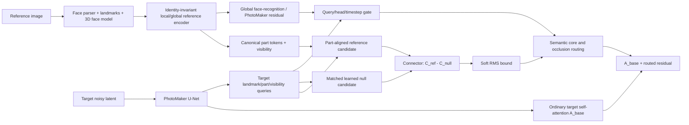

# Code-grounded review of branched attention for PhotoMaker V2

**Date:** 20 July 2026  
**Repository reviewed:** `kolyangg/rsrch`, branch `main_clean`  
**Reviewed commit:** `e58dba9fc8f23f2517b46e3ad9ed6cf3d3cb5bb9` (`20 Jul new run NN3a`)  
**Primary project brief:** `2026_07_18_branched_attention_photomaker_research_review_brief.md`  
**Scope:** source-code review, repository experiment reports, original PhotoMaker work, and related literature through 20 July 2026.

> **Important scope note.** This is a static code and research review. I did not rerun GPU training or generation. Findings labelled **verified in code** follow directly from the reviewed source; findings labelled **supported by project evidence** use the repository's experiment reports; proposed changes are research recommendations rather than measured results.

> **Design constraint accepted.** `pose_adapt_ratio=0` and `ca_mixing_for_face=false` are treated as intentional. I do **not** recommend re-enabling either as a remedy. They do not solve source–target correspondence and could reintroduce uncontrolled mixing.

---

## 1. Executive conclusion

### 1.1 Does the architecture make sense?

The **research hypothesis** makes sense:

> Target-coordinate queries may be able to retrieve identity-specific local evidence from a same-person reference representation that is richer than PhotoMaker's compact ID tokens.

The **legacy NN1 realization** does not make sense as a final architecture. It gives unaligned, nuisance-rich reference K/V absolute ownership of the target face-attention update at every self-attention site. A bounding box is not a correspondence map, and the branch has no target-face fallback. Face/body misalignment, duplicated landmarks, pasted geometry, occluder collisions, and color plates are therefore expected rather than surprising.

The newer **packed residual PPR/NN3 realization** is a sound safety scaffold. It makes the ordinary target self-attention the anchor, packs only valid reference ROI tokens, uses a zero-initialized bounded residual, limits injection to up-block self-attention, and can keep the ordinary PhotoMaker epsilon prediction exact outside a face core. That explains why the newer experiments preserve body pose, occluders, and head attachment much better.

However, PPR has not yet learned an **identity-causal residual**. The repository's latest diagnostics show that the branch is active and reference-content-sensitive, but changing the spatial reference does not reliably move the output identity toward the swapped reference. Its dominant effect is generic expression, texture, age, sharpness, or rendering modification. The next problem is therefore **semantic identifiability and causal supervision**, not branch strength.

### 1.2 Highest-priority actions

| Priority | Action | Why |
|---|---|---|
| **P0** | Fix classifier-free-guidance reference-noise pairing | The current inference path resamples reference noise after expanding the reference batch for CFG, so unconditional and conditional copies can receive different noise. This contaminates the CFG difference and creates a train/inference mismatch. |
| **P0** | Isolate the reference half from target pooled-text conditioning | Zeroing the reference token cross-attention does not neutralize SDXL's duplicated pooled `text_embeds`; expression and scene semantics still enter the reference stream globally. This is a plausible source of the generic expression shortcut. |
| **P0** | Make resolved backbone/config provenance unambiguous | The current source config states same-backbone validation, while the recorded NN3a run reports SDXL training and RealVisXL validation. Save the fully resolved Hydra config and model hashes with every run. |
| **P1** | Keep PPR, retire the legacy absolute-replacement route | PPR has already demonstrated much better geometric safety. More NN1 training is unlikely to solve its ill-posed correspondence. |
| **P1** | Add a real matched/null reference objective | A learned null memory alone does not force the output to depend on reference identity. Train matched and null variants with the same target latent, target noise, prompt, and timestep, and explicitly drive the null residual to zero. |
| **P1** | Replace bbox-only memory/routing with semantic or 3D-aligned part memory | Canonical eyes, nose, mouth, cheeks, and contour tokens with visibility/occlusion metadata are much safer than an undifferentiated rectangular ROI. |
| **P1** | Use query/head/timestep-dependent gates and lower high-resolution authority | A scalar gate per layer cannot reject a bad match for one eye, one head, or one denoising phase. Latest diagnostics already show the highest-resolution site dominates expression and texture changes. |
| **P2** | Use a stable reference encoder/cache instead of an evolving same-timestep noised reference stream | It removes reference-noise nuisance, lowers inference cost, and makes identity attribution easier. |

### 1.3 Recommended next experiment

Before another long run, build a **minimal NN3c correctness-and-causality screen**:

1. fix CFG reference-noise duplication;
2. construct separate target/reference `added_cond_kwargs`, neutralizing only the reference half's pooled text semantics;
3. compare `disable_branched_ca=true` against token-CA-zero, because frozen CA is still active in the current path;
4. use `reference_minus_learned_null`;
5. add an explicit null-residual loss;
6. run only `up_blocks.0` first, then add `up_blocks.1` with a much lower cap;
7. evaluate matched, wrong-ID, null, and second-noise references with identical target seeds and batch shapes.

Do not increase the runtime scale, gate maximum, or RMS cap until the swapped-reference output shows statistically reliable movement **toward the swapped identity**.

---

## 2. What PhotoMaker contributes—and what the spatial branch should add

### 2.1 Original PhotoMaker

PhotoMaker encodes one or more identity images, fuses each visual identity embedding with the prompt's person-class token, stacks those fused embeddings, and replaces the class-token position in the text sequence. The pretrained diffusion model's existing cross-attention then integrates identity and prompt semantics. Its identity representation is compact and semantic rather than spatially aligned to target pixels.

The official implementation makes this explicit: the fusion module concatenates prompt and ID embeddings, processes them with MLPs, and scatters the resulting stacked ID embeddings into class-token positions. The U-Net is not given a second spatial reference latent as an alternative self-attention memory.

### 2.2 PhotoMaker V2 in this project

The public V2 model card describes:

- a finetuned OpenCLIP ViT-H/14-based ID encoder plus fuse layers;
- LoRA weights on all U-Net attention layers with rank 64;
- improved single-image and Asian-face fidelity compared with V1.

No separate V2 technical report was found; the public V2 documentation still points to the V1 PhotoMaker paper. Consequently, claims about V2-specific training details should be based on code/model-card evidence, not an unpublished report.

### 2.3 Architectural implication

PhotoMaker V2 already supplies a strong **global semantic identity prior**. The spatial branch should not become a second, unrestricted face renderer. Its useful role is narrower:

> recover identity-specific local residual evidence that PhotoMaker misses, while target geometry, expression, visibility, hair, accessories, lighting intent, and prompt semantics remain authoritative.

This suggests a two-channel decomposition:

```text
PhotoMaker identity tokens  -> global identity and editability
Spatial identity residual   -> local identity details, correspondence-gated
Target U-Net state          -> geometry, pose, expression, occlusion, context
```

---

## 3. Reconstructed execution path on `main_clean`

The active code is concentrated in:

- [`branched_runtime.py`](https://github.com/kolyangg/rsrch/blob/e58dba9fc8f23f2517b46e3ad9ed6cf3d3cb5bb9/diffusion_template/src/model/photomaker_branched/branched_runtime.py)
- [`attn_processor_cleanest.py`](https://github.com/kolyangg/rsrch/blob/e58dba9fc8f23f2517b46e3ad9ed6cf3d3cb5bb9/diffusion_template/src/model/photomaker_branched/attn_processor_cleanest.py)
- [`packed_residual_attn_processor.py`](https://github.com/kolyangg/rsrch/blob/e58dba9fc8f23f2517b46e3ad9ed6cf3d3cb5bb9/diffusion_template/src/model/photomaker_branched/packed_residual_attn_processor.py)
- [`lora2.py`](https://github.com/kolyangg/rsrch/blob/e58dba9fc8f23f2517b46e3ad9ed6cf3d3cb5bb9/diffusion_template/src/model/photomaker_branched/lora2.py)
- [`lora2_helpers.py`](https://github.com/kolyangg/rsrch/blob/e58dba9fc8f23f2517b46e3ad9ed6cf3d3cb5bb9/diffusion_template/src/model/photomaker_branched/lora2_helpers.py)
- [`br_pipeline_helpers.py`](https://github.com/kolyangg/rsrch/blob/e58dba9fc8f23f2517b46e3ad9ed6cf3d3cb5bb9/diffusion_template/src/pipelines/br_pipeline_helpers.py)
- [`photomaker_branched_clean.py`](https://github.com/kolyangg/rsrch/blob/e58dba9fc8f23f2517b46e3ad9ed6cf3d3cb5bb9/diffusion_template/src/pipelines/photomaker_branched_clean.py)

The 50-step inference schedule is:

```text
steps  0–9   text-only SDXL
steps 10–14  ordinary PhotoMaker
steps 15–49  PhotoMaker + branched attention
```

At a branched step, the code:

1. starts with the target latent batch, already duplicated as `[uncond B, cond B]` under CFG;
2. encodes and noises the reference latent at the same diffusion timestep;
3. concatenates target and reference batches;
4. concatenates target and reference prompt contexts;
5. runs one doubled U-Net call with branched attention processors;
6. discards the reference U-Net output half;
7. optionally runs a second ordinary target-only U-Net pass and anchors the final epsilon outside the face core;
8. applies CFG and the scheduler update.

### 3.1 Important terminology distinction

These three settings are different:

- `ca_mixing_for_face=false`: no face-region mixture of target and face-prompt cross-attention outputs;
- `train_branched_ca_lora=false`: branched cross-attention projections are frozen;
- `disable_branched_ca=true`: the split reference/target cross-attention processors are not installed.

The current PPR inheritance freezes branched CA but normally still executes all 70 split cross-attention processors. Thus “CA mixing is off” does **not** mean the reference stream is free of text conditioning.

---

## 4. Legacy NN1: why face/body alignment and artifacts fail

### 4.1 Implemented equation

For target hidden states `H_t`, reference hidden states `H_r`, target mask `M_t`, and reference mask `M_r`, the legacy face route is effectively:

```text
Q_face = M_t * Wq(H_t)
K_ref  = Wk(M_r * H_r)
V_ref  = Wv(M_r * H_r)
A_face = Attention(Q_face, K_ref, V_ref)
```

The background route uses target K/V, and the target map is merged spatially:

```text
A_target = (1 - M_t) * A_background + M_t * A_face
```

Because `POSE_ADAPT_RATIO=0`, there is no explicit target-face attention candidate in the legacy path. Because `CA_MIXING_FOR_FACE=false`, target face queries also do not gain a compensating face-prompt cross-attention mixture. The reference stream continues to evolve through the same U-Net.

### 4.2 Why this is ill-posed

#### Unaligned coordinates

The target query may represent a profile eye, while the reference memory contains a frontal eye, mouth, glasses, hair, or background at unrelated positions. The model is asked to discover correspondence implicitly at every layer and resolution.

#### Nuisance-rich memory

The reference hidden grid contains identity together with pose, expression, crop, illumination, hair, accessories, occluders, and reference noise. Nothing in the architecture labels which dimensions are identity-invariant.

#### Absolute reference authority

There is no mechanism that says:

```text
"This reference match is uncertain or pose-incompatible; keep target geometry."
```

A wrong reference match still becomes the face-attention update.

#### Zero-token softmax sinks

Masking the full reference grid by multiplication leaves out-of-ROI positions in the attention sequence. Their K/V vectors may be zero or near-zero, but they remain softmax competitors. This is both inefficient and semantically ambiguous.

#### Repetition across all self-attention layers

The same ownership rule is applied at coarse geometry-forming and late detail-forming layers. Errors can compound across 70 self-attention sites and 35 denoising steps.

#### Bounding-box boundary mismatch

A rectangle does not distinguish internal facial identity from target-owned hairline, ears, jaw boundary, neck, glasses, hats, hands, or other occluders. An inserted frontal jaw or cheek width can be incompatible with the generated head and body.

### 4.3 Verdict on NN1

Retire NN1 as a production candidate. Keep it only as a negative-control architecture demonstrating why absolute, unaligned spatial ownership fails. Re-enabling pose adaptation would merely blend two undifferentiated attention candidates with a global scalar; it would not establish correspondence. Re-enabling CA mixing would add another source of identity/prompt conflict and is not a principled fix.

---

## 5. Packed residual PPR/NN3: what it fixes and what remains

### 5.1 Implemented PPR equation

At selected up-block self-attention sites, PPR first computes ordinary base self-attention for both streams:

```text
A_t = Attention(Q_t, K_t, V_t)
A_r = Attention(Q_r, K_r, V_r)
```

It then packs only reference tokens selected by the ROI mask and computes:

```text
C_ref = Attention(Q_t, K_ref_packed, V_ref_packed)
```

The connector input is one of:

```text
NN2:  C_ref - A_t
NN3a: C_ref - 0
NN3b: C_ref - C_null_learned
```

A zero-initialized low-rank connector produces a delta, which is RMS-capped and gated:

```text
raw_delta     = Up(Down(connector_input))
bounded_delta = RMSCap(raw_delta, A_t, cap)
g              = gate_max * sigmoid(gate_logit)
A_out          = A_t + M_core * g * runtime_scale * bounded_delta
```

The reference stream keeps ordinary base self-attention. A second ordinary PhotoMaker U-Net prediction can then anchor final epsilon outside `M_core`:

```text
epsilon_out = epsilon_PM + M_core * (epsilon_PPR - epsilon_PM)
```

### 5.2 What PPR gets right

- **Exact pretrained anchor at initialization.** `connector_up` is zero-initialized.
- **Target geometry fallback.** Target self-attention remains the base rather than being removed.
- **No zero-token full-grid memory.** Reference ROI tokens are packed and padding is masked with `-inf`.
- **Bounded authority.** Gate and RMS cap limit the residual magnitude.
- **Layer restriction.** Injection is limited to up-block self-attention rather than all layers.
- **Boundary protection.** A feathered inner core leaves a target-owned ring.
- **Output protection.** Ordinary PhotoMaker epsilon can be preserved exactly outside the core.
- **Better observed geometry.** Repository diagnostics report stable body, pose, clothing, hands, occluders, and face attachment, with no pervasive duplicated or displaced face patches.

These are substantial improvements. PPR should remain the base for the next iteration.

### 5.3 Why PPR is not yet identity-causal

#### `reference_minus_target` has an explicit shortcut

The connector can learn from the stable `-A_t` term and target queries even when the reference-varying component is weak. Diffusion reconstruction rewards any useful face correction; it does not require that correction to be controlled by reference identity.

#### `reference_minus_null` with a zero candidate is not a contrast

`C_ref - 0` simply equals `C_ref`. It removes the explicit `-A_t` shortcut, but no matched null reference is encoded, no null forward is performed, and no loss requires the null residual to be zero.

#### A learned null memory is necessary but insufficient

`C_ref - C_null` is more principled because both candidates use the same query and K/V projection route. However, without matched/null training, the learned null can become an average face memory while the connector still learns generic expression or rendering corrections.

#### The memory is still not identity-disentangled

Packing removes softmax sinks and absolute full-image crop location, but it does not remove reference pose, expression, lighting, hair, or accessories. Nor does it create semantic eye-to-eye or mouth-to-mouth correspondence.

#### The gate is too coarse

There is one scalar gate per processor. It cannot vary by:

- attention head;
- target query position;
- facial part;
- correspondence quality;
- visibility/occlusion;
- denoising timestep.

#### High-resolution sites can dominate nuisance detail

The latest diagnostics report much larger reference sensitivity in `up_blocks.1` than `up_blocks.0`, consistent with expression, texture, age, and sharpness being easier to transfer than stable identity geometry.

---

## 6. Verified code issues and design risks

### 6.1 P0 correctness defect: CFG reference copies receive different noise

**Status: verified in code.**

During setup, `_ref_noise` is sampled with the unexpanded reference batch shape `[B, C, H, W]`. In `two_branch_predict`, `reference_latents` is first repeated to match the CFG generation batch `[2B, C, H, W]`. The code then checks whether `_ref_noise.shape == reference_latents.shape`; the check fails and `_ref_noise` is resampled at shape `2B`.

This means the reference stream is normally:

```text
unconditional reference = z_ref + epsilon_ref,U
conditional reference   = z_ref + epsilon_ref,C
```

rather than:

```text
unconditional reference = z_ref + epsilon_ref
conditional reference   = z_ref + epsilon_ref
```

The CFG difference therefore includes reference-noise variation in addition to text-conditioning variation. With guidance scale 5, this nuisance difference is extrapolated. Training does not use CFG, so this is also a train/inference mismatch.

A diagnostic `ppr_reference_noise_seed` sampled during setup can also be overwritten by this shape-triggered resampling. Setup-time noise hashes therefore do not, by themselves, prove that the actual expanded tensor used by the U-Net is controlled.

#### Required patch

Cache base reference noise at the output-image batch size and duplicate it exactly for CFG:

```python
base_batch = latent_model_input.shape[0] // 2 if do_cfg else latent_model_input.shape[0]

ref_latents_base = match_reference_batch(reference_latents, base_batch)
ref_noise_base = get_or_sample_cached_noise(ref_latents_base)  # shape B

if do_cfg:
    reference_latents_used = torch.cat([ref_latents_base, ref_latents_base], dim=0)
    reference_noise_used = torch.cat([ref_noise_base, ref_noise_base], dim=0)
else:
    reference_latents_used = ref_latents_base
    reference_noise_used = ref_noise_base
```

Then assert and log:

```python
assert torch.equal(reference_noise_used[:B], reference_noise_used[B:])
assert torch.equal(ref_noised[:B], ref_noised[B:])
```

Use a separate name such as `_ref_noise_base` so expanded-shape checks cannot silently resample it.

### 6.2 P0 conditioning leak: target pooled text is duplicated into the reference half

**Status: verified in code; causal impact is a strong hypothesis.**

The neutral reference-CA ablation zeros `face_prompt_embeds`, which controls the token sequence used by `BranchedCrossAttnProcessor`. However, the doubled U-Net kwargs are built by concatenating every tensor with itself. Consequently, SDXL `added_cond_kwargs["text_embeds"]`—the pooled target prompt embedding—is also supplied to the reference half.

In SDXL, pooled text conditioning is incorporated through the added timestep/text embedding path, not only through token cross-attention. The reference stream therefore remains globally conditioned on target prompt semantics such as expression, style, lighting, and scene even when reference token CA is zeroed.

This gives a code-grounded explanation for why the neutral-CA experiment could retain generic prompt/expression behavior: it neutralized one text route, not all text routes.

#### Required ablation and likely patch

Build target and reference added conditions separately:

```python
target_added = {
    "text_embeds": target_pooled,
    "time_ids": target_time_ids,
}
reference_added = {
    "text_embeds": neutral_face_pooled,  # or reference-ID-specific pooled context
    "time_ids": target_time_ids,
}

doubled_kwargs["text_embeds"] = torch.cat(
    [target_added["text_embeds"], reference_added["text_embeds"]], dim=0
)
doubled_kwargs["time_ids"] = torch.cat(
    [target_added["time_ids"], reference_added["time_ids"]], dim=0
)
```

Run four inference-only conditions on the same checkpoint:

1. current token CA + current pooled text;
2. zero token CA + current pooled text;
3. current token CA + neutral reference pooled text;
4. zero token CA + neutral reference pooled text.

This isolates token-level and pooled/global prompt leakage.

### 6.3 Frozen branched CA is still active

**Status: verified in code.**

`train_branched_ca_lora=false` freezes projection parameters but does not restore standard cross-attention. The target half still attends the generation prompt while the reference half attends the face/ID prompt at all 70 `attn2` sites.

For a clean spatial-memory experiment, add `disable_branched_ca=true` as a first-class ablation. This does not re-enable CA mixing; it removes the split reference text route.

### 6.4 Reference counterfactuals are confounded by target-ID conditioning

In `face_embed_strategy=id`, the reference half normally receives a prompt derived from the target's PhotoMaker-conditioned prompt. During a swapped-spatial-reference diagnostic, target PhotoMaker identity can therefore conflict with the swapped spatial identity in the reference stream.

The repository already tested token-CA neutralization and found it insufficient. Because pooled target semantics remain, the more complete test is:

```text
spatial R2 reference
+ neutral token CA
+ neutral reference pooled text
+ target PhotoMaker path unchanged
```

A second useful condition supplies the **actual R2 identity embedding only to the reference half** while keeping target PhotoMaker identity fixed. This distinguishes failure to encode R2 from failure to transmit R2.

### 6.5 RMS cap protects magnitude but encourages hidden saturation

**Status: verified in code and supported by training diagnostics.**

`cap_scale` is detached before multiplying `raw_delta`. The forward value is capped, but backpropagation does not include the derivative of the inverse-norm scaling. The optimizer can therefore continue increasing pre-cap magnitude even when the visible output is saturated. The repository's NN3a report observes widespread cap saturation and growing raw connector weights.

Keep the cap for safety, but add one of:

- a differentiable smooth norm bound;
- an explicit penalty `relu(pre_cap_ratio - target_ratio)^2`;
- weight/spectral normalization on connector projections;
- a curriculum that learns direction before allowing larger magnitude.

Do not simply raise the cap.

### 6.6 The output anchor changes the effective training objective

**Status: verified by composition of the code paths.**

With `base_outside_core`, the final target epsilon equals the no-grad PhotoMaker baseline outside the core. A full-image MSE still reports error outside the core, but that part contributes no gradient to the branch. The nominal blended loss therefore is not the actual gradient weighting:

- the full-image term only trains through the small core;
- the face-crop term trains only where the core overlaps the crop;
- outside-core error adds a constant component to the logged loss.

Log separate quantities:

```text
trainable core MSE
frozen outside-core baseline MSE
face-crop/core intersection MSE
```

Prefer an explicit core-normalized diffusion loss for the branch. This improves signal-to-noise and makes the configured `lambda_face` interpretable.

### 6.7 Bbox-derived core is not semantic ownership

The core mask is built from the rectangle's min/max extents and cosine-feathered inward. It has no knowledge of:

- facial skin versus hair;
- eyes, nose, mouth, and contour;
- glasses, hands, hats, or foreground hair;
- jaw/neck boundary;
- profile-side visibility.

This is adequate as a safety envelope, not as an identity routing map.

### 6.8 Packed ROI preserves content but not explicit correspondence

Packing retains raster order, and hidden tokens contain convolutional context, but there is no explicit landmark-relative coordinate, semantic-part ID, 3D pose, or visibility code. Target queries can still attend confidently to the wrong facial part. Attention entropy is not sufficient: a semantically wrong match can be sharp.

### 6.9 Run provenance conflict

The current PPR config comments that training and validation use the same SDXL base, with `pretrained_model_for_validation_name_or_path: null`. The recorded NN3a run report, however, states SDXL-base training and RealVisXL validation. This may be a command-line or launcher override, but publication-quality analysis should not leave it implicit.

Save for every run:

- fully resolved Hydra YAML;
- exact base model IDs and revisions/hashes;
- checkpoint SHA;
- branch commit SHA;
- all command-line overrides;
- validation pipeline model hash.

Treat same-backbone evaluation as primary and cross-backbone transfer as a separate experiment.

### 6.10 Compute cost

PPR with output anchoring performs:

- one doubled target/reference U-Net call; plus
- one ordinary target-only U-Net call.

During branched steps this is roughly three target-batch equivalents, before memory overhead. A cached/static reference encoder would materially reduce cost and simplify attribution.

---

## 7. Interpreting the repository's latest evidence

Repository reports used for this synthesis:

- [`2026-07-20_PPR_8k_reference_vs_noise_results_and_next_recommendations.md`](https://github.com/kolyangg/rsrch/blob/e58dba9fc8f23f2517b46e3ad9ed6cf3d3cb5bb9/diffusion_template/Jul_new_exp/2026-07-20_PPR_8k_reference_vs_noise_results_and_next_recommendations.md)
- [`2026-07-20_PPR_8k_neutral_reference_CA_results_and_next_steps.md`](https://github.com/kolyangg/rsrch/blob/e58dba9fc8f23f2517b46e3ad9ed6cf3d3cb5bb9/diffusion_template/Jul_new_exp/2026-07-20_PPR_8k_neutral_reference_CA_results_and_next_steps.md)
- [`2026-07-20_NN3a_4k_metrics_training_diagnosis_and_stop_decision.md`](https://github.com/kolyangg/rsrch/blob/e58dba9fc8f23f2517b46e3ad9ed6cf3d3cb5bb9/diffusion_template/Jul_new_exp/2026-07-20_NN3a_4k_metrics_training_diagnosis_and_stop_decision.md)
- [`2026-07-20_NN3b_architecture_and_cross_server_launch.md`](https://github.com/kolyangg/rsrch/blob/e58dba9fc8f23f2517b46e3ad9ed6cf3d3cb5bb9/diffusion_template/Jul_new_exp/2026-07-20_NN3b_architecture_and_cross_server_launch.md)

The latest PPR reports support the following sequence:

1. **The branch is not bypassed.** Gate, connector, and reference K/V weights move; scale sweeps produce large face changes.
2. **Reference content reaches the connector.** R1/R2 differences exceed reference-noise differences at internal reference and connector tensors.
3. **The output remains geometrically localized.** Body, pose, clothing, hands, and background are stable; face detection remains high.
4. **The change is not identity-directed.** Swapping R1 to R2 does not consistently increase similarity to R2, while strong PPR scaling lowers similarity to the original identity.
5. **The dominant visible factors are expression/rendering.** Mouth opening, eye closure, emotional intensity, age, texture, and sharpness change more reliably than identity.
6. **The high-resolution site dominates.** `up_blocks.1` shows much greater reference sensitivity than `up_blocks.0`.
7. **Neutralizing reference token CA does not solve the problem.** This rules out token CA as the sole cause, but it does not rule out pooled target-text conditioning in the reference half.
8. **NN3a's zero-null subtraction is not a causal null test.** The branch remains weak at scale 1 and saturates raw deltas at many training sites.

The correct conclusion is not that spatial reference attention is impossible. It is that the current features and losses do not identify **which reference variation is identity**.

---

## 8. Related work and concrete lessons

The most useful literature is not simply “other face adapters”; it is work that separates identity from geometry, routes identity regionally, preserves a pretrained baseline, or enforces causal/reference dependence.

| Work | Relevant mechanism | Lesson for this project |
|---|---|---|
| [PhotoMaker, CVPR 2024](https://arxiv.org/abs/2312.04461) | Stacked semantic ID embeddings replace person-class tokens and are integrated through existing cross-attention. | Keep PhotoMaker as the global semantic identity anchor; use spatial memory only for missing local residual evidence. |
| [IP-Adapter, 2023](https://arxiv.org/abs/2308.06721) | Decoupled image and text cross-attention lanes. | Separate image-reference authority from text authority instead of replacing target self-attention. |
| [MasaCtrl, 2023](https://arxiv.org/abs/2304.08465) | Mask-guided mutual self-attention with layer/timestep selection. | Source–target attention needs carefully selected layers, steps, and masks; “all layers, all late steps” is unsafe. |
| [InstantID, 2024](https://arxiv.org/abs/2401.07519) | Strong semantic identity plus weaker landmark/spatial condition. | Identity and geometry should be represented separately rather than inferred from one raw spatial latent. |
| [FlashFace, 2024](https://arxiv.org/abs/2403.17008) | Multi-scale face feature maps with disentangled integration. | Rich spatial features can help, but their injection must be explicitly disentangled from text/editability. |
| [PuLID, NeurIPS 2024](https://arxiv.org/abs/2404.16022) | Protected standard diffusion branch, lightning ID branch, contrastive alignment, accurate ID loss. | Preserve the base model and supervise ID-specific variation; PPR's protected baseline is directionally correct. |
| [ConsistentID, 2024](https://arxiv.org/abs/2404.16771) | Fine-grained multimodal face information and facial attention localization. | Replace a rectangular face grid with localized, semantically meaningful facial evidence. |
| [Arc2Face, 2024](https://arxiv.org/abs/2403.11641) | Identity-only face-recognition embedding used as conditioning. | A strong identity-invariant representation is a useful complement to local spatial detail. |
| [Face2Diffusion, 2024](https://arxiv.org/abs/2403.11207) | Multi-scale ID encoding, expression guidance, and class-denoising regularization. | Train identity invariance against expression and other identity-irrelevant attributes rather than relying on pixel reconstruction alone. |
| [DreamCache, CVPR 2025](https://openaccess.thecvf.com/content/CVPR2025/html/Aiello_DreamCache_Finetuning-Free_Lightweight_Personalized_Image_Generation_via_Feature_Caching_CVPR_2025_paper.html) | Caches reference features from selected layers and one timestep; lightweight adapters modulate generation. | A static/cached reference memory is a strong alternative to a noisy evolving reference U-Net stream. |
| [DynamicID, ICCV 2025](https://openaccess.thecvf.com/content/ICCV2025/html/Hu_DynamicID_Zero-Shot_Multi-ID_Image_Personalization_with_Flexible_Facial_Editability_ICCV_2025_paper.html) | Query-level Semantic-Activated Attention gating. | Gate identity by query relevance, not with one scalar per layer. |
| [UniPortrait, ICCV 2025](https://openaccess.thecvf.com/content/ICCV2025/html/He_UniPortrait_A_Unified_Framework_for_Identity-Preserving_Single-_and_Multi-Human_Image_ICCV_2025_paper.html) | Decoupled ID embeddings and adaptive regional routing. | Identity representation and spatial routing should be separate modules. |
| [InfiniteYou, ICCV 2025](https://openaccess.thecvf.com/content/ICCV2025/html/Jiang_InfiniteYou_Flexible_Photo_Recrafting_While_Preserving_Your_Identity_ICCV_2025_paper.html) | Residual identity injection and multi-stage SPMS data to improve alignment and reduce copy-paste. | Residual injection is safer, but data must vary pose/context for one identity and explicitly discourage reference copying. |
| [Visual Persona, CVPR 2025](https://openaccess.thecvf.com/content/CVPR2025/html/Nam_Visual_Persona_Foundation_Model_for_Full-Body_Human_Customization_CVPR_2025_paper.html) | Body-region decomposition, local features, and dense identity embeddings. | Region/part decomposition is more robust than one monolithic ROI, especially for full-body consistency. |
| [DynamicFace, ICCV 2025](https://openaccess.thecvf.com/content/ICCV2025/html/Wang_DynamicFace_High-Quality_and_Consistent_Face_Swapping_for_Image_and_Video_ICCV_2025_paper.html) | Composable 3D facial priors and separate high-level/detail identity routes. | Explicit 3D pose/expression structure is a practical way to preserve target attributes while injecting identity. |
| [SpatialID, 2026](https://arxiv.org/abs/2602.13994) | Spatially adaptive masks plus temporal-spatial scheduling. | Identity injection should vary across space and denoising time, not remain uniformly active for 35 steps. |
| [Diff-PC, 2026](https://arxiv.org/abs/2602.00639) | 3D face priors, local/global ID encoder, geometry-guided alignment and injection. | Use target/reference 3D geometry to align identity evidence instead of asking attention to discover alignment from raw grids. |
| [AnyPhoto, 2026](https://arxiv.org/abs/2603.14770) | RoPE-aligned location canvas, identity-adaptive modulation, identity-isolated attention, and reference degradation. | Add explicit location/identity separation and train against copy-paste shortcuts. |
| [EmojiDiff, WACV 2026](https://openaccess.thecvf.com/content/WACV2026/html/Jiang_EmojiDiff_Advanced_Facial_Expression_Control_with_High_Identity_Preservation_in_WACV_2026_paper.html) | Identity-irrelevant expression data and ID-enhanced contrastive alignment. | Build data/objectives that explicitly separate expression from identity, matching the project's dominant failure mode. |
| [ID-constrained diffusion face swapping, CVPR 2026](https://openaccess.thecvf.com/content/CVPR2026/html/He_High-Fidelity_Diffusion_Face_Swapping_with_ID-Constrained_Facial_Conditioning_CVPR_2026_paper.html) | Identity-first training followed by attribute alignment with decoupled conditions. | Consider staged optimization: establish identity direction first, then restore target pose/expression attributes. |

### Literature synthesis

Across these works, the recurring successful pattern is:

```text
identity-invariant representation
+ explicit spatial or geometric routing
+ bounded/residual injection
+ region/query/timestep adaptivity
+ data or loss that separates identity from pose/expression/context
```

The current PPR implementation has the bounded/residual component but lacks the other four strongly enough.

---

## 9. Recommended vNext architecture

I recommend a **Geometry-Aligned Causal Identity Residual (GACIR)** rather than another raw spatial-attention variant.

### 9.1 Overview



### 9.2 Identity memory

Use two complementary reference representations:

1. **Global identity embedding** from ArcFace/InsightFace or the PhotoMaker ID encoder, trained to be invariant to pose and expression.
2. **Canonical local part tokens** for:
   - left/right eye and brow;
   - nose;
   - upper/lower mouth;
   - cheeks;
   - central forehead;
   - identity-bearing contour, only when visible.

Each part token should include:

- semantic part ID;
- canonical 2D or 3D coordinate;
- reference pose;
- visibility confidence;
- occlusion probability;
- local identity feature;
- optional texture/detail feature separated from geometry.

For multiple references, aggregate per part across views with visibility-aware attention. A frontal reference can supply both eyes; a profile reference should not be forced to supply the hidden eye.

### 9.3 Target geometry remains authoritative

Extract target facial geometry from either:

- a target preview/PhotoMaker baseline;
- a predicted clean latent at selected steps;
- a lightweight landmark/3D head predictor;
- target U-Net features trained to predict semantic parts.

Create target queries with part and target-pose encodings. Route each target part only to compatible reference parts. Hair, ears, neck, jaw boundary, hands, glasses, hats, and foreground occluders remain target-owned unless explicitly modelled.

### 9.4 Residual candidate

For target query `q_i` and part-aware reference memory:

```text
C_ref,i  = Attn(q_i + p_target,i, K_ref + p_ref, V_ref)
C_null,i = Attn(q_i + p_target,i, K_null + p_part, V_null)
Delta_i  = Connector(C_ref,i - C_null,i)
```

Do **not** subtract `A_target` inside the connector. The target base already appears as the additive anchor.

### 9.5 Adaptive gate

Replace the scalar layer gate with:

```text
g = sigmoid(MLP[
    target_query,
    global_ID,
    semantic_part,
    match_score,
    visibility,
    occlusion,
    layer_id,
    logSNR(t)
])
```

At minimum, make the gate per head and per query. A practical low-cost version can factorize it:

```text
g(layer, head, query, t)
= g_layer * g_head * g_query * g_time
```

Initialize the final gate projection to zero so the exact PhotoMaker path is preserved.

### 9.6 Semantic ownership masks

Use a face parser/occlusion model to build:

```text
M_identity = internal face skin + visible internal features
M_boundary = hairline + jaw/face edge + ears + neck transition
M_occluder = glasses + hair strands + hats + hands + foreground objects
```

Apply:

```text
M_apply = M_identity * (1 - M_occluder)
```

Keep `M_boundary` target-owned or use a much smaller gate. This directly addresses face-to-head and face-to-neck seams.

### 9.7 Layer and timestep policy

Start conservatively:

- **down/mid blocks:** no spatial reference injection;
- **first attention-bearing up block:** identity shape/proportion residual, moderate cap;
- **higher-resolution up block:** fine details only, much lower cap and later/shorter schedule;
- **last 15–20% of denoising:** decay the high-resolution gate to prevent expression/texture takeover.

A suggested initial policy:

```text
up_blocks.0: active over middle 45–75% of denoising, cap 0.15
up_blocks.1: active over middle 55–70%, cap 0.05
other sites: off
```

These numbers are starting points for ablation, not claimed optima.

### 9.8 Stable reference encoder or cache

The preferred long-term design is a separate frozen reference encoder or DreamCache-like feature cache:

- encode the clean reference or a fixed low-noise reference once;
- extract selected multi-scale features;
- canonicalize and pack semantic part tokens;
- reuse the memory across all denoising steps.

This removes per-step reference noise, avoids an evolving reference U-Net that absorbs target prompt semantics, reduces compute, and makes the reference contribution easier to test.

If the doubled stream is retained temporarily, compare:

1. same-timestep noised reference;
2. fixed low-noise reference;
3. clean cached reference features;
4. reference stream with token and pooled text both neutralized.

---

## 10. Training objectives that enforce identity causality

### 10.1 Matched/null paired training

For the same target latent, target noise, timestep, prompt, and target conditioning, compute:

```text
matched reference -> residual Delta_match
null reference    -> residual Delta_null
```

Use:

```text
L_null = ||Delta_null||^2
L_dep  = margin - distance(Delta_match, Delta_null)
```

or a normalized contrastive equivalent. The null path must pass through the same reference encoder/projections, not be inserted as `zeros_like(C_ref)` after attention.

### 10.2 Same-identity nuisance invariance

For two references of identity A with different pose, expression, lighting, crop, hair, and accessories:

```text
Delta(A, ref1) ≈ Delta(A, ref2)
```

after accounting for visibility and part availability. This directly teaches the branch to ignore reference nuisance variation.

### 10.3 Wrong-identity counterfactuals

A wrong reference B cannot be supervised with the original target-A pixel reconstruction alone; that objective tells the model to ignore B. Use one of:

- synthetic paired targets with the same pose/expression/context but identity B;
- a face-swap/3D rendering teacher;
- an identity-space counterfactual loss on predicted clean faces while target pose/expression losses preserve geometry;
- contrastive residual representation before image decoding.

For a generated face `G_B` conditioned on wrong/swapped reference B:

```text
L_swap_id   = 1 - sim(FR(G_B), FR(B))
L_pose      = distance(Pose(G_B), Pose(target))
L_expr      = distance(Expression(G_B), Expression(target))
L_boundary  = seam/segmentation consistency
```

Apply the ID term only when face detection, landmark confidence, and image validity pass strict gates.

### 10.4 PhotoMaker-ID attenuation

The NN3b idea is reasonable: sometimes reduce target PhotoMaker identity so the branch cannot remain irrelevant. Improve it by sampling a continuum rather than a single hard 0/1 split:

```text
alpha_PM ~ {1.0, 0.75, 0.5, 0.25, 0.0}
```

Add identity consistency across attenuation levels while keeping pose/text outputs stable. Keep full PhotoMaker batches in the mixture so inference at `alpha_PM=1` remains in-distribution.

Do not preserve the target's full ID prompt in the reference half during a reference-causality batch; otherwise the branch can receive identity through text instead of the spatial reference.

### 10.5 Geometry and validity losses

Use a gated combination of:

- face-recognition identity loss;
- 2D landmark consistency;
- 3DMM pose and expression consistency;
- face parsing/occlusion consistency;
- face-validity detector loss or rejection;
- boundary gradient/seam loss;
- outside-core epsilon or LPIPS preservation;
- anti-copy loss comparing generated and reference pose/layout.

The current VGGFace2 cosine loss alone can reward smoothed or malformed identity-correlated texture. It needs validity and geometry guards.

### 10.6 Smooth magnitude regularization

Add:

```text
L_cap = mean(relu(pre_cap_ratio - cap_target)^2)
L_gate = small sparsity/entropy regularizer on query gates
```

The goal is a sparse, semantically useful residual, not a large raw delta hidden behind a hard cap.

---

## 11. Minimal implementation plan

### Phase A — correctness, no retraining

1. **Fix CFG reference-noise duplication.**
2. **Hash the actual expanded noise and noised reference used by the U-Net.**
3. **Neutralize reference pooled text separately from token CA.**
4. **Add `disable_branched_ca=true` diagnostic.**
5. **Force equal batch shapes for every paired comparison.**
6. **Confirm zero-weight PPR equals ordinary PhotoMaker under CFG for batch sizes 1 and 2.**

Suggested tests:

```text
test_cfg_reference_noise_is_identical_between_uncond_cond
test_reference_noise_seed_controls_actual_unet_tensor
test_ppr_zero_connector_exact_pm_under_cfg
test_ppr_batch_size_invariance
test_reference_pooled_text_ablation_isolated
test_disable_branched_ca_restores_standard_attn2
```

### Phase B — minimal NN3c training

Keep:

- PPR packed ROI;
- base target self-attention;
- zero-initialized connector;
- output anchor;
- pose adaptation off;
- CA mixing off.

Change:

- learned null memory;
- explicit matched/null paired loss;
- neutral or reference-derived reference text conditioning;
- core-normalized diffusion loss;
- differentiable/supervised cap;
- only `up_blocks.0` initially;
- query/head gate if implementation budget permits.

### Phase C — semantic geometry

Add:

- face parser and occlusion mask;
- canonical facial part tokens;
- 3D/landmark-relative positional encodings;
- visibility-aware routing;
- `up_blocks.1` at a lower cap after `up_blocks.0` proves identity direction.

### Phase D — stable reference memory

Replace the evolving reference U-Net stream with a cached reference encoder and measure:

- identity direction;
- pose/expression preservation;
- reference-noise sensitivity;
- inference cost;
- memory usage.

---

## 12. Evaluation protocol and stop criteria

### 12.1 Required counterfactual matrix

For each target seed and prompt:

```text
PM0      branch off
R1N1     matched reference, noise 1
R2N1     wrong/swapped reference, same noise 1
R1N2     matched reference, noise 2
NULL     null reference, same target state
```

All conditions must share:

- target latent;
- target seed;
- target prompt and PhotoMaker embedding;
- scheduler and guidance;
- target mask;
- batch size and ordering;
- model weights and base model;
- actual reference noise where specified.

### 12.2 Metrics

Report at least:

- face-recognition similarity to original, matched, and swapped identities;
- **directional identity gain** toward R2;
- reference-content effect versus reference-noise effect;
- face detection and landmark validity;
- target pose and expression deviation;
- face-core LPIPS/MAE;
- outside-core LPIPS/MAE;
- boundary seam/gradient metric;
- CLIP text alignment;
- per-site gate, pre-cap ratio, cap fraction, and applied residual ratio;
- confidence intervals across identities and seeds.

A useful directional score is:

```text
D_R2 = [sim(G(R2), R2) - sim(G(R1), R2)]
     - [sim(G(R2), R1) - sim(G(R1), R1)]
```

Positive movement away from PhotoMaker is not sufficient; `D_R2` must be reliably positive.

### 12.3 Stratification

Stratify results by:

- yaw/pitch;
- expression magnitude;
- face size;
- hair/hat/glasses/hand occlusion;
- lighting mismatch;
- reference/target pose difference;
- demographic groups;
- unseen identities;
- one versus multiple reference images.

### 12.4 Stop criteria

Stop a branch configuration when, after a reasonable calibration sweep:

- matched/wrong reference swaps do not produce positive identity direction beyond noise;
- higher scale mainly changes expression/texture;
- face validity or landmark accuracy falls below PhotoMaker;
- the high-resolution site saturates without directional gain;
- null reference produces a nontrivial residual;
- outside-core preservation fails.

---

## 13. Direct answers to the two requested questions

### Question 1: Does the current architecture make sense, and what should be tweaked?

- **Legacy NN1:** no, not as a final architecture. Its absolute, unaligned reference-face update is the principal source of face/body mismatch and artifacts.
- **PPR/NN3:** yes, as a safe experimental scaffold. Keep its target base, packed ROI, zero-init residual, selected layers, cap, inner core, and epsilon anchor.
- **Do not re-enable pose adaptation or CA mixing.** They do not address the core failure.
- **Fix CFG reference-noise pairing immediately.** This is a concrete inference correctness issue.
- **Neutralize reference pooled prompt conditioning.** Current CA-neutralization is incomplete.
- **Do not increase branch strength.** The current residual is semantically wrong, not too weak.
- **Replace bbox-only routing with semantic/3D part correspondence and occlusion-aware ownership.**
- **Add an explicit matched/null causal objective and gated identity/geometry losses.**
- **Reduce high-resolution authority and use per-query/head/timestep gates.**

### Question 2: What recent architectural improvements are most useful?

The most transferable ideas from 2024–2026 work are:

1. **protected residual identity branch** rather than absolute replacement (PuLID, InfiniteYou);
2. **query-level or regional routing** (DynamicID, UniPortrait, SpatialID);
3. **identity/geometry separation** using landmarks or 3D priors (InstantID, DynamicFace, Diff-PC);
4. **static selected reference features** rather than an evolving noisy full reference stream (DreamCache);
5. **identity-adaptive modulation and isolated attention** (AnyPhoto);
6. **data and contrastive objectives that explicitly remove expression/pose shortcuts** (Face2Diffusion, EmojiDiff, InfiniteYou);
7. **semantic part decomposition and dense local identity features** (ConsistentID, Visual Persona, FlashFace).

The best next architecture is therefore not “stronger branched attention.” It is **a geometry-aligned, visibility-aware, causally supervised identity residual attached to the protected PhotoMaker prediction**.

---

## 14. Recommended decision

Proceed with PPR as the base, but pause any long run that only changes gate, cap, scale, or training duration. Implement the two P0 code corrections and run the complete text-conditioning/noise ablation first. If the branch still lacks swapped-identity direction, move directly to matched/null causal training plus semantic or 3D-aligned part memory.

The smallest principled change that preserves the target-query/reference-KV idea is:

```text
ordinary target self-attention
+ packed, part-aligned reference candidate
- matched learned null candidate
+ zero-init bounded residual
+ per-query/head/timestep gate
+ semantic identity/occlusion mask
+ matched/null and identity-direction supervision
```

That retains the scientifically interesting spatial retrieval hypothesis while adding the three missing ingredients identified in the project brief: **correspondence, target fallback, and identity-specific supervision**.

---

## 15. Selected references

1. Li et al., [PhotoMaker: Customizing Realistic Human Photos via Stacked ID Embedding](https://arxiv.org/abs/2312.04461), CVPR 2024.
2. Ye et al., [IP-Adapter: Text Compatible Image Prompt Adapter for Text-to-Image Diffusion Models](https://arxiv.org/abs/2308.06721), 2023.
3. Cao et al., [MasaCtrl: Tuning-free Mutual Self-Attention Control for Consistent Image Synthesis and Editing](https://arxiv.org/abs/2304.08465), 2023.
4. Wang et al., [InstantID: Zero-shot Identity-Preserving Generation in Seconds](https://arxiv.org/abs/2401.07519), 2024.
5. Zhang et al., [FlashFace: Human Image Personalization with High-fidelity Identity Preservation](https://arxiv.org/abs/2403.17008), 2024.
6. Guo et al., [PuLID: Pure and Lightning ID Customization via Contrastive Alignment](https://arxiv.org/abs/2404.16022), NeurIPS 2024.
7. Huang et al., [ConsistentID: Portrait Generation with Multimodal Fine-Grained Identity Preserving](https://arxiv.org/abs/2404.16771), 2024.
8. Papantoniou et al., [Arc2Face: A Foundation Model for ID-Consistent Human Faces](https://arxiv.org/abs/2403.11641), 2024.
9. Chen et al., [Face2Diffusion for Fast and Editable Face Personalization](https://arxiv.org/abs/2403.11207), 2024.
10. Aiello et al., [DreamCache](https://openaccess.thecvf.com/content/CVPR2025/html/Aiello_DreamCache_Finetuning-Free_Lightweight_Personalized_Image_Generation_via_Feature_Caching_CVPR_2025_paper.html), CVPR 2025.
11. Hu et al., [DynamicID](https://openaccess.thecvf.com/content/ICCV2025/html/Hu_DynamicID_Zero-Shot_Multi-ID_Image_Personalization_with_Flexible_Facial_Editability_ICCV_2025_paper.html), ICCV 2025.
12. He et al., [UniPortrait](https://openaccess.thecvf.com/content/ICCV2025/html/He_UniPortrait_A_Unified_Framework_for_Identity-Preserving_Single-_and_Multi-Human_Image_ICCV_2025_paper.html), ICCV 2025.
13. Jiang et al., [InfiniteYou](https://openaccess.thecvf.com/content/ICCV2025/html/Jiang_InfiniteYou_Flexible_Photo_Recrafting_While_Preserving_Your_Identity_ICCV_2025_paper.html), ICCV 2025.
14. Nam et al., [Visual Persona](https://openaccess.thecvf.com/content/CVPR2025/html/Nam_Visual_Persona_Foundation_Model_for_Full-Body_Human_Customization_CVPR_2025_paper.html), CVPR 2025.
15. Wang et al., [DynamicFace](https://openaccess.thecvf.com/content/ICCV2025/html/Wang_DynamicFace_High-Quality_and_Consistent_Face_Swapping_for_Image_and_Video_ICCV_2025_paper.html), ICCV 2025.
16. Li and Ye, [SpatialID: Inject Where It Matters](https://arxiv.org/abs/2602.13994), 2026.
17. Xu et al., [Diff-PC](https://arxiv.org/abs/2602.00639), 2026.
18. Yuan, [AnyPhoto](https://arxiv.org/abs/2603.14770), 2026.
19. Jiang et al., [EmojiDiff](https://openaccess.thecvf.com/content/WACV2026/html/Jiang_EmojiDiff_Advanced_Facial_Expression_Control_with_High_Identity_Preservation_in_WACV_2026_paper.html), WACV 2026.
20. He et al., [High-Fidelity Diffusion Face Swapping with ID-Constrained Facial Conditioning](https://openaccess.thecvf.com/content/CVPR2026/html/He_High-Fidelity_Diffusion_Face_Swapping_with_ID-Constrained_Facial_Conditioning_CVPR_2026_paper.html), CVPR 2026.
