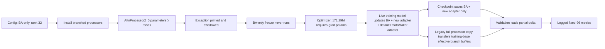

# Branched-attention plateau analysis and architecture recommendations

**Date:** 1 August 2026  
**Repository:** `diffusion_template` on branch `test`  
**Scope:** architecture, optimization, checkpointing, and validation code for
the Large Dataset and BigCelebs SA-only branched-attention runs  
**Status:** analysis only; no training job was launched and no model code was
changed

## Executive answer

The two runs are strong evidence that explicit reference-conditioned branched
self-attention is useful, but they do **not** show that the model has exhausted
the available identities or that rank 32 is the capacity ceiling.

The most important finding is a correctness failure that must be fixed before
any rank sweep:

> Both runs were configured as `train_ba_only=true`, but a swallowed exception
> prevented the BA-only freeze from executing. The optimizer contained
> **171.29M requires-grad parameters**, including the pretrained rank-64
> PhotoMaker adapter, the new rank-32 generic U-Net adapter, and the rank-32 BA
> processors. Checkpointing and alternate-base validation then saved/loaded
> only the new adapter and BA processor deltas, omitting the updates made to the
> pretrained PhotoMaker adapter.

Consequently, the live training network, the saved network, and the network
used for validation were not the same. The logged validation curves remain
useful evidence that a saved BA-containing path works, but they cannot be
interpreted as a clean rank-32 BA-only capacity experiment.

The recommended order is:

1. Make trainable ownership, saving, loading, and validation fail closed.
2. Re-establish a clean rank-32 BA-only baseline.
3. Replace the current hard face-attention replacement with a
   **key-masked, residual reference-attention branch** that preserves the
   frozen target/PhotoMaker path.
4. Add branch-specific output capacity and learned layer/timestep gates.
5. Only then compare rank 32 with rank 64, restricted to the reference branch.
6. After self-attention is stable, add a corrected decoupled branched
   cross-attention path in which **target queries** attend explicit identity
   tokens.

The central proposed equation is:

```text
target base:      y_base = SA(Q_target, K_target, V_target)
reference branch: y_ref  = SA(Q_target, K_reference_face, V_reference_face,
                              true_reference_key_mask)
merged target:    y      = y_base + target_face_mask * gate(layer, t, face_scale)
                                      * reference_output_adapter(y_ref)
```

This keeps the project invariant intact: target queries consume explicit
reference K/V. It does not mix target features into reference K/V, so
`pose_adapt_ratio=0` remains true. It also gives the model a target-native
geometry path without making target K/V an identity substitute.

## Evidence reviewed

### Runs

| Dataset | Run | Immutable Comet ID | Accepted images | Identities | Complete validation range |
|---|---|---|---:|---:|---:|
| Large Dataset | `rhca_large_dataset_sameid_40k_full96_r4` | [`a99db1fb953d4511827672380e6c1645`](https://www.comet.com/nikolay-2104/jul-comet-large-testing-tr/a99db1fb953d4511827672380e6c1645) | 47,500 | 2,561 | 0–34k |
| BigCelebs v2 | `rhca_big_celebs_sameid_40k_full96_r1` | [`569cc685ff9144f5a9b42bf70e14e040`](https://www.comet.com/nikolay-2104/jul-comet-large-testing-tr/569cc685ff9144f5a9b42bf70e14e040) | 349,348 | 68,648 | 0–32k |

By accepted-image count BigCelebs is **7.35 times** larger, and by identity
count it is **26.8 times** larger. Both runs use the same fixed 96-image
validation panel, seed, prompts, reference images, generated/reference bboxes,
RealVisXL V4 validation base, scheduler, 50 inference steps, CFG, and metrics.

The source download note is
[`docs/experiments/2026-08-01_large_dataset_big_celebs_comet_downloads.md`](../docs/experiments/2026-08-01_large_dataset_big_celebs_comet_downloads.md).
Exact run specifications are:

- [`experiments/large_dataset/rhca_large_dataset_sameid_40k_full96_r4.json`](../experiments/large_dataset/rhca_large_dataset_sameid_40k_full96_r4.json)
- [`experiments/big_celebs/rhca_big_celebs_sameid_40k_full96_r1.json`](../experiments/big_celebs/rhca_big_celebs_sameid_40k_full96_r1.json)

### Shared intended architecture and optimization

```text
training base                    SDXL base 1.0
validation base                  RealVisXL V4.0
branched self-attention          enabled at every attention site
branched cross-attention         disabled
target/reference projection mode noise_and_ref
BA projection kind               LoRA
configured BA rank               32
train_ba_only                    true
pose_adapt_ratio                 0
ca_mixing_for_face               false
train_ba_all_steps               true
batch size                       2
loss                             face-crop epsilon MSE on every update
learning rate                    1e-4
warmup                           20 optimizer steps
post-warmup schedule             constant
weight decay                     0
gradient clipping                disabled
trainable dtype                  bfloat16 in the observed startup audit
```

These values are present in both immutable Comet exports, not inferred only
from the current Hydra files.

## 1. What the training behaviour uncovers

### 1.1 It is a broad equilibrium, not a sharp 10k ceiling

The Large Dataset trajectory continues making noisy gains after 10k and peaks
on identity at 24k. BigCelebs enters a broad 10k–24k identity plateau and then
regresses. A concise view is:

| Run | ID at 0 | ID at 10k | Best ID | ID at final complete step | Text at 2k | Text at final | Best face mean |
|---|---:|---:|---:|---:|---:|---:|---:|
| Large Dataset | .3063 | .3571 | **.3904 at 24k** | .3797 at 34k | 27.3566 | 27.1602 | .7126 at 26k |
| BigCelebs | .3063 | .3723 | **.3817 at 18k** | .3628 at 32k | **27.8118** | 26.5828 | .6933 at 10k |

For BigCelebs, identity falls by `.0189` from its 18k peak to 32k and text
falls by `1.2290` from 2k to 32k. Face mean also falls from `.6933` at 10k to
`.6816` at 32k. This is not a model simply waiting to see more data; continued
updates are trading away some previously acquired behavior.

The full checkpoint tables are in the appendix.

### 1.2 Data exhaustion cannot explain the BigCelebs result

At batch size 2:

| Run/event | Optimizer steps | Target samples consumed | Fraction of one image pass |
|---|---:|---:|---:|
| Large Dataset identity peak | 24,000 | about 48,000 | about 1.01 passes |
| BigCelebs identity peak | 18,000 | about 36,000 | about 10.3% |
| BigCelebs final complete validation | 32,000 | about 64,000 | about 18.3% |

At most 36,000 identity occurrences can appear in the first 36,000 BigCelebs
samples, so at least 32,648 of its 68,648 identities cannot have appeared by
the 18k peak; repeats make the actual unseen count larger. The plateau is
therefore an architecture/objective/optimization limit under the current
training contract, not saturation of the identity pool.

The Large Dataset peak near one pass is compatible with some dataset-scale
overfitting. The BigCelebs peak at one tenth of a pass falsifies that as a
general explanation.

### 1.3 BA learns useful identity quickly, then identity and prompt gradients compete

BigCelebs gains about `.0975` identity similarity from 2k to 18k while text
similarity loses about `1.188`. Face-only epsilon MSE is applied at every
update, while generic U-Net and cross-attention adapters were unintentionally
trainable. This creates a direct route for the optimizer to improve the face
objective by altering prompt-conditioned features rather than by making the
reference branch more discriminative.

The likely equilibrium is:

```text
more reference/face adaptation
        improves average identity and face sharpness
        but increasingly changes target/text features
        and does not fix reference-to-target spatial ambiguity
        -> aggregate identity oscillates and text degrades
```

This reading is consistent with the earlier full-Cosmic experiments: hard
action, small-face, and occluded-face cases retained sharp but misplaced,
duplicated, or mask-like features while easier faces improved.

### 1.4 The current branch has a hidden face-area-dependent gain

Reference features outside the bbox are multiplied by zero, but those tokens
are still included in the softmax denominator. If the reference face occupies
a fraction `f` of the feature map and logits are initially similar, only about
`f` of the attention probability mass reaches nonzero face values. Therefore,
branch amplitude depends strongly on reference-face occupancy even when the
same identity information is present.

This provides a mechanistic explanation for why larger-face/cropped-reference
experiments often improve quickly: they are not only providing better pixels;
they are implicitly increasing branch gain. A true key mask would normalize
attention over valid reference-face tokens and separate information quality
from bbox area.

### 1.5 Structurally good averages do not prove that routing is solved

The fixed-96 face coverage is near one in much of both runs, and average face
quality is materially above step 0. That supports the user's observation that
the model is structurally much healthier than early Cosmic experiments.

However:

- BigCelebs face mean peaks at 10k and declines later.
- Large Dataset p10 peaks at 24k and falls from `.6034` to `.5530` at 32k.
- A small spot check of the downloaded 2k/20k panels found generally coherent
  scenes, but persistent eye/hand interaction errors and a more mask-like
  Jisoo face in one dynamic example.
- Earlier exhaustive fixed-96 reviews showed that crisp crop-based IQA can
  reward a geometrically wrong face.

The plateau should therefore be judged with the fixed hard prompt subset and
per-image paired deltas, not only the mean identity or mean TOPIQ-Face curve.

### 1.6 The logged curve measures only part of the network being optimized

Because the default PhotoMaker adapter was unintentionally trainable but not
saved or transferred to validation, optimization could place useful updates
in a parameter set that the validator never saw. This can itself create an
apparent validation plateau: training gradients continue to move two parallel
adapters, while validation observes only one of them.

This is the strongest reason not to respond to the current curves by simply
doubling rank.

## 2. Current architecture and code issues

### 2.1 Intended versus actual state flow



### 2.2 Critical: BA-only installation fails open

In
[`lora2_helpers.py`](../src/model/photomaker_branched/lora2_helpers.py), lines
86–120, installation does this:

```python
for proc in model.unet.attn_processors.values():
    for p in proc.parameters():
        p.requires_grad_(True)

configure_branched_trainables(model)
```

With branched CA disabled, the map contains ordinary diffusers
`AttnProcessor2_0` instances, which are not `nn.Module` objects and do not have
`.parameters()`. Both run logs begin with:

```text
[PhotomakerBranchedLora] exception while installing branched processors:
'AttnProcessor2_0' object has no attribute 'parameters'
```

The broad `except` prints the error and returns. It prevents
`configure_branched_trainables()` from reaching lines 46–83, where the U-Net
would be frozen and the intended BA parameters selectively re-enabled.

The startup audit then reports:

```text
total trainable: 3080 tensors / 171.29M params
Processor params in optimizer: 840/840
```

The second line was treated as a pass, but it checks only that processor
parameters are included. It does not check that unwanted parameters are
excluded.

#### Parameter reconstruction

The exact 171.29472M count can be reconstructed from the SDXL attention
layout and configured ranks:

| Requires-grad group | Rank | Parameters | Intended? | Saved? |
|---|---:|---:|---|---|
| BA `noise_to_{q,k,v}` + `ref_to_{q,k,v}` | 32 | 31.94880M | Yes for the historical config | Yes |
| New generic `lora_adapter` across SA and CA | 32 | 46.44864M | No under `train_ba_only` | Yes |
| Pretrained PhotoMaker `default` adapter across SA and CA | 64 | 92.89728M | No; should stay pretrained/frozen | **No** |
| **Total** | | **171.29472M** | | |

Some generic-adapter tensors—principally patched self-attention Q/K/V—are
likely forward-dormant because the processor calls its cloned projections
instead. The forward-active estimate is still about **123.37M**, because both
generic adapters remain active in self-attention output projections and all
ordinary cross-attention projections. This estimate is an inference from the
active code; 171.29M is directly observed.

#### Required repair

Installation must fail closed, and the allowlist must be checked before the
optimizer is created. The processor-wide `requires_grad_(True)` loop is
unnecessary because `configure_branched_trainables()` owns this decision.

Illustrative diff:

```diff
 def install_branched_processors_for_training(model) -> None:
-    try:
-        patch_unet_attention_processors(...)
-        for proc in model.unet.attn_processors.values():
-            for p in proc.parameters():
-                p.requires_grad_(True)
-        configure_branched_trainables(model)
-    except Exception as e:
-        print(f"... exception ...: {e}")
+    try:
+        patch_unet_attention_processors(...)
+        configure_branched_trainables(model)
+        assert_branched_trainable_contract(model)
+    except Exception as exc:
+        raise RuntimeError(
+            "Branched processor installation/trainable ownership failed"
+        ) from exc
```

The assertion should verify all of the following, not a hard-coded count
alone:

```python
trainable = {name for name, p in model.unet.named_parameters() if p.requires_grad}
expected = expected_trainable_names_from_ba_config(model)
if trainable != expected:
    raise RuntimeError({
        "missing": sorted(expected - trainable),
        "unexpected": sorted(trainable - expected),
    })
```

For the exact historical SA-only, `noise_and_ref`, rank-32 contract, the
expected audit is 840 tensors and 31,948,800 parameters, with no
`.default.`, `.lora_adapter.`, or `.attn2.` trainables.

### 2.3 Critical: checkpoints omit a trained adapter

[`lora2.py`](../src/model/photomaker_branched/lora2.py), lines 188–218, creates
and activates both the pretrained `default` PhotoMaker adapter and the new
`lora_adapter`. Because the freeze failed, both have `requires_grad=true`.

But `get_state_dict()` at lines 274–299 saves only:

```python
get_peft_model_state_dict(self.unet, adapter_name="lora_adapter")
```

plus trainable processor deltas. It never saves the changed `default` adapter.
Both full and weights-only checkpoints call this same method
([`base_trainer.py`](../src/trainer/base_trainer.py), lines 1039–1075).

Consequences:

- A resumed run reloads pretrained `default` weights but restores optimizer
  moments accumulated for the missing updated weights.
- A standalone checkpoint cannot reconstruct the live training model.
- Alternate-base validation never sees the live default-adapter updates.
- The full live model state from the stopped runs is not recoverable from the
  saved files. Their logged validation state remains reproducible because the
  validator also omitted that adapter.

#### Required repair

First freeze the default adapter. Independently, make serialization capture
**every** trainable parameter and store an architecture manifest so a future
ownership change cannot be silently omitted.

Illustrative schema:

```diff
 def get_state_dict(self):
-    return {"lora_weights": ..., "attn_processors": ...}
+    trainable_names = tuple(
+        name for name, p in self.unet.named_parameters() if p.requires_grad
+    )
+    return {
+        "schema_version": 2,
+        "architecture": self.branched_architecture_manifest(),
+        "trainable_unet": {
+            name: dict(self.unet.named_parameters())[name].detach().cpu()
+            for name in trainable_names
+        },
+    }

 def load_state_dict_(self, state):
+    assert_architecture_manifest_matches(self, state["architecture"])
+    expected = set(self.expected_trainable_names())
+    received = set(state["trainable_unet"])
+    if expected != received:
+        raise RuntimeError(...)
+    with torch.no_grad():
+        for name, value in state["trainable_unet"].items():
+            dict(self.unet.named_parameters())[name].copy_(value)
```

Keep a version-1 compatibility loader for historical checkpoints; do not
rewrite their meaning.

### 2.4 Critical for interpretation: validation is a hybrid of two bases

The run trains on SDXL base 1.0 and validates on RealVisXL V4. That base switch
is intentional and must remain controlled. The issue is the processor copy at
[`base_trainer.py`](../src/trainer/base_trainer.py), lines 667–685:

```python
v_proc.load_state_dict(t_proc.state_dict(), strict=False)
```

`BranchLoRALinear.state_dict()` includes `base_weight` and `base_bias` buffers
cloned from the training-base attention modules. Those effective weights
contain the SDXL training backbone plus the initially loaded PhotoMaker
`default` adapter delta. The loop therefore replaces the validation model's
RealVis-native branch projection bases with training-base effective buffers.
The resulting model is roughly:

```text
RealVis U-Net
  + RealVis/PhotoMaker ordinary output and cross-attention projections
  + SDXL-training-base + initial PhotoMaker cloned Q/K/V inside branched SA
  + saved BA and lora_adapter deltas
  - omitted trained default-adapter delta
```

The standalone evaluator already recognizes this distinction and exposes
`validation_native` versus `legacy_full_copy` in
[`evaluate_rhca_checkpoint.py`](../tools/inference/evaluate_rhca_checkpoint.py),
lines 204–286. The in-training validator always performs the legacy full copy
when `update_proc_weights_val=true`.

This does not invalidate comparisons within these two runs because their
policy is consistent. It does mean the scalar values are not measurements of
a clean RealVis-native delta deployment.

#### Required repair without breaking comparability

Add an explicit, recorded mode:

```yaml
validation_processor_base_mode: legacy_full_copy  # historical protocol
```

and branch the code:

```diff
 _val_model.load_state_dict_(state)
-for name, t_proc in train_unet.attn_processors.items():
-    v_procs[name].load_state_dict(t_proc.state_dict(), strict=False)
+if config.validation_processor_base_mode == "legacy_full_copy":
+    copy_full_processor_state_with_exact_audit(...)
+elif config.validation_processor_base_mode == "validation_native":
+    assert_validation_base_buffers_unchanged(...)
+else:
+    raise ValueError(...)
```

Run both modes once on a fixed existing checkpoint. Preserve
`legacy_full_copy` for historical comparisons. If `validation_native` is
adopted for new architectures, give that validation contract a new explicit
protocol version; do not silently replace the old series.

### 2.5 High: reference masking does not mask attention keys

In
[`attn_processor_cleanest.py`](../src/model/photomaker_branched/attn_processor_cleanest.py),
lines 325–355:

```python
ref_face_hidden = ref_hidden * ref_mask_flat
key_face = self._k_ref(attn, ref_face_hidden)
value_face = self._v_ref(attn, ref_face_hidden)
hidden_face = F.scaled_dot_product_attention(
    q_face, key_face, value_face, dropout_p=0.0, is_causal=False
)
```

Zeroed tokens remain legal keys. They consume softmax probability and make
reference strength dependent on bbox area. If any projection has bias, zero
hidden tokens can also produce nonzero K/V.

Required implementation:

```python
ref_keep = self._prepare_mask(self.mask_ref, ref_len, batch_size).squeeze(-1)
# [B, 1, 1, L_ref], True means the key is allowed.
ref_key_mask = ref_keep.unsqueeze(2).bool()
if not ref_key_mask.flatten(1).any(dim=1).all():
    raise RuntimeError("Every sample must expose at least one reference key")

key_face = self.ref_to_k(ref_hidden)
value_face = self.ref_to_v(ref_hidden)
hidden_ref = F.scaled_dot_product_attention(
    q_target,
    key_face,
    value_face,
    attn_mask=ref_key_mask,
    dropout_p=0.0,
    is_causal=False,
)
```

Confirm the bool-mask semantics against the installed PyTorch version with a
tiny deterministic tensor before implementation. Log valid key counts and
face-area fractions by layer.

### 2.6 High: the face path is a replacement, not a bounded residual

The current processor computes target background attention and
reference-only face attention, then hard merges them at lines 382–396:

```python
merged = hidden_bg * (1 - mask_flat) + hidden_face * mask_flat * self.scale
hidden_states = attn.to_out[0](merged)
```

Inside the target face, there is no ordinary target self-attention output.
The module residual still carries the incoming target feature when
`strict_face_routing=false`, but the self-attention update itself is replaced.
There is also no branch-specific output projection or learned strength gate.

This design asks reference K/V to supply identity, pose-consistent structure,
and the correct output basis simultaneously. Increasing Q/K/V rank does not
fix that bottleneck.

The preferred change is the residual BA v2 described in section 3. It retains
ordinary target attention everywhere and adds a bounded reference-derived
delta only inside the face.

### 2.7 High: the generic output/CA adapters can change prompt behavior

The processor has trainable branch Q/K/V copies but uses the ordinary shared
`attn.to_out[0]`. Because both PEFT adapters were active, that output and the
ordinary cross-attention path changed during training. BigCelebs' falling text
curve is consistent with this route, although it does not prove causation.

The new architecture should:

- freeze the pretrained PhotoMaker `default` adapter;
- omit or freeze the generic `lora_adapter` under BA-only training;
- give the reference residual its **own** output adapter;
- never rely on a shared generic CA LoRA to express BA identity.

### 2.8 High: training and inference use different timestep support

Inference enables BA at step 15 of 50, so BA is active for the last 35
denoising iterations. The run config sets `train_ba_all_steps=true`, and
[`lora2.py`](../src/model/photomaker_branched/lora2.py), lines 440–453, routes
every uniformly sampled training timestep through BA.

About 30% of the uniform denoising-progress range therefore trains BA where it
will not be used at inference. More importantly, future gates cannot use the
current training `step_idx`: `run_branched_forward_pass()` hard-codes
`step_idx=0` in
[`lora2_helpers.py`](../src/model/photomaker_branched/lora2_helpers.py), lines
513–544.

Recommended repair:

- derive the active training timestep set from the actual configured 50-step
  inference scheduler, without changing that scheduler;
- sample BA-only updates from that support, or skip optimizer updates when no
  trainable path is active;
- pass normalized log-SNR/noise level—not an inference loop index—to every
  processor through `cross_attention_kwargs`;
- sample one timestep per example rather than repeating one scalar across the
  whole batch, while keeping each target/reference pair on the same timestep.

### 2.9 High: the objective does not reward correct-reference dependence

`trainer.masked_loss_step=1` makes every batch a face-only epsilon-MSE batch
([`sdxl_trainers.py`](../src/trainer/sdxl_trainers.py), lines 243–260). The
loss has no identity metric, no correct-versus-wrong reference term, and no
full-image preservation term. A network can reduce it while using target
features, generic subject priors, or a coarse average of the reference path.

This helps explain why more distinct identities do not necessarily extend the
improvement phase: the objective never explicitly asks the model to distinguish
the correct reference from another plausible face.

After the correctness baseline, use:

```text
L = L_full_epsilon
    + lambda_face * L_area_normalized_face_epsilon
    + lambda_boundary * L_face_boundary_ring
    + lambda_ref * L_correct_vs_shuffled_reference
```

On a small fraction of low-noise batches, an auxiliary frozen-ArcFace loss on
the predicted-x0 face crop can be tested. Keep it auxiliary and report its
compute cost. The primary identity mechanism must remain explicit BA.

For timestep balance, Min-SNR weighting is a relevant primary-source
precedent, not yet evidence for this repository:
[Hang et al., 2023](https://arxiv.org/abs/2303.09556).

### 2.10 High: one LR group, 20-step warmup, no decay, clipping, or FP32 trainables

`get_trainable_params()` puts every requires-grad U-Net tensor into one group
and ignores the documented `lr_for_attn_processors` knob
([`lora2.py`](../src/model/photomaker_branched/lora2.py), lines 237–272).
The scheduler becomes constant after 20 updates
([`lr_schedulers.py`](../src/lr_schedulers/lr_schedulers.py), lines 3–8).
Observed settings are weight decay 0 and `max_grad_norm=null`.

The trainable tensors are also reported as bfloat16. Adam states may be FP32,
but parameter updates are written back to BF16 parameters; small late updates
can be quantized away. This is a risk to test, not a proven root cause.

Recommended groups for BA v2:

| Group | Initial LR range | Precision | Notes |
|---|---:|---|---|
| reference K/V LoRA | `3e-5`–`1e-4` | FP32 trainables | sweep only after clean baseline |
| zero-output/branch MLP | `1e-4` | FP32 trainables | B/up matrix learns first |
| gate logits/timestep MLP | `1e-4`–`5e-4` | FP32 | tiny group; log separately |
| optional ID projector | `1e-6`–`1e-5` | FP32 | only in a later experiment |

Use 500–1,000 warmup steps, clip global grad norm at 1.0, and compare constant
with cosine-to-10%-of-peak. Do not change all of these in the first
correctness rebaseline; the initial goal is attribution.

LoRA+ suggests separate learning rates for the two low-rank factors, and DoRA
separates direction from magnitude. They are reasonable later optimizers, not
the first repair:

- [LoRA](https://arxiv.org/abs/2106.09685)
- [LoRA+](https://arxiv.org/abs/2402.12354)
- [DoRA](https://arxiv.org/abs/2402.09353)

### 2.11 High but inactive in these runs: current branched CA does not inject the face branch into target queries

Branched CA is disabled in both reviewed runs, so this is not their plateau
cause. It blocks the proposed “add a cross-attention connection” direction,
however.

At
[`attn_processor_cleanest.py`](../src/model/photomaker_branched/attn_processor_cleanest.py),
lines 690–733:

```python
q_bg = Q(noise_hidden)
q_ref = Q(ref_hidden)
hidden_bg = attention(q_bg, K(gen_prompt), V(gen_prompt))
hidden_ref = attention(q_ref, K(face_prompt), V(face_prompt))
hidden_states = cat([hidden_bg, hidden_ref])
```

The target half receives only `hidden_bg`. Face-prompt CA changes the
reference half and can influence the target only indirectly through later
self-attention. A corrected BA cross-attention path must compute identity
attention with `Q(noise_hidden)` and merge it into the target face as a gated
residual.

### 2.12 Medium: strict loading and runtime audits are too permissive

- Processor delta loading uses `strict=False` in `lora2.py`, lines 301–313.
- Full validation processor copy catches every exception and continues in
  `base_trainer.py`, lines 678–685.
- Startup audit catches every exception and continues in `train.py`, lines
  272–296.
- `_print_trainable_summary()` classifies processor LoRA tensors as generic
  `unet_lora` because it checks `lora_A/lora_B` before `.processor.`.

Architecture mismatches can therefore appear healthy. Make missing,
unexpected, wrong-shape, and wrong-count state fatal; log an explicit
architecture hash and per-group tensor/numel totals.

### 2.13 Medium: layer selection is positional rather than semantic

`select_branched_processor_names()` returns the first fraction of attention
processor names (`candidate_names[:keep_count]`) in
[`branched_runtime.py`](../src/model/photomaker_branched/branched_runtime.py),
lines 15–40. All sites are currently selected, so this does not alter the two
runs. It makes future `top_k` architecture experiments fragile and difficult
to interpret.

Replace it with explicit named groups such as:

```yaml
ba_layer_groups:
  - mid_16
  - up_32
  - up_64
```

and seal the resolved processor-name list in the experiment record.

### 2.14 Medium: several active-looking knobs are dead or misleading

- `use_attn_v2` is read, but the conditional imports are commented out and
  `attn_processor_cleanest` is always imported.
- `train_branch_mode` is stored but unused by the active processor.
- `ba_weights_split` is propagated but unused by the active processor.
- `id_alpha` and `use_id_embeds` do not affect the active cleanest SA path.
- `ca_mixing_for_face` is stored, while the processor hard-codes it false.
- `lr_for_attn_processors` is documented but ignored.

The eligible runs use values that happen to match the active path, so these
are not the primary plateau cause. They are dangerous for future ablations.
Every public knob should either control code, be removed from new configs, or
trigger a startup error when unsupported.

### 2.15 Medium and not active under the current fixed-96 ordering: batched validation reference setup uses the first reference

`run_branched_setup()` uses `input_id_images[0]`, and the pipeline reduces a
per-prompt reference bbox list to entry zero. The current manual validation
dataset is ordered as 12 prompts per identity and uses batch size 12, so every
reviewed batch shares one reference image/bbox and is safe.

A heterogeneous identity batch is not safe: all spatial BA lanes would use
the first reference. Make reference latents and reference masks per sample
before using mixed-identity validation batches.

### 2.16 Medium and inactive here: same-base validation can replace learned processor objects

After validation without an alternate base, `ensure_branched_after_eval()` can
reinstall newly initialized processors. An optimizer created earlier still
points to the old parameter objects. The reviewed runs use an alternate
RealVis validation model, so this path is not their cause. Add an object-ID
and optimizer-membership assertion after any processor switch, or never
replace trainable modules after optimizer creation.

## 3. Architecture improvements in priority order

### Priority 0 — establish a trustworthy BA-only substrate

This is mandatory before claiming any architectural win.

Implement:

1. Fail-closed processor installation and exact trainable allowlist.
2. Freeze the SDXL backbone, pretrained PhotoMaker adapter, generic U-Net
   adapter, text encoders, VAE, and ID encoder.
3. Save and reload every trainable tensor with an architecture manifest.
4. Make validation processor-base mode explicit.
5. Add a one-update checkpoint round-trip: the same batch/timestep/noise must
   produce matching predictions before save and after reload.
6. Verify old and new architecture toggles independently.

The first clean control should preserve the historical forward math, rank 32,
loss, LR, full-96 protocol, and legacy validation processor mode. Only
trainable ownership/serialization should change. Expected startup:

```text
BA self-attention processors: 70
trainable tensors:            840
trainable parameters:         31,948,800
trainable attn2 tensors:      0
trainable default adapter:    0
trainable lora_adapter:       0
```

This control reveals how much of the current improvement came from BA itself
versus unintended generic/default adapter training.

### Priority 1 — key-masked residual branched self-attention v2

This is the highest-value architecture change.

#### Design goals

- Preserve target queries and a frozen target-native SA path.
- Keep reference K/V completely reference-derived.
- Normalize attention only over valid reference-face keys.
- Add reference information as a bounded residual, not a replacement.
- Give that residual its own trainable output basis.
- Be an exact/no-near-no-op at initialization so pretrained pose, prompt, and
  composition are preserved.

#### Recommended processor structure

Create a new defaults-off processor, for example
`ResidualBranchedSelfAttnProcessorV2`; do not mutate historical behavior in
place.

```python
class ResidualBranchedSelfAttnProcessorV2(nn.Module):
    def __init__(self, hidden_size, heads, ref_rank=32, out_rank=16, ...):
        super().__init__()
        self.ref_to_k = BranchLoRALinear(..., rank=ref_rank)
        self.ref_to_v = BranchLoRALinear(..., rank=ref_rank)

        # Standalone residual projection: random/down A, zero/up B.
        self.ref_out_A = nn.Parameter(...)
        self.ref_out_B = nn.Parameter(torch.zeros(...))

        # Start small; do not zero both gate and output path in a way that
        # prevents all gradients.
        self.gate_logit = nn.Parameter(torch.tensor(-2.2))  # sigmoid ~= 0.10
        self.gate_slope = nn.Parameter(torch.zeros(()))

    def __call__(self, attn, hidden_states, *, ba_log_snr, ...):
        target, reference = hidden_states.chunk(2)

        # Frozen PhotoMaker/target path, computed normally everywhere.
        q_target = attn.to_q(target)
        k_target = attn.to_k(target)
        v_target = attn.to_v(target)
        base = sdpa(q_target, k_target, v_target)
        base = attn.to_out[0](base)

        # Explicit BA path: target Q, reference-only K/V, true key mask.
        k_ref = self.ref_to_k(reference)
        v_ref = self.ref_to_v(reference)
        ref_keep = self.reference_key_mask(...)
        ref_message = sdpa(q_target, k_ref, v_ref, attn_mask=ref_keep)

        # Branch-local extra capacity.
        delta = linear(linear(ref_message, self.ref_out_A), self.ref_out_B)
        gate = self.bounded_gate(ba_log_snr)
        target_out = base + target_face_mask * gate * delta

        # Reference lane can use frozen ordinary SA; it does not need trainable
        # reference Q merely to deliver target-facing K/V.
        reference_out = frozen_standard_sa(reference)
        return cat_with_residual_and_rescale(target_out, reference_out)
```

Do not initialize both `ref_out_B` and a multiplicative gate to exact zero.
One zero barrier is sufficient. Two can prevent either component from
receiving a useful first gradient. Two safe choices are:

- zero-initialize `ref_out_B`, initialize gate to 1; or
- initialize a small nonzero branch output, initialize sigmoid gate near 0.05–0.1.

Zero-initialized residual conditioning has a useful precedent in
[ControlNet](https://arxiv.org/abs/2302.05543). Decoupling an image/identity
attention stream from text attention has a useful precedent in
[IP-Adapter](https://arxiv.org/abs/2308.06721). These papers motivate the
pattern; the exact BA implementation still requires repository-specific
ablation.

#### Component ablation order

1. Current merge + true key mask only.
2. Residual merge with fixed small gate.
3. Trainable per-layer gate.
4. Branch-local output adapter.

The production candidate can combine them, but the first experiments should
isolate the cause of improvement.

### Priority 2 — semantic layer, timestep, and face-scale gates

The current architecture applies the same reference takeover to all 70 SA
sites and trains it at all noise levels. Identity detail, global geometry, and
late denoising do not require the same branch strength.

#### Layer groups

Start with explicit SDXL semantic groups:

| Group | Expected role | Initial treatment |
|---|---|---|
| Down 64/32 | target feature extraction and pose layout | frozen/no BA in first v2 candidate |
| Mid 16 | coarse identity/face geometry | small gated BA |
| Up 32 | face structure and target attachment | gated BA |
| Up 64 | local identity detail | strongest BA/output rank |

The exact resolved names must be generated from the instantiated U-Net and
stored in the run JSON. Do not rely on dictionary position.

#### Gate definition

Use a bounded gate, initially scalar per processor and later per head:

```python
x = normalized_log_snr(t)              # same definition in train/inference
a = normalized_log_face_area(mask)
gate = gate_max * torch.sigmoid(
    gate_logit + gate_t * x + gate_area * a
)
```

Recommended safeguards:

- `gate_max <= 1` initially;
- log mean/p10/p90 gate by semantic group;
- regularize only against complete collapse, not toward a preselected high
  value;
- log branch/base RMS ratio and cap extreme residual RMS;
- make the target face mask the final spatial gate, not a query multiplier.

Before training, use one fixed checkpoint to test which existing layer and
inference-step windows reduce hard-case duplication without erasing identity.
Then train one selected window as a single-variable experiment.

### Priority 3 — add capacity inside the reference branch, not across the whole U-Net

Once Priority 0–2 produce a stable baseline, capacity expansion becomes
meaningful.

#### Recommended order

1. Add the branch-specific output LoRA described above.
2. Compare reference K/V rank 32 versus 64.
3. Use resolution-asymmetric ranks.
4. Add a small branch-local nonlinear adapter after reference attention.
5. Only then consider LoRA+/DoRA.

Do **not** first increase the existing `noise_and_ref` rank globally. That
doubles both target-side and reference-side Q/K/V capacity while leaving the
hard merge, key dilution, objective, and state bugs unchanged.

#### Parameter budgets

For all 70 current SDXL SA sites:

| Design | Trainable projections | Rank | Approximate params |
|---|---|---:|---:|
| Current intended `noise_and_ref` | target Q/K/V + ref Q/K/V | 32 | 31.95M |
| Same current design | target Q/K/V + ref Q/K/V | 64 | 63.90M |
| Proposed BA v2 | ref K/V + branch output | 32/32 | 15.97M |
| Proposed BA v2 | ref K/V + branch output | 64/64 | 31.95M |
| Proposed mid/up-only BA v2 | ref K/V + branch output | 32/32 | about 10.57M |

The mid/up estimate assumes the current SDXL site distribution and must be
recomputed from the instantiated allowlist. The important point is that BA v2
can be more expressive at the merge while using fewer and better-targeted
parameters.

#### Resolution-asymmetric candidate

```yaml
ba_ranks:
  mid_16:
    ref_kv: 16
    output: 16
  up_32:
    ref_kv: 32
    output: 32
  up_64:
    ref_kv: 64
    output: 32
```

This places the highest K/V rank where fine identity details are represented
and avoids spending rank on early pose/layout layers.

#### Optional branch-local nonlinear adapter

```text
delta = W_up(SiLU(W_down(reference_attention_message)))
```

Use bottleneck width 64–256 and zero-initialize `W_up`. It is acceptable
because its input is explicitly the BA reference message; it cannot become an
unrelated conditioning mechanism. Keep it face-masked and gated.

### Priority 4 — bbox-relative alignment and persistent reference memory

The current target face queries attend reference tokens in the reference
image's own spatial frame. Attention can match content, but it has no explicit
concept of “left eye within the reference bbox” versus “left eye within the
target bbox.” This is a plausible reason identity content can be sharp yet
misregistered in dynamic poses.

Implement in two stages.

#### Stage A: normalized positional bias

For target queries and valid reference keys, compute coordinates normalized to
their respective face bboxes:

```text
p_target = ((x - target_x0) / target_width,
            (y - target_y0) / target_height)
p_ref    = ((x - ref_x0) / ref_width,
            (y - ref_y0) / ref_height)
```

Add a small learned per-head relative-position bias to reference attention.
Initialize it to zero so the first checkpoint exactly matches the key-masked
model. Do not hard-warp the reference face into the target pose in the first
implementation.

#### Stage B: persistent reference memory

Pool 4–16 tokens from the valid reference ROI at mid/up resolutions, project
them through a small reference-only transformer or MLP, and expose them as an
additional K/V bank at later up blocks:

```text
K/V available to target Q = local reference-face K/V
                            + persistent identity-memory K/V
```

Keep separate gates for spatial and memory banks. This adds cross-layer
connections and identity capacity without weakening the BA invariant.

Promote only if correct-reference versus shuffled-reference separation grows
and target pose/text do not regress. A memory path that works equally well
with a wrong reference has become a generic face prior and should be rejected.

### Priority 5 — corrected decoupled branched cross-attention v2

Do not reactivate the current `BranchedCrossAttnProcessor`. Add a versioned,
defaults-off implementation.

#### Correct computation

```python
# Ordinary frozen text path.
y_text = attention(
    Q_target(target_hidden),
    K_text(prompt_tokens),
    V_text(prompt_tokens),
)

# Explicit identity branch. Gather actual identity tokens; do not retain 76
# zero tokens in the softmax denominator.
id_tokens = gather_identity_tokens(photomaker_prompt, class_tokens_mask)
y_id = attention(
    Q_target(target_hidden),
    K_id(id_tokens),
    V_id(id_tokens),
)

y_target = y_text + target_face_mask * id_gate(layer, log_snr) * id_out(y_id)
```

This mirrors the successful decoupled-stream principle of IP-Adapter while
retaining the project's explicit target-Q branched path. PhotoMaker,
InstantID, and PuLID are relevant identity-conditioning references:

- [Official PhotoMaker repository](https://github.com/TencentARC/PhotoMaker)
- [InstantID](https://arxiv.org/abs/2401.07519)
- [PuLID](https://arxiv.org/abs/2404.16022)

Recommended first settings:

```yaml
branched_ca_version: target_id_residual_v2
branched_ca_rank: 16
branched_ca_output_rank: 16
branched_ca_gate_init: 0.05
branched_ca_layers: [up_32, up_64]
pose_adapt_ratio: 0.0
ca_mixing_for_face: false
```

The last two invariants remain fixed. `ca_mixing_for_face=false` prohibits the
old mixing behavior; it does not prohibit a separately defined target-query
identity residual.

### Priority 6 — limited identity projector/fusion tuning

If BA v2 is stable but identity still saturates, selectively tune only the
PhotoMaker identity fusion/projector or add a small ArcFace-to-identity-token
projector at `1e-6`–`1e-5`. Keep the vision/ArcFace backbones frozen.

Requirements:

- serialize these tensors in the exact trainable-state manifest;
- use a separate optimizer group;
- retain explicit spatial SA BA as the primary identity path;
- verify that zeroing/shuffling the spatial reference still causes a material
  identity drop;
- reject any setup in which the projector makes BA reference K/V causally
  irrelevant.

Full U-Net or full ID-encoder fine-tuning is not recommended at this stage.

## 4. Supporting training changes needed for the architecture

### 4.1 Timestep-aligned sampling

Illustrative diff:

```diff
-t_scalar = torch.randint(0, num_train_timesteps, (1,), device=device)
-timesteps = t_scalar.repeat(batch_size)
+timesteps = sample_timesteps(
+    batch_size=batch_size,
+    policy=config.ba_training_timestep_policy,
+    inference_scheduler=configured_inference_scheduler,
+    inference_steps=50,
+    branched_start_step=15,
+    device=device,
+)
+ba_log_snr = scheduler_log_snr(noise_scheduler, timesteps)

 noise_pred = run_branched_forward_pass(
     ...,
+    ba_log_snr=ba_log_snr,
 )
```

The target and its reference must receive the same per-example timestep. The
two examples in a batch need not share one timestep.

### 4.2 Reference-causal training signal

On perhaps 10–25% of batches, construct a shuffled-reference counterpart with
the exact same target, prompt, timestep, and noise. One simple ranking loss is:

```python
correct = face_epsilon_mse(pred_correct_ref, target)
wrong = face_epsilon_mse(pred_shuffled_ref, target)
loss_ref = F.relu(reference_margin - (wrong - correct))
```

This discourages an identity-agnostic face prior. Track the raw `wrong -
correct` gap even if the loss is not enabled; it is a direct causal diagnostic.

### 4.3 Preserve prompt and background behavior

The existing `BlendedMaskedDiffusionLoss` uses a convex interpolation and
defaults to `lambda_face=.1`. For BA v2, use an additive, area-normalized form
so the full image is always anchored while the small face does not vanish by
area:

```python
loss = full_mse + lambda_face * face_mse + lambda_ring * boundary_ring_mse
```

Because the target/PhotoMaker base is frozen and the BA residual is
face-masked, full-image gradients mainly constrain leakage and mask boundaries
rather than encouraging a generic whole-U-Net rewrite.

### 4.4 FP32 trainables with BF16 frozen backbone

After processor installation and ownership selection:

```python
for p in model.unet.parameters():
    if p.requires_grad:
        p.data = p.data.float()
```

Verify that the installed diffusers/PEFT/autocast path accepts mixed module
parameter dtypes and that saved/reloaded predictions match. Do not upcast the
frozen 2.6B-parameter U-Net.

### 4.5 Architecture observability

Log at startup and every validation gate:

- architecture version and resolved processor-name hash;
- trainable names hash, tensor count, numel, dtype, and optimizer membership;
- per-group LR and grad norm;
- reference valid-key count and bbox area distribution;
- per-layer gate mean/p10/p90;
- reference residual RMS divided by target-base RMS;
- correct, shuffled, and zero-reference identity deltas on a small fixed panel;
- checkpoint round-trip audit result.

These diagnostics are more informative than raw training loss for deciding
whether the branch is still learning.

## 5. Proposed configuration surface

All new behavior should be defaults-off so historical checkpoints and
launchers remain valid.

```yaml
ba_architecture_version: residual_sa_v2

# Trainable ownership.
train_ba_only: true
train_default_photomaker_adapter: false
train_generic_unet_adapter: false
strict_trainable_contract: true

# Eligible project invariants.
pipeline:
  pose_adapt_ratio: 0.0
  ca_mixing_for_face: false

# Self-attention branch.
ba_self_attention:
  merge: residual
  reference_key_mask: true
  target_query_source: frozen_target
  reference_kv_source: reference_only
  ref_kv_rank: 32
  output_rank: 16
  output_zero_init: true
  gate_kind: layer_logsnr
  gate_init: 0.10
  gate_max: 1.0
  semantic_groups: [mid_16, up_32, up_64]
  relative_position_bias: false
  persistent_memory_tokens: 0

# Timestep and loss.
ba_training_timestep_policy: inference_active
loss_kind: full_plus_face
lambda_face: 1.0
lambda_boundary: 0.1
reference_shuffle_probability: 0.0  # enable in a separate ablation
min_snr_gamma: null

# Optimizer.
optimizer_groups:
  ref_kv_lr: 5.0e-5
  output_lr: 1.0e-4
  gate_lr: 2.0e-4
lr_scheduler:
  kind: cosine
  warmup_steps: 500
  final_lr_ratio: 0.1
trainer:
  max_grad_norm: 1.0
trainable_dtype: fp32

# Explicit validation semantics.
validation_processor_base_mode: validation_native
validation_protocol_version: cosmic_full96_auto_v2_validation_native

# Cross-attention remains off until its isolated experiment.
disable_branched_ca: true
branched_ca_version: disabled
```

The first correctness rebaseline should **not** use all of these new values.
It should change only ownership/serialization, retain the old forward/loss/LR
and `legacy_full_copy`, and establish an attributable baseline. The block
above is the target architecture candidate after those gates pass.

## 6. Controlled experiment ladder

Do not combine rank, merge, mask, layer window, timestep policy, and loss in
one run. The proposed ladder is:

| Order | Arm | Single intended change | Minimum useful budget | Decision question |
|---:|---|---|---:|---|
| 0 | `C0_clean_ba32` | Correct ownership/save/load only; historical forward | 12k, extend if improving | What does real rank-32 BA-only learn? |
| 1 | `C1_roundtrip` | No training arm; fixed checkpoint validation-native vs legacy copy | fixed checkpoint | How large is the validation hybrid effect? |
| 2 | `A1_true_key_mask` | True reference key mask | 12k | Does area-normalized reference attention extend identity gains? |
| 3 | `A2_residual_merge` | Target base + fixed small reference residual | 12k | Does preserving target SA improve text/structure without losing ID? |
| 4 | `A3_learned_gates` | Semantic layer/log-SNR gates | 20k | Can the model allocate reference strength by stage? |
| 5 | `K1_rank64` | Ref K/V rank 32 -> 64 only | 20k | Is clean reference-branch capacity limiting? |
| 6 | `O1_output32` | Branch output rank 16 -> 32 | 20k | Is the merge/output basis limiting? |
| 7 | `P1_bbox_position` | Zero-init bbox-relative positional bias | 20k | Does normalized alignment repair hard poses? |
| 8 | `CA1_target_id_v2` | Correct target-query ID cross-attention | 20k | Does a direct identity token path add ID without text loss? |
| 9 | `M1_memory` | Persistent reference memory tokens | 20k | Does cross-layer identity memory extend learning? |

Use the standard fixed-96 validation at step 0 and every 2,000 optimizer steps.
Do not change its seed, prompts, references, bboxes, validation base, scheduler,
steps, or metric definitions inside this ladder.

### Promotion gates

A candidate should satisfy all of the following:

1. Startup trainable contract and one-update round-trip are exact.
2. Identity improves beyond the broad checkpoint-to-checkpoint noise band,
   preferably by at least `.01` with a paired per-image bootstrap interval that
   excludes zero.
3. Text similarity does not repeat BigCelebs' monotonic decline.
4. TOPIQ-Face p10/coverage and a fixed hard-case anatomy count do not regress.
5. Correct reference beats shuffled and zero reference on identity.
6. Background/outside-face paired change remains bounded.
7. Gate and branch-RMS logs show a live, nonexploding reference path.

The `.01` value is a practical screening threshold, not a new metric
definition. Preserve the canonical scalar metrics and publish the paired
analysis as an auxiliary report.

### Efficient stopping

- Inspect 2k and 4k for catastrophic routing or a dead branch.
- At 8k compare ID/text slopes and reference-causal gap.
- At 12k stop arms that are dominated on identity, text, hard-face count, and
  causal reference use.
- Continue only competitive arms to 20k/32k.

The BigCelebs run shows that an unchecked 40k budget is not automatically
useful merely because the dataset is large.

## 7. Recommended implementation sequence for a developer

### Patch set 1 — correctness only

Files:

- `src/model/photomaker_branched/lora2_helpers.py`
- `src/model/photomaker_branched/lora2.py`
- `train.py`
- `src/trainer/base_trainer.py`

Deliverables:

- fail-closed install;
- exact trainable contract;
- explicit optimizer groups;
- schema-v2 complete trainable state;
- strict load audit;
- explicit validation processor-base mode;
- checkpoint round-trip smoke command.

Do not change attention math in this patch set.

### Patch set 2 — reference key mask

Add a new versioned processor or a defaults-off mask mode. Verify:

- valid keys sum to bbox token count at every resolution;
- invalid reference pixels cannot affect output;
- duplicating zero-padding around the same face does not change the branch
  output beyond tolerance;
- old mode remains byte-compatible.

### Patch set 3 — residual SA v2

Add:

- frozen target base path;
- reference-only K/V path;
- branch-specific zero-output adapter;
- fixed gate first;
- architecture manifest fields.

Verify `gate=0` reproduces ordinary PhotoMaker target output and that changing
the reference changes only the gated branch.

### Patch set 4 — gates, scheduler support, and observability

Thread log-SNR through training and inference, introduce semantic layer groups,
and add branch/gate diagnostics. Keep learned gates behind a toggle until the
fixed-gate residual model passes.

### Patch set 5 — capacity and CA v2

Only after the preceding checkpoints are stable:

- rank/output sweeps;
- corrected target-query CA;
- bbox-relative bias/reference memory;
- optional ID projector.

## 8. Bottom-line decisions

### Do now

- Treat the current Large Dataset and BigCelebs curves as evidence that the
  **saved BA-containing path is useful**, not as a clean BA-only rank limit.
- Fix trainable ownership and state fidelity before spending on another long
  run.
- Build the stronger model around a true-key-masked, gated **reference
  residual** with a separate output adapter.
- Keep target Q and the target-native PhotoMaker path frozen.
- Keep `pose_adapt_ratio=0` and `ca_mixing_for_face=false`.
- Preserve the fixed-96 contract and explicitly version any validation
  processor-base change.

### Do not do first

- Do not increase the current global rank from 32 to 64 under the existing
  fail-open trainable state.
- Do not full-finetune the U-Net.
- Do not re-enable the current branched CA processor.
- Do not use a nonzero pose-adapt ratio as a target-native fallback; that
  replaces reference K/V with target features and is an ineligible ablation.
- Do not judge capacity from training loss or face-IQA mean alone.

The likely ceiling is not “too little rank.” It is that the current model has
no cleanly isolated, area-normalized, bounded way to convert reference K/V
into an identity residual while preserving the target model. Fixing that
interface is the highest-probability route to using the much larger dataset
productively.

## Appendix A — full metric trajectories

### Large Dataset

| Step | ID | Text | TOPIQ-Face mean | p10 | Coverage |
|---:|---:|---:|---:|---:|---:|
| 0 | .3063 | 26.4229 | .6225 | .5118 | .9062 |
| 2,000 | .2983 | 27.3566 | .6960 | .5712 | 1.0000 |
| 4,000 | .3443 | 27.4803 | .6871 | .5587 | 1.0000 |
| 6,000 | .3378 | 27.6226 | .6912 | .5680 | 1.0000 |
| 8,000 | .3646 | 27.2839 | .6932 | .5800 | 1.0000 |
| 10,000 | .3571 | 27.5057 | .6934 | .5692 | 1.0000 |
| 12,000 | .3627 | 27.6128 | .6941 | .5700 | 1.0000 |
| 14,000 | .3845 | 27.1675 | .7037 | .5858 | 1.0000 |
| 16,000 | .3723 | **27.6455** | .6961 | .5810 | 1.0000 |
| 18,000 | .3726 | 27.5202 | .6944 | .5885 | 1.0000 |
| 20,000 | .3764 | 27.4212 | .6975 | .5865 | 1.0000 |
| 22,000 | .3775 | 27.3109 | .7001 | .5840 | 1.0000 |
| 24,000 | **.3904** | 27.1367 | .7105 | **.6034** | 1.0000 |
| 26,000 | .3789 | 27.2026 | **.7126** | .6015 | 1.0000 |
| 28,000 | .3884 | 27.2459 | .7027 | .5964 | 1.0000 |
| 30,000 | .3736 | 27.3145 | .7027 | .5751 | 1.0000 |
| 32,000 | .3871 | 27.1009 | .6951 | .5530 | 1.0000 |
| 34,000 | .3797 | 27.1602 | .7005 | .5721 | 1.0000 |

### BigCelebs

| Step | ID | Text | TOPIQ-Face mean | p10 | Coverage |
|---:|---:|---:|---:|---:|---:|
| 0 | .3063 | 26.4229 | .6225 | .5118 | .9062 |
| 2,000 | .2841 | **27.8118** | .6683 | .5109 | .9375 |
| 4,000 | .3138 | 27.2061 | .6789 | .5459 | .9792 |
| 6,000 | .3095 | 27.5321 | .6793 | .5444 | .9688 |
| 8,000 | .3609 | 27.0166 | .6875 | .5459 | 1.0000 |
| 10,000 | .3723 | 26.8761 | **.6933** | .5712 | 1.0000 |
| 12,000 | .3701 | 26.7520 | .6869 | .5705 | 1.0000 |
| 14,000 | .3751 | 26.5962 | .6898 | .5661 | .9896 |
| 16,000 | .3567 | 26.9510 | .6855 | .5546 | .9792 |
| 18,000 | **.3817** | 26.6243 | .6875 | .5684 | 1.0000 |
| 20,000 | .3762 | 26.5120 | .6865 | .5722 | 1.0000 |
| 22,000 | .3748 | 26.3831 | .6920 | .5620 | 1.0000 |
| 24,000 | .3724 | 26.6082 | .6862 | **.5747** | .9896 |
| 26,000 | .3716 | 26.7495 | .6789 | .5556 | .9792 |
| 28,000 | .3651 | 26.7370 | .6842 | .5558 | .9896 |
| 30,000 | .3552 | 26.5687 | .6834 | .5512 | 1.0000 |
| 32,000 | .3628 | 26.5828 | .6816 | .5512 | .9792 |

## Appendix B — evidence classification

### Directly observed

- Immutable Comet metric histories and fixed-step images.
- Exact dataset/image/identity counts in immutable run specifications.
- Identical step-0 metrics for the two runs.
- Startup exception, 171.29M trainable count, BF16 dtype, one LR group, and
  840/840 processor inclusion in both preserved logs.
- Current source behavior for trainable configuration, checkpoint state,
  validation copying, attention routing, masks, timestep sampling, and loss.

### Derived from code and observed counts

- Exact parameter-group reconstruction of 171.29472M.
- Approximate 123.37M forward-active subset.
- Dataset-pass fractions from batch size and optimizer steps.
- The hybrid validation-base composition.
- Softmax dilution from zeroed-but-unmasked reference keys.

### Hypotheses requiring experiments

- Default-adapter omission materially contributes to the apparent plateau.
- True key masking will extend improvement on smaller faces.
- Residual merge will retain identity while repairing text/pose tradeoff.
- FP32 trainables, schedule matching, rank 64, learned gates, bbox-relative
  bias, CA v2, or persistent memory will improve the fixed-96 result.

These hypotheses are deliberately separated from the observed findings.
