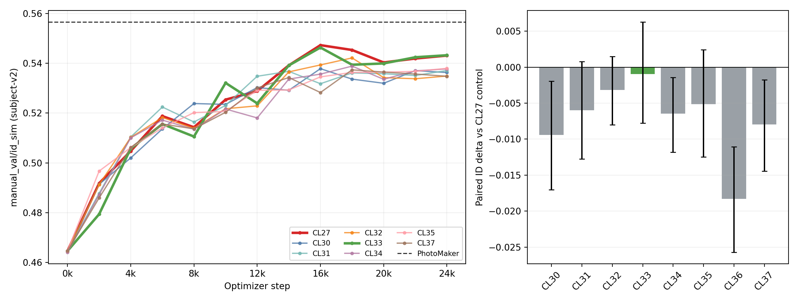
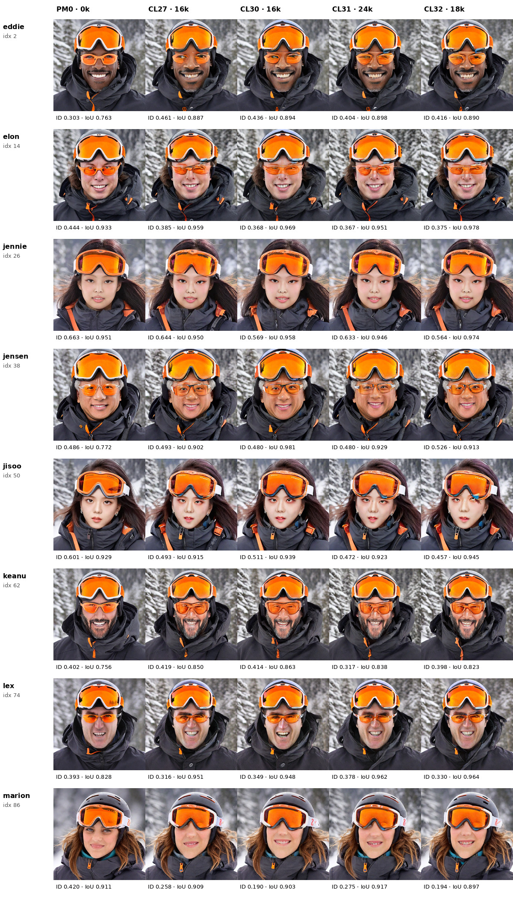
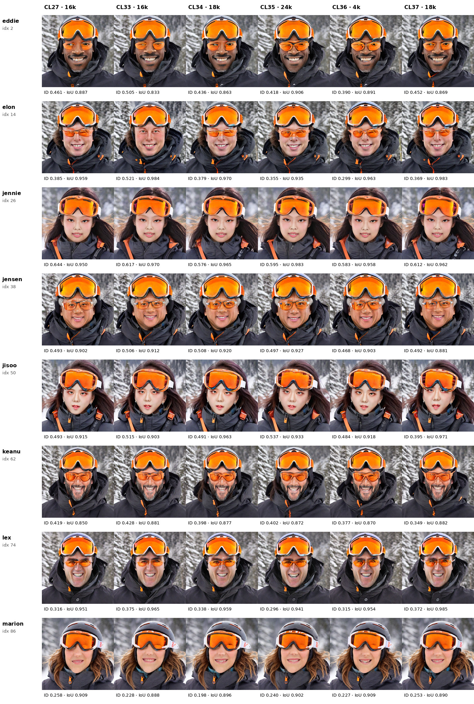
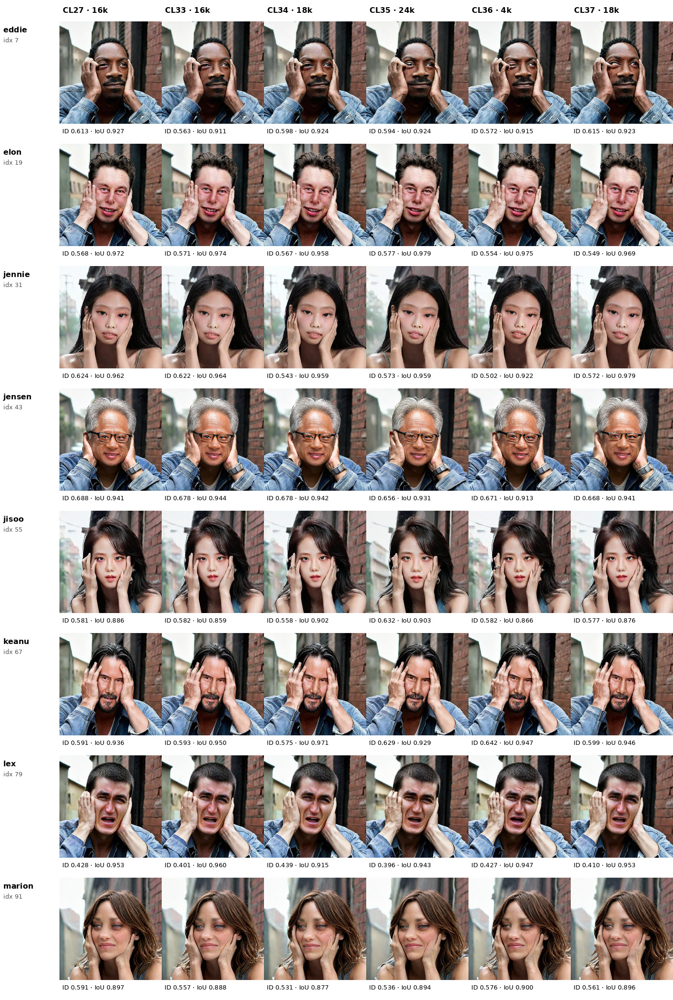
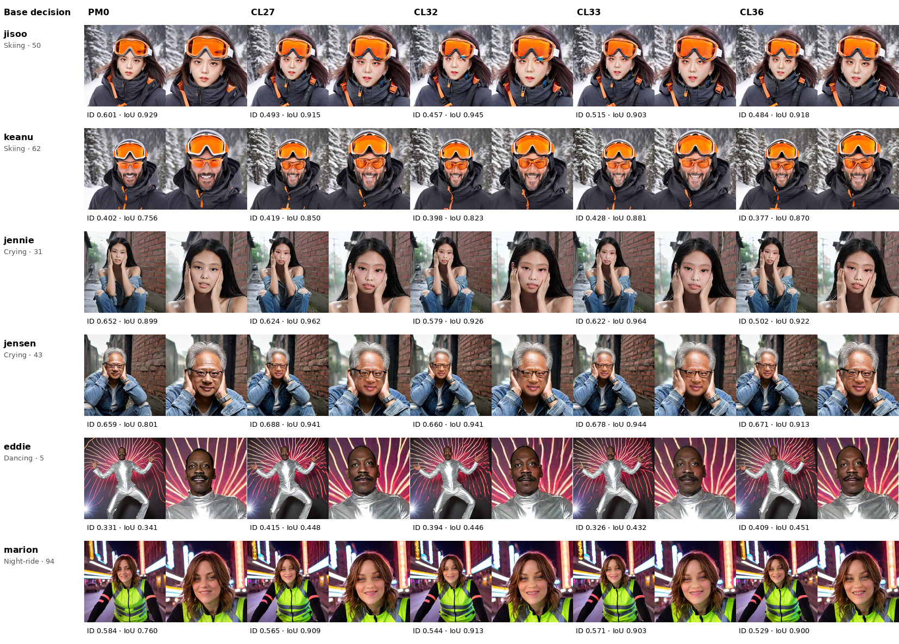
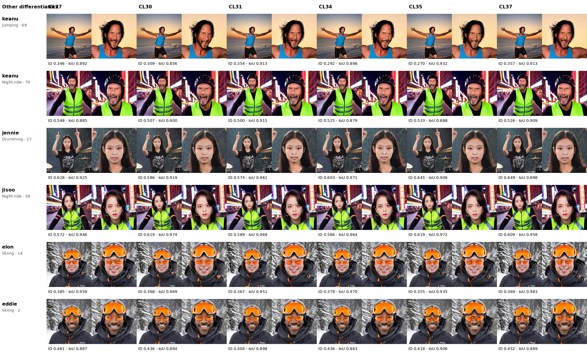

# CL27-16k remains the base: CL33 raises Skiing ID by deleting some eyewear, while no CL30–CL37 arm improves aggregate identity

**Date:** 19 August 2026  
**Evidence cutoff:** 08:17 UTC / 09:17 BST, 19 August 2026  
**Scope:** completed CL30–CL37 scientific runs; immutable Comet histories and
table-sealed validation panels; paired per-image identity analysis; hard-case
visual review; loss-activity and configuration audit; comparison with CL27-16k
and controlled PhotoMaker. Failed retries and one-item smokes are operational
evidence only and are excluded from scientific comparisons.  
**Primary metric:** mask-owned subject-v2 `manual_val/id_sim` on the fixed
96-image `manual_val` panel.  
**Reproducible assets:**
[`assets/cl30_cl37_20260819/`](assets/cl30_cl37_20260819/)

## Executive conclusion

**Keep CL27 at 16k as the primary architecture and checkpoint for further
experiments. Do not promote a complete CL30–CL37 configuration.** The closest
new arm, CL33 at 16k, reaches `0.546311` ID_SIM versus CL27's `0.547260`. Its
paired difference is `-0.000949`, `47/96` wins, with a 95% cell-bootstrap
interval of `[-0.007764,+0.006280]`: aggregate equivalence is plausible, but
improvement is not established. Every other arm is lower, and CL30, CL34,
CL36, and CL37 are clearly negative against their correct CL27 controls.
`[measured][paired]`

CL33 produces the only important hard-case gain: Skiing rises from `0.433680`
to `0.461983`, almost matching PhotoMaker's `0.464005`. Visual inspection
changes the interpretation. Elon gains ID partly because CL33 **deletes his
identity-defining ordinary glasses**; Marion's large goggles still cover the
eye region. PhotoMaker remains `8 pass / 0 minor / 0 fail` on the eight Skiing
cells, compared with `6/1/1` for CL27-16k and `6/0/2` for CL33-16k under the
predeclared topology rubric. CL33 improves some goggle layers, but it has
learned an object-deletion shortcut and is not a clean occlusion solution.
`[measured][visual]`

Crying is no longer the limiting topology case: all reviewed selected panels
keep hands and faces readable (`8/8` passes for PhotoMaker, CL27, and CL33).
The remaining weaknesses are the Skiing object/face layer order, Marion ID,
and inconsistent small/action faces. None of the new arms improves Marion's
12-prompt mean over CL27 (`0.493482`); CL31 is the closest at `0.488494`.
CL32 has the best new Jumping mean (`0.410518`), and CL35 the best Dancing mean
(`0.461924`), but neither improvement generalizes to aggregate ID.
`[measured][visual]`

The mechanism audit prevents two false conclusions. CL35's DINOv2 patch-ID
reward is nonzero only around step 100 and stays exactly zero after 1k because
the observed gate mass averages about `0.111` while the configured eligibility
floor is `0.55`. CL36's ArcFace hinge is similarly almost absent: identity loss
is nonzero in only `4/60` post-1k logged windows and its BA auxiliary gradient
ratio is zero throughout. The complete CL35 and CL36 recipes are negative, but
these runs do **not** establish that patch identity or ArcFace supervision is
intrinsically ineffective. `[measured][code]`

PhotoMaker still leads the selected CL27 checkpoint by `0.009320` mean ID. The
paired interval `[-0.021757,+0.003438]` crosses zero on this 96-cell panel, but
the point estimate and visual Skiing result both favor PhotoMaker. The next
work should therefore preserve CL27's active frequency-surface BA mechanism,
pin the 16k checkpoint as the source/control, and repair one objective at a
time rather than stacking any CL30–CL37 recipe. `[measured][decision]`

# 1. Evidence integrity

## 1.1 Immutable scientific identities and completion

Each scientific row below is the final successful retry. MLS recorded the job
as completed with exit code zero, and each run has a table-sealed fixed-96
Comet panel. Earlier failed retries and bounded smokes are not joined by display
name and are not used in the analysis. `[measured]`

| Arm | Critical change versus CL27 | Immutable Comet key | Selected step | Final step |
|---|---|---|---:|---:|
| CL30 r4 | positive-only low-band same-ID pull | `db38cfb250d241cf89bf57705ff86b18` | 16k | 24k |
| CL31 r4 | attention ownership alignment | `ed5077fd3cfc41bd898c1234b8c3ba24` | 24k | 24k |
| CL32 r1 | contact-frequency surface partition | `078cf231674f4fa499e160a435300511` | 18k | 24k |
| CL33 r1 | visibility-balanced reconstruction | `3173f3086fa344f7ad3eb6ce7b07ac1f` | 16k | 24k |
| CL34 r4 | learned shared frequency schedule | `577cc412ffa04e5686e5c10760186c65` | 18k | 24k |
| CL35 r7 | attention-gated DINOv2 patch identity | `f3417ee9a86342cb9bc13e5eb37bb3e2` | 24k | 24k |
| CL36 r4 | ArcFace hinge continuation from CL27-16k | `41dcb0987d5d439bb14329052953ff6d` | 4k | 4k |
| CL37 r4 | small-face ROI teacher distillation | `f3c535315da242d78494d7df6dd1eaa3` | 18k | 24k |

Controls are CL27 r3, key `dbfbf40c3bdd4f70bedc58bda3dfb9cd`,
selected at 16k, and PhotoMaker step 0, key
`74efd227d3f8488a98e83d815c77c07c`. All eligible arms retain branched
self-attention, target-query/reference-KV conditioning, `pose_adapt_ratio=0`,
and `ca_mixing_for_face=false`. None improves by switching off the BA core.
`[code]`

## 1.2 Fixed panel, joins, and uncertainty

The analysis uses the fixed 96-image `manual_val` contract: one image per
identity/prompt cell with unchanged references, prompts, seeds, ownership
boxes, scheduler, inference steps, CFG, and subject-v2 metric. Each selected
export has exactly 96 images and one 96-row per-image table with no exporter
warning or error. Filenames were normalized for spaces and underscores before
joining image, table, and bounding-box records. The table is the completion
seal, so a partially uploaded next panel cannot be mistaken for a checkpoint.
`[measured]`

Paired intervals use 50,000 bootstrap resamples of the fixed cells. They
quantify uncertainty across this panel, not across training seeds. The visual
rubric is separate from ID_SIM:

- **pass:** prompted top object and identity-defining ordinary eyewear are
  present, object/face order is readable, and the intended face is attached;
- **minor:** readable ownership and order with a localized asymmetry;
- **fail:** fused or duplicated layers, important object deletion, unreadable
  face, or wrong face/body association.

Visual counts are one unblinded review of one fixed seed. They diagnose cells;
they are not a population estimate. `[limitation]`

## 1.3 Step-zero parity

CL30, CL31, CL32, CL33, CL35, and CL37 have per-image ID vectors exactly equal
to CL27 at step zero (`max |delta| = 0`). CL36 starts from CL27-16k and its
step-zero ID vector is exactly equal to that source checkpoint. These results
exclude a favorable initialization as the explanation for their later scores.
`[measured]`

CL34 is the exception: step-zero mean is `0.464134` versus CL27's `0.464640`,
and the maximum per-cell difference is `0.032371`. The change is small relative
to CL34's later deficit, but strict step-zero parity is false; no
difference-in-differences causal claim is made for CL34. `[measured][caveat]`

# 2. Quantitative results

## 2.1 Identity trajectories and paired decisions

{ width=96% }

*Figure 1. Left: complete subject-v2 ID trajectories for CL27 and the full
24k arms; PhotoMaker is the dashed line. Right: each arm's selected-checkpoint
paired difference against the correct CL27 control with 95% cell-bootstrap
intervals. CL36 is compared with its CL27-16k source.*

| Arm | Selected ID @ step | Delta versus control | Wins | 95% interval |
|---|---:|---:|---:|---:|
| **CL27** | **`0.547260 @16k`** | — | — | — |
| CL30 | `0.537826 @16k` | `-0.009435` | 38/96 | `[-0.017018,-0.001939]` |
| CL31 | `0.537079 @24k` | `-0.006001` | 43/96 | `[-0.012779,+0.000756]` |
| CL32 | `0.542138 @18k` | `-0.003182` | 45/96 | `[-0.008031,+0.001499]` |
| **CL33** | **`0.546311 @16k`** | **`-0.000949`** | **47/96** | **`[-0.007764,+0.006280]`** |
| CL34 | `0.538839 @18k` | `-0.006482` | 47/96 | `[-0.011836,-0.001425]` |
| CL35 | `0.537951 @24k` | `-0.005130` | 37/96 | `[-0.012482,+0.002413]` |
| CL36 | `0.528958 @4k` | `-0.018302` | 32/96 | `[-0.025719,-0.011047]` |
| CL37 | `0.537343 @18k` | `-0.007978` | 35/96 | `[-0.014435,-0.001741]` |
| PhotoMaker | `0.556580 @0` | `+0.009320` vs CL27 | 50/96 | `[-0.003438,+0.021757]` |

CL30, CL34, CL36, and CL37 are clearly worse. CL31 and CL35 have negative
point estimates but intervals crossing zero; CL32 is neutral; CL33 is the
closest result but supplies no evidence for promotion. Final 24k ID values for
CL30–CL37 are, respectively, `0.536273`, `0.537079`, `0.534867`, `0.543207`,
`0.537722`, `0.537951`, `0.528958 @4k`, and `0.534766`. `[measured]`

The trajectories repeat the CL27 early-stop lesson. CL27 and CL33 both peak at
16k and lose about `0.0042` and `0.0031`, respectively, by 24k. CL32, CL34,
and CL37 peak at 18k and also decline. Future 24k jobs should retain validation
through 24k for comparability but treat 16k and 18k as required promotion gates
rather than assuming the final checkpoint is best. `[measured][decision]`

\newpage

## 2.2 Hard-case and identity slices

| Slice | PhotoMaker | CL27 | CL30 | CL31 | CL32 | CL33 | CL34 | CL35 | CL36 | CL37 |
|---|---:|---:|---:|---:|---:|---:|---:|---:|---:|---:|
| Skiing | `0.4640` | `0.4337` | `0.4145` | `0.4158` | `0.4075` | **`0.4620`** | `0.4156` | `0.4175` | `0.3928` | `0.4118` |
| Crying | **`0.6000`** | `0.5855` | `0.5561` | `0.5695` | `0.5680` | `0.5710` | `0.5611` | `0.5740` | `0.5658` | `0.5689` |
| Jumping | **`0.4173`** | `0.3946` | `0.3871` | `0.4099` | `0.4105` | `0.4046` | `0.3978` | `0.3933` | `0.3784` | `0.3930` |
| Dancing | `0.4487` | `0.4422` | `0.4324` | `0.4189` | `0.4321` | `0.4496` | `0.4227` | **`0.4619`** | `0.4342` | `0.4219` |
| Marion, all prompts | **`0.5029`** | `0.4935` | `0.4716` | `0.4885` | `0.4747` | `0.4819` | `0.4737` | `0.4599` | `0.4593` | `0.4789` |

CL33's `+0.028303` Skiing gain over CL27 is real in the metric, but is not
accompanied by Crying or Marion gains: those fall by `0.014535` and `0.011558`.
CL32's Jumping result and CL35's Dancing result are useful cell-family signals,
not base promotions. No new arm closes CL27's Marion gap. `[measured]`

## 2.3 Face ownership and quality

| Arm | Mask IoU mean | IoU median | IoU p10 | Mean faces | Multi-face cells | TOPIQ-Face mean / p10 |
|---|---:|---:|---:|---:|---:|---:|
| PhotoMaker | `0.8652` | `0.8825` | `0.7772` | `1.135` | 12 | `0.7532 / 0.5918` |
| CL27 | `0.9211` | `0.9358` | `0.8858` | `1.125` | 11 | `0.7142 / 0.5882` |
| CL30 | `0.9259` | `0.9346` | `0.8793` | `1.135` | 13 | `0.7077 / 0.5874` |
| CL31 | `0.9247` | `0.9326` | `0.8894` | `1.135` | 11 | unavailable |
| CL32 | `0.9257` | `0.9377` | `0.8840` | `1.115` | 11 | `0.7131 / 0.5817` |
| CL33 | `0.9205` | `0.9290` | `0.8739` | `1.115` | 10 | `0.7140 / 0.5797` |
| CL34 | `0.9252` | `0.9335` | `0.8821` | `1.115` | 10 | `0.7157 / 0.5891` |
| CL35 | `0.9234` | `0.9354` | `0.8848` | `1.104` | 9 | `0.7146 / 0.5844` |
| CL36 | `0.9197` | `0.9255` | `0.8803` | `1.115` | 11 | `0.7125 / 0.5901` |
| CL37 | `0.9248` | `0.9310` | `0.8807` | `1.094` | 8 | `0.7159 / 0.5856` |

All selected BA panels have zero cells below `0.3` mask IoU. There is no broad
face/body relocation collapse. BA continues to improve intended-box ownership
relative to PhotoMaker, while PhotoMaker retains the higher average face
quality and identity. Eddie/Dancing remains a useful low-IoU stress cell:
PhotoMaker scores `0.341`, CL27 `0.448`, and the new BA arms about
`0.418–0.455`. `[measured]`

CL31's face-quality series is absent from Comet, so its values are reported as
unavailable rather than inferred from other runs. `[measured][caveat]`

# 3. Visual inspection: critical differentiators

## 3.1 Skiing exposes a CL33 shortcut

{ width=86% }

*Figure 2. Skiing at each selected checkpoint: PhotoMaker, CL27, and
CL30–CL32. Every cell is the face crop from the fixed ownership box; values are
per-image subject-v2 ID and mask IoU.*

{ width=86% }

*Figure 3. Skiing at the selected checkpoints for CL27 and CL33–CL37.*

| Run | Pass | Minor | Fail |
|---|---:|---:|---:|
| PhotoMaker | 8 | 0 | 0 |
| CL27-16k | 6 | 1 | 1 |
| CL33-16k | 6 | 0 | 2 |

PhotoMaker keeps every large-goggle layer visibly above a readable face and
retains the male identities' ordinary glasses. CL27 has localized nested-
eyewear asymmetry for Eddie and a clear Marion failure. CL33 improves several
large-goggle layers, but Elon's ordinary glasses disappear and Marion still
fails. `[visual]`

CL33 raises Eddie from `0.461` to `0.505`, Elon from `0.385` to `0.521`, Jisoo
from `0.493` to `0.515`, and Keanu from `0.419` to `0.428`. Elon's jump is not
a valid topology win because it removes a required identity object. Jisoo and
Keanu are cleaner examples of the visibility-balanced loss helping without
obvious deletion. Marion remains unresolved in every arm. `[measured][visual]`

CL34 and CL35 often keep readable large-goggle order, but their aggregate
Skiing means stay below CL27. CL32 introduces localized rim/eye corruption in
some rows. CL37 gives no consistent small-face or occlusion benefit. The
metric mean alone would have promoted CL33's Skiing behavior; the topology
rubric correctly prevents that mistake. `[visual]`

## 3.2 Crying is stable, not the remaining bottleneck

{ width=86% }

*Figure 4. Crying for CL27 and CL33–CL37; hands and face boundaries remain
readable.*

The previous hand/face fusion failure does not recur. All eight reviewed
Crying rows pass for PhotoMaker, CL27, and CL33; the other selected panels are
also visually coherent. Differences are mainly identity strength rather than
topology. For example, CL27 is stronger than CL33 on Jennie (`0.624` versus
`0.622`) and Jensen (`0.688` versus `0.678`), consistent with the lower CL33
Crying mean. Further architecture work should not trade this recovered
behavior for Skiing gains. `[measured][visual]`

## 3.3 Small/action faces: isolated gains do not generalize

{ width=100% }

*Figure 5. Base-decision cells across PhotoMaker, CL27, CL32, CL33, and CL36:
Jisoo/Keanu Skiing, Jennie/Jensen Crying, Eddie Dancing, and Marion Night-ride.
Each column shows the full image beside the owned-face crop.*

CL32 improves several Jumping cells and reaches the best new Jumping mean, but
does not improve aggregate ID or Skiing. CL36 demonstrates the risk of direct
identity continuation without a verified gradient path: by 4k it has lost
`0.018302` versus its exact CL27 source and visibly weakens several critical
faces. `[measured][visual]`

{ width=100% }

*Figure 6. Additional differentiators across CL27, CL30, CL31, CL34, CL35,
and CL37: Keanu Jumping/Night-ride, Jennie Drumming, Jisoo Night-ride, and
Eddie/Elon Skiing.*

CL37's Keanu/Jumping cell rises from CL27 `0.346` to `0.357`, yet the whole
Jumping mean falls slightly (`0.3930` versus `0.3946`) and aggregate ID is
clearly worse. CL35's Dancing mean is high, with strong Elon/Jisoo examples,
but the inactive patch reward means the visual result cannot be attributed to
DINO supervision. These are useful leads for eligibility and sampling design,
not successful complete interventions. `[measured][visual]`

# 4. What worked, what did not, and what was not actually tested

| Arm | Was the new mechanism active? | Evidence and conclusion |
|---|---|---|
| CL30 | yes | Positive pull is sampled at about `0.124`; its loss is nonzero in `449/460` logged windows after 1k. It is clearly worse than CL27. Positive-only low-band attraction at this weight/cadence is rejected. `[measured]` |
| CL31 | yes | Ownership loss is sampled at about `0.247` and nonzero in `449/461` windows. Aggregate effect is not established; some goggle order looks better, but there is no promotion. `[measured][visual]` |
| CL32 | yes | Contact partition is applied at about `0.220`. It produces the best new Jumping mean but lower Skiing and neutral aggregate ID. Contact repartition alone is insufficient. `[measured]` |
| **CL33** | **yes** | Visibility partition is applied at about `0.254`. It preserves aggregate ID and improves mean Skiing, but sometimes optimizes by deleting ordinary glasses and lowers Crying/Marion. This is the only reusable objective idea, after anti-deletion repair. `[measured][visual]` |
| CL34 | technically, but barely moves | Learned schedule values change only `0.00085–0.00140` from initialization. The run is clearly worse and lacks exact step-zero parity. Do not reuse it as a base. `[measured]` |
| CL35 | **no, after startup** | Observed gate mass is about `0.111` against a `0.55` floor, so patch-ID loss and applied fraction are zero after 1k. The complete recipe is negative; the intended DINO reward remains untested at sustained activity. `[measured][code]` |
| CL36 | mostly no | Applied fraction is about `0.0147`; identity loss is nonzero in only `4/60` post-1k windows and BA auxiliary gradient ratio is always zero. Reject this continuation recipe, not ArcFace as a class. `[measured][code]` |
| CL37 | yes, but sparse | Teacher sampling is about `0.124`, while eligibility averages only `0.0158`. The signal is too sparse; one Keanu gain does not generalize. `[measured][visual]` |

The useful general lesson is **activity must be a promotion gate, not merely a
logged diagnostic**. A loss can be configured, instantiated, and nonzero in a
smoke while contributing nothing for almost all scientific training. Future
identity or teacher objectives should fail closed before a full run if their
conditional eligibility, nonzero-loss cadence, and BA-owned gradient ratio are
outside a declared range. `[decision]`

\newpage

# 5. Base configuration going forward

## 5.1 Decision: retain CL27, with a precise checkpoint contract

CL27 still makes sense as the base. The base should now be named precisely:

1. CL27 frequency-surface SA-only branched-attention architecture;
2. immutable source checkpoint `CL27 r3 @16k`, not the 24k endpoint;
3. target queries consuming reference K/V, with
   `pose_adapt_ratio=0`, `ca_mixing_for_face=false`, and unchanged reference
   weight;
4. optimized training pipeline and the fixed subject-v2 96-image validation
   contract;
5. explicit 16k and 18k selection gates even when training continues to 24k.

This is an operationally tightened CL27 base, not a new scientific
configuration. It preserves the best established BA score and hard-case
behavior while preventing a weaker 24k checkpoint from silently becoming the
control. `[measured][decision]`

## 5.2 Why no modified configuration should replace it

CL33 is the only plausible alternative, but it fails the promotion test for
three independent reasons: aggregate ID improvement is not established;
Crying and Marion regress; and its strongest Skiing gain includes ordinary-
glasses deletion. Its 24k score also declines. Using CL33 as the default base
would make later improvements harder to interpret because an anti-occlusion
objective and its shortcut would already be entangled in every comparison.
`[measured][visual][decision]`

CL31 and CL32 are mechanistically active but aggregate-neutral. CL30, CL34, and
CL37 are clearly negative. CL35 and CL36 are confounded by effectively inactive
intended rewards. None supplies evidence for a safer or higher-ID complete
base. `[measured]`

The recommended arrangement is therefore:

- **primary control/base:** CL27-16k;
- **specialized secondary control:** CL33-16k only for a single-delta
  visibility-loss successor;
- **do not stack:** CL30/31/32/34/35/36/37 mechanisms into the base before a
  corrected isolated arm passes both metric and visual gates.

# 6. Highest-value next work

## Priority 1 — visibility-balanced v2 with anti-deletion ownership

Start cold from the CL27 configuration and change only the reconstruction
weighting. Preserve CL33's visible-face/top-object/contact partition, but add a
small object-presence/ownership term that penalizes erasing identity-defining
ordinary eyewear when it is visible in the target. The term should supervise
the top-object region and ordinary-eyewear region separately so the model
cannot improve the large-goggle face crop by deleting the smaller glasses.
`[hypothesis]`

**Promotion gates:** step-zero exact parity; sustained partition activity;
aggregate ID not below CL27 at both 16k and 18k; Skiing at least `7/8` passes;
zero ordinary-glasses deletions; Crying and Marion no worse than CL27 within
predeclared tolerances. The main risk is noisy ordinary-eyewear labeling.

## Priority 2 — requalify patch identity before another 24k run

Do not rerun CL35 unchanged. First use a bounded diagnostic to set eligibility
from the observed gate-mass distribution rather than the impossible `0.55`
floor. Require nonzero reward in a declared fraction of eligible low-noise
steps and a nonzero gradient ratio on BA-owned trainables. Only then run one
CL27-based arm with the same DINO objective. `[measured][hypothesis]`

**Promotion gates:** no fallback to ordinary three-reference CL31 behavior;
conditional application and gradient telemetry in range; no aggregate ID loss
at 4k/8k early gates; no Skiing object deletion. This tests the intended loss,
which CL35 did not.

## Priority 3 — make small-face teaching eligible before increasing weight

CL37's `~1.58%` eligible fraction is too sparse. A successor should change only
the eligibility/sampling design—for example, stratify batches by measured face
area or compute the teacher on all sampled small-face records—while retaining
the same stop-gradient teacher and weight. Do not increase weight until the
current signal is observed often enough to evaluate. `[measured][hypothesis]`

**Promotion gates:** declared eligible fraction reached; Jumping and Dancing
both improve without lowering whole-panel ID; face/body ownership and detected
face count do not regress.

ArcFace should remain behind these priorities. Before any scientific rerun,
the exact auxiliary gradient path must be demonstrated on BA-owned parameters;
CL36's zero gradient ratio makes a new 24k launch unjustified. `[decision]`

# 7. What is established and what is not

**Established:** no completed CL30–CL37 arm improves aggregate ID over its
correct CL27 control; CL33 is the closest and raises Skiing mean; PhotoMaker
still has the higher mean ID and cleanest Skiing topology; BA panels retain
better intended-box ownership; Crying topology remains repaired; Marion and
small/action faces remain inconsistent. `[measured][visual]`

**Not established:** CL33 is equivalent across training seeds; DINO patch
identity or ArcFace supervision is intrinsically ineffective; CL37's teacher
would fail under adequate eligibility; the one-seed visual rubric predicts
multi-seed user preference. `[limitation]`

**Decision confidence:** high that CL27-16k should remain the primary base;
moderate that visibility-balanced v2 is the best next scientific arm; low on
the value of direct identity losses until their gradient path is proven.

# 8. Reproduction

From `diffusion_template/`, the immutable report inputs are the final and peak
Comet manifests in `analysis/assets/cl30_cl37_20260819/`. The selected/final
per-image tables, joined slice data, paired comparisons, step-zero audit,
telemetry summary, visual-review counts, figure builder, and file hashes are in
the same asset directory.

```bash
python analysis/assets/cl30_cl37_20260819/build_analysis_assets.py
sha256sum -c analysis/assets/cl30_cl37_20260819/SHA256SUMS.txt
python tools/reports/publish_report.py \
  analysis/2026-08-19_cl30_cl37_completed_results_and_base_decision.md --upload
```

The bulk downloaded Comet images are reproducible cache and are intentionally
not part of the repository artifact. The curated grids and exact tables are
the durable visual and numeric evidence. `[reproducibility]`

## Prior internal evidence

- `analysis/2026-08-17_cl27_cl29_vs_cl23_visual_results_and_next_experiments.md`
  defines the CL27 selection and hard-case rubric.
- `analysis/2026-08-16_training_pipeline_processor_lookup_fix.md` defines the
  optimized scientific pipeline used by these runs.
- `docs/handoffs/LATEST.md` records immutable retries, source seals, and launch
  history; this report supersedes its provisional CL30–CL37 live-state entry.
