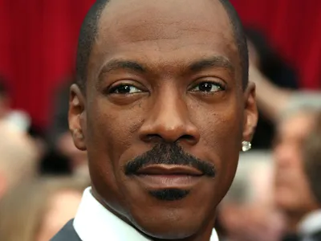
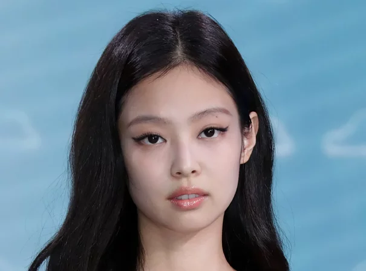
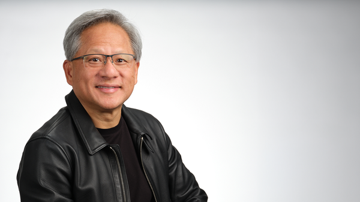
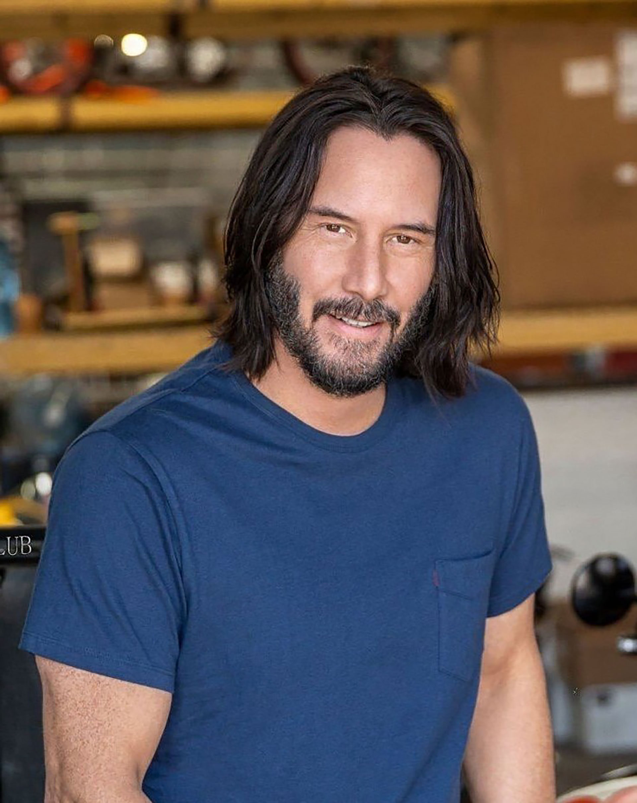
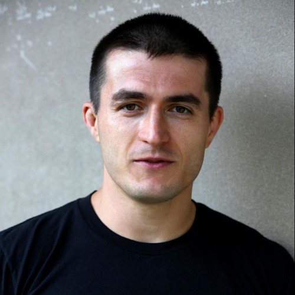
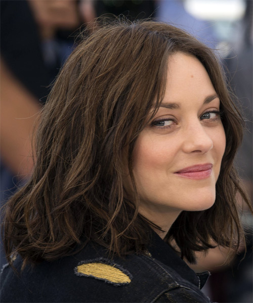

<!-- report-page: CL14 architecture -->
<!-- layout: architecture -->
<!-- column: left -->
# CL14 architecture: the reference design

## CL14 - actual hard spatial branched self-attention

The spatial self-attention batch is doubled: target/noisy features X and reference features R. M_t and M_r are the target-face and reference-face masks. CL14 uses separate trainable low-rank Q/K/V deltas for the target and reference streams (noise_and_ref mode, BA rank 128), while the frozen SDXL/PhotoMaker path remains the initialization anchor.

$$\mathrm{SDPA}(Q,K,V)=\mathrm{softmax}(QK^\top/\sqrt{d})V$$

The background lane keeps target information. The identity lane keeps target queries, but reads masked reference-face keys and values. Because pose_adapt_ratio = 0, no target feature replaces reference K/V.

$$A_{bg}=\mathrm{SDPA}((1-M_t)Q_t(X),K_t(X),V_t(X))$$

$$A_{id}=\mathrm{SDPA}(M_tQ_t(X),K_r(M_rR),V_r(M_rR))$$

$$Y_t=O((1-M_t)A_{bg}+M_tA_{id})+X$$

The reference half is propagated independently so later U-Net blocks retain reference state. Reference features outside M_r are zeroed, but true key masking is off, so zero-key softmax sinks remain part of the historical CL14 contract.

<!-- column: right -->
## Timing and optimization contract

- PhotoMaker token conditioning starts at denoising step 10; BA starts at step 15 of DDIM50.
- Spatial self-attention BA is enabled; branched cross-attention is disabled.
- Training owns 2,240 tensors / 219,217,920 parameters: BA plus generic and PhotoMaker-default LoRA lanes.

## CL14 boundary-mask behavior

CL14 writes two inward training rings with weights 1/3 and 2/3. The installed processors bilinearly resize and threshold at > 0.5. The outer 1/3 ring disappears and the 2/3 ring remains: the actual route is a hard one-cell erosion, not a continuous boundary blend. Validation uses the unchanged binary bbox mask.

## Interpretation

CL14 is the architectural reference for this report. CL19 changes where the native/reference merge occurs. CL23 then changes how the CL19 reference-minus-native message is split and scheduled. CL27 leaves CL23 inference unchanged and adds only a training loss.

<!-- report-page: CL19 architecture -->
<!-- layout: architecture -->
<!-- column: left -->
# CL19: true soft full-query routing

## Difference from CL14

CL19 keeps target-query/reference-KV identity routing and historical zero sinks, but stops masking Q before attention. It computes two complete target messages, then blends exactly once with a two-cell cosine router S.

$$A_n=\mathrm{SDPA}(Q_t(X),K_t(X),V_t(X))$$

$$A_r=\mathrm{SDPA}(Q_t(X),K_r(M_rR),V_r(M_rR))$$

$$Y_t=O((1-S)A_n+SA_r)+X$$

For ring j of c = 2 transition cells, S_j = 0.5[1 - cos(pi j/(c+1))]. The two ring weights are 0.25 and 0.75; the inner face is 1 and the background is 0. Full query support removes CL14's zeroed-query message and second spatial output mask.

<!-- column: right -->
## What remains unchanged

- The identity lane uses target Q and masked reference K/V.
- The reference lane is propagated independently through the U-Net.
- Generic rank-32 and PhotoMaker-default rank-64 adapters remain jointly trainable with BA rank 128.
- Trainable ownership remains 2,240 tensors / 219,217,920 parameters.

## Shared validation invariants

- RealVisXL V4.0 validation base, DDIM50, CFG 5, batch 12, seed 0.
- Same 96 prompt/reference pairs, bboxes, PhotoMaker V2 checkpoint, and subject-v2 identity metric.
- pose_adapt_ratio = 0 and ca_mixing_for_face = false.

## Result interpretation

CL19's 24k panel is the final completed endpoint. The line chart separately labels its highest point, so an earlier peak is not hidden by endpoint selection.

<!-- report-page: CL23 and CL27 architecture -->
<!-- layout: architecture -->
<!-- column: left -->
# CL23 and CL27: frequency-routed successors

## CL23 - temporal low/high-frequency route

CL23 starts from CL19's full native and reference target messages. It defines the reference correction D, separates it with a fixed 5x5 Gaussian filter G, then applies denoising-progress-dependent scales inside the same cosine router S.

$$D=A_r-A_n,\quad L=G(D),\quad H=D-L$$

$$s_L(p)=0.50+0.35p,\quad s_H(p)=0.75+0.50p$$

$$Y_t=O(A_n+S(s_L(p)L+s_H(p)H))+X$$

Here p runs from 0 to 1 over denoising progress. Low-frequency identity structure rises from 0.50 to 0.85, while high-frequency reference detail rises from 0.75 to 1.25. This is deterministic; it introduces no new trainable tensors.

<!-- column: right -->
## CL27 - training-only frequency-surface objective

CL27 uses the exact CL23 inference equation, schedule, parameter ownership, and validation path. Only training changes, and only in up0/up1 on the 25% deterministic semantic-occlusion sample.

Let T be top-object pixels inside the face and V the remaining visible-face pixels. With routed low/high components L_r and H_r:

$$E_T=\mathrm{mean}_T(H_r^2+0.25L_r^2)$$

$$\rho_V=\frac{\mathrm{RMS}_V(D_{routed})}{\mathrm{stopgrad}(\mathrm{RMS}_V(A_n))}$$

$$\mathcal{L}_{surface}=0.02E_T+0.005\,\mathrm{mean}_V[\max(0,0.35-\rho_V)^2]$$

The first term suppresses routed object energy where goggles, hands, or occluders should remain native. The second prevents the visible-face reference contribution from collapsing. At validation torch.no_grad disables this objective, so CL27 is inference-identical to CL23 apart from learned weights.

<!-- report-page: CL14 implementation excerpts -->
<!-- layout: code -->
<!-- column: left -->
# CL14 critical implementation excerpts

## Hard target/reference attention lanes

The processor gates target queries by the target mask, obtains identity K/V only from the masked reference face, then merges background and identity messages spatially.

```python
# Background: target Q/K/V.
q_bg = q * (1.0 - mask_gate)
hidden_bg = F.scaled_dot_product_attention(
    q_bg, key_bg, value_bg,
    dropout_p=0.0, is_causal=False,
)

# Identity: target Q, reference-face K/V.
ref_face_hidden = ref_hidden * ref_mask_flat
key_face = self._k_ref(attn, ref_face_hidden)
value_face = self._v_ref(attn, ref_face_hidden)
q_face = q * mask_gate
hidden_face = F.scaled_dot_product_attention(
    q_face, key_face, value_face,
    dropout_p=0.0, is_causal=False,
)

merged = (
    hidden_bg * (1.0 - mask_flat)
    + hidden_face * mask_flat * self.scale
)
```

<!-- column: right -->
## Why the written feather is still hard

The training mask writes 1/3 and 2/3 boundary rings, but every spatial-attention resolution uses this preparation path:

```python
m2d = F.interpolate(
    m4, size=(H, W), mode="bilinear",
    align_corners=False,
)
if self.force_binary_masks:
    m2d = (m2d > 0.5).to(m2d.dtype)
```

The threshold removes the 1/3 ring. This code-level fact is why CL14 is described as hard routing with one-cell erosion.

<!-- report-page: CL19 and CL23 implementation excerpts -->
<!-- layout: code -->
<!-- column: left -->
# CL19 and CL23 implementation excerpts

## CL19: full messages, one cosine blend

```python
native_out, reference_out, _ = (
    self._full_target_lanes(attn, target, reference)
)
router = self._soft_router_mask(
    self.mask, target.shape[1],
    target.shape[0], native_out.dtype,
)
target_out = (
    native_out * (1.0 - router)
    + reference_out * router
)
```

```python
phase = float(index + 1) / float(cells + 1)
weight = 0.5 - 0.5 * math.cos(math.pi * phase)
result = result * (1.0 - ring) + ring * weight
```

<!-- column: right -->
## CL23: Gaussian split and deterministic schedule

```python
low, high = self._gaussian_split(
    reference_out - native_out
)
progress = self._progress(target)
low_scale = 0.50 + progress * (0.85 - 0.50)
high_scale = 0.75 + progress * (1.25 - 0.75)
low_component = router * low_scale * low
high_component = router * high_scale * high
target_out = native_out + low_component + high_component
```

```python
kernel_1d = image.new_tensor(
    [1.0, 4.0, 6.0, 4.0, 1.0]
) / 16.0
kernel = kernel_1d[:, None] * kernel_1d[None, :]
low = F.conv2d(image, kernel, padding=2, groups=channels)
high = delta.float() - low
```

CL23 changes the routed message but retains CL19's full target-query native and reference attention lanes.

<!-- report-page: CL27 implementation excerpts -->
<!-- layout: code -->
<!-- column: left -->
# CL27 training-only objective excerpts

## Configuration: no inference change

```yaml
defaults:
  - CL23_cosmic_temporal_frequency_router_24k

model:
  ba_frequency_surface_loss_enabled: true
  ba_frequency_surface_loss_groups:
    [up_blocks.0, up_blocks.1]
  ba_frequency_surface_top_weight: 0.02
  ba_frequency_surface_top_low_band_factor: 0.25
  ba_frequency_surface_visible_floor_weight: 0.005
  ba_frequency_surface_visible_floor_ratio: 0.35
```

## Training-only execution guard

```python
if (
    not self.frequency_surface_loss_enabled
    or not self.training
    or not torch.is_grad_enabled()
):
    return metrics
```

This guard is critical because alternate-base validation retains module training mode while running under no_grad.

<!-- column: right -->
## Top-object suppression and visible-face floor

```python
top = self._binary_mask(supervision, length, batch,
                        torch.float32) * face
visible = (face - top).clamp(0.0, 1.0)

top_high = self._masked_mean_square(high_component, top)
top_low = self._masked_mean_square(low_component, top)
top_energy = top_high + 0.25 * top_low

routed_rms = self._masked_mean_square(
    routed_delta, visible
).clamp_min(1.0e-12).sqrt()
native_rms = self._masked_mean_square(
    native_out, visible
).clamp_min(1.0e-12).sqrt()
ratio = routed_rms / native_rms.detach().clamp_min(1.0e-6)

top_loss = (top_energy * eligible).sum() / count
floor_loss = (
    F.relu(0.35 - ratio).square() * eligible
).sum() / count
surface_loss = 0.02 * top_loss + 0.005 * floor_loss
```

CL27 adds no trainable parameters: it changes gradients applied to the existing CL23 route.

<!-- report-page: Fixed validation references and prompts -->
<!-- layout: references_prompts -->
# Fixed 96-image validation contract

## References










## Prompt templates

1. Reading paper <class>, park bench, calm face, grey overcoat
2. Rushing <class> portrait, subway platform, anxious face, swinging briefcase
3. Skiing <class>, snowy slope, fearless grin, orange goggles
4. Drumming <class>, rock concert in rain, passionate angry face, black t-shirt
5. Kickboxing <class>, gym ring, fierce roar face, sweatband
6. Dancing <class>, neon club, euphoric face, silver jumpsuit
7. Angry <class>, traffic jam, scowling face, dark suit
8. Crying <class>, stormy alley, tearful face, ripped jeans
9. Laughing <class>, carnival wheel, carefree laugh, polka-dot shirt
10. Jumping <class>, beach sunset, ecstatic face, blue tank top
11. Night-ride biker <class>, neon city, excited face, reflective vest
12. Chef <class>, bustling kitchen, proud grin, tall white toque
